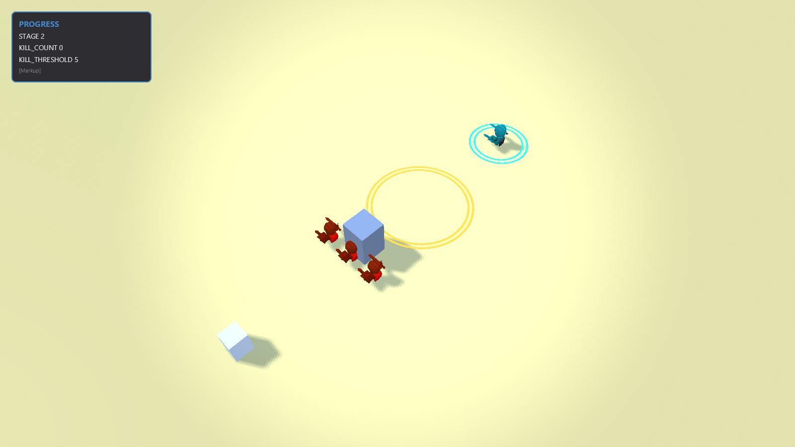

# TriggerGraph 执行槽验收

## 概述

玩家触发机关后，行为可能当场完成，也可能等到下一拍或玩家确认后继续。本次把这些运行中的数据集中存储：每条活动行为占一个槽，等待时保留，结束后归还。多个行为使用同一张图，也分别保留自己的输入。

这是 Epic #1464 的 A1 执行槽实现及现有夜袭场景回归。完整万人场景和工具链体验台尚未完成。

## 结构

- 玩家入口：现有画廊“夜袭三波”，preset 为 `map_trigger_night_raid_raylib`。玩法是进圈迎战、击杀推进阶段。
- 作者观察入口：带 `AgentBridgeMod` 启动后，调用 `ludots.graph.debug` 的 `list/configure/drain`。
- 复用：原 `GraphExecutor.ExecuteScriptSlice`、`GraphEntryPayloadTable`、`GraphCallbackService`、`TriggerManager` 注册和注销路径。
- 新增：`src/Core/GraphRuntime/TriggerGraphExecutionSlotStore.cs`，按类型连续存放各槽数据。载荷表是共享数组的有界视图；执行期间通过 Span 访问。
- 容量：`assets/game.json` 的 `triggerGraphExecutionCapacity`，默认 1024。它约束同时运行和等待的数量；Mod 可经原配置管线覆盖。
- 原始请求与响应：[trace.jsonl](trace.jsonl)；测试摘录：[test-output.txt](test-output.txt)；路径：[path.mmd](path.mmd)。

## 详情

| 使用者 | 本轮可验证的体验 |
|---|---|
| 玩家 | 多段行为保留各自输入；重新触发时，队列里的旧确认不会唤醒新一轮等待 |
| 玩法作者 | 不同入口和同一入口的同步嵌套使用独立运行数据；跨拍恢复能读取触发当时的载荷 |
| 编辑器作者 | 同一调试接口返回容量、活动槽数和峰值，可用于解释资源使用情况 |
| 开发者 | 关闭调试的挂载不再各自创建寄存器数组；容量耗尽、过期槽、嵌套等待明确失败 |

槽位在引擎初始化时按配置预分配，空闲挂载不领槽；这是固定预留内存，归还槽位不会把整个存储交还操作系统。trace 关闭则移除记录数组引用，后续由 GC 回收。

注销覆盖地图、全局订阅、实体所有者、技能及 Mod；替换地图注册会先释放旧运行。注销若发生在图派发事件期间，当前 VM 退出前仍保留其槽，避免仍在使用的内存被新运行领取。同步嵌套保留既有状态连跳；嵌套运行若 Yield 或等待回调，取消内层并明确报错。

## 场景

2026-09-08，最终代码在 PID 69804、端口 47931 的 `night_raid` 进程取证；会话加载 `LudotsCoreMod`、`CoreInputMod`、`MapTriggerNightRaidMod`、`NightRaidShowcaseMod`、`AgentBridgeMod`。

1. 观察：9 个挂载，执行槽容量 1024、活动 0、峰值 1。画面显示 `STAGE 2`、三名袭击者和英雄。
2. 驱动：为 `Graph.NightRaid.Flow / on_kill_tool` 开启 `NodeAndPins`，触发一次 `NightRaid.KillTool.Used`。
3. 验证：`triggerErrors=0`，18 条轨迹从 `kt_scope` 到 `kt_done`，没有缺口或丢弃；事件结束后活动槽仍为 0、峰值 1。
4. 结束观察：关闭 trace 后 `allocatedCapacity=0`，再次读取记录为空。
5. 判活：`pumpCount` 1145 → 1158；UI 树和截图均来自同一进程。



## 边界

- 定向测试 47/47。发布版 10,000 个完整挂载的执行批次新增分配为 0，等待时占槽 10,000，结束归零；挂载和恢复伴随对象创建分配 7,121,096 字节，另有预分配的执行槽存储。
- 发布版单跑开始 17.978 ms、恢复 31.320 ms。此批次复用输入上下文、直接调用挂载，没有事件总线、实体作用域过滤、完整帧和渲染；不能解释成游戏 FPS 或最终性能预算已通过。
- BT/HFSM 单独验收 20/20：万人 BT `scriptSlices=0`、HFSM `lifecycleRuns=0`；合波 p95=4.844 ms。与编译并行的扩大回归曾测得 p95=17.014 ms，超过 15 ms 门槛，未删除该失败记录。
- 扩大回归为 269/272：除上述合波超限，另有旧命名检查和 GraphReturnWriter 错误文案断言失败；这两项已在干净 main `6b177db111` 复现。
- 真实进程证明夜袭图仍执行、轨迹可读、活动槽结束归零；容量耗尽和跨拍隔离由自动化测试证明。万人交互旋钮、全域挂载选择与完整工具链体验台仍在 Epic 中，不能把本截图当作这些产品已经交付。
- `Codegen` 字段仍是既有后端选择标记；真正特化的切片生成代码属于 A2。本轮不改变 BT/HFSM 的 L2 作者正轨。

## UAT

```gherkin
Feature: 多段场景行为各自记住触发时的输入
  Scenario: 两个机关等待后继续
    Given 两个机关分别收到数值 41 和 99
    When 它们暂停后，后续事件的数值改为 0
    And 下一拍继续这两个机关
    Then 它们分别得到 41 和 99
    And 两条行为结束后都归还运行空间

  Scenario: 重新触发正在等待确认的行为
    Given 一条行为正在等待第一次确认
    When 我重新触发它并送入数值 99
    And 已排队的旧确认到达
    Then 新一轮仍等待自己的确认
    When 新一轮确认到达
    Then 行为使用 99 完成

Feature: 作者知道运行空间何时不足
  Scenario: 等待中的行为已占满配置容量
    Given 现有行为已占满运行空间
    When 我再触发一条行为
    Then 错误记录明确指出执行槽已满
    And 已经等待的行为仍可正确完成
    When 已有行为完成后再次触发
    Then 新行为可以正常开始

Feature: 观察夜袭中的一个图入口
  Scenario: 打开轨迹后触发一次事件
    Given 夜袭正在运行并显示第一波袭击者
    When 作者只观察 on_kill_tool 并触发对应事件
    Then 能读到该入口的 18 条节点和引脚记录
    And 活动运行数在结束后归零
    When 作者关闭观察
    Then 再次读取轨迹为空
```
