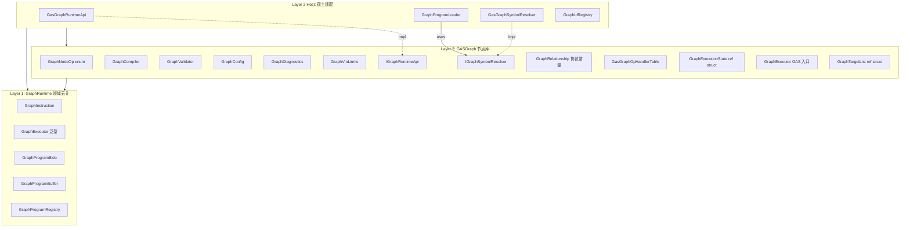

# NodeLibraries 架构设计

# 1 设计概述

## 1.1 本文档定义

本文档定义节点库（NodeLibraries）的三层分层、依赖方向、注入边界与运行时约束。

边界：

- 只覆盖 `NodeLibraries/GASGraph/` 及其 Host 子目录。
- 不覆盖 GraphRuntime 通用 VM（见 `docs/03_基础服务/04_Graph运行时/01_GraphExecutor.md`）。
- 不覆盖 GAS 业务逻辑（见 `docs/04_游戏逻辑/08_能力系统/`）。

非目标：

- 不定义领域语义（GAS/AI/UI 逻辑不在本层裁决）。
- 不做 Phase 2 的 NodeLibraries 分包（Std/Spatial/GAS 拆分属于后续工作）。

## 1.2 设计目标

1. 领域隔离：GraphRuntime 不出现任何领域语义；领域能力只出现在节点库。
2. 显式依赖：Program 对节点库依赖必须可声明、可校验、可 fail-fast。
3. 可测试：节点库可单测，不需启动完整引擎。
4. 热路径 0GC：执行阶段全栈分配，禁止堆分配与 GC 压力。

## 1.3 设计思路

将 Graph 代码分三层，依赖方向严格向下：

```
Layer 1 (GraphRuntime)  ← 领域无关 VM
    ↑
Layer 2 (NodeLibraries/GASGraph)  ← 节点定义 + 编译器 + 协议
    ↑
Layer 2 Host (NodeLibraries/GASGraph/Host)  ← 宿主适配（ECS 桥接）
```

Layer 1 不依赖任何领域或 ECS 类型。Layer 2 非 Host 部分不依赖 `Gameplay.*`。Host 子目录是唯一允许引用 `Gameplay.*` 的边界。

# 2 功能总览

## 2.1 术语表

| 术语 | 定义 |
|---|---|
| GraphRuntime (Layer 1) | 领域无关的指令集 VM：`GraphInstruction`、`GraphExecutor`、`GraphProgramBlob`、`GraphProgramRegistry` |
| GASGraph (Layer 2) | GAS 领域的节点库：ops 枚举、编译器、校验器、配置、handler 表、执行状态 |
| Host (Layer 2 Host) | 宿主适配层：`GasGraphRuntimeApi`、`GasGraphSymbolResolver`、`GraphProgramLoader`、`GraphIdRegistry` |
| `IGraphRuntimeApi` | 节点库对宿主能力的抽象接口（查询、属性、效果、事件） |
| `IGraphSymbolResolver` | 符号解析接口，将字符串名称解析为运行时整型 id |
| `GraphRelationship` | 关系协议常量（Neutral=0, Friendly=1, Hostile=2），解耦节点库与 `TeamRelationship` 枚举 |
| `GraphVmLimits` | 集中管理的 VM 硬限制常量 |

## 2.2 功能导图

- 编译期：`GraphConfig` → `GraphValidator` → `GraphCompiler` → `GraphProgramPackage`
- 加载期：`GraphProgramBlob.Read` → `GraphProgramLoader.PatchSymbols` → `GraphProgramRegistry`
- 运行期：`GraphExecutor.Execute` → `GasGraphOpHandlerTable` → `IGraphRuntimeApi`

## 2.3 架构图



## 2.4 关联依赖

| 方向 | 源 | 目标 | 说明 |
|---|---|---|---|
| Layer 2 → Layer 1 | `GASGraph/*` | `GraphRuntime/*` | 使用 `GraphInstruction`、`GraphProgramBuffer`、`GraphProgramRegistry` |
| Host → Gameplay | `Host/GasGraphRuntimeApi.cs` | `Gameplay.GAS.*`、`Gameplay.Components`、`Gameplay.Teams` | 宿主适配层桥接 ECS |
| Host → Gameplay | `Host/GasGraphSymbolResolver.cs` | `Gameplay.GAS.Registry` | 符号解析代理到 GAS 注册表 |
| Layer 2 → Arch.Core | `GASGraph/*` | `World`、`Entity` | VM 执行状态需要 ECS 实体引用 |
| **禁止** | `GASGraph/*.cs`（非 Host） | `Gameplay.*` | 非 Host 文件不得引用 Gameplay |
| **禁止** | `GraphRuntime/*` | `GASGraph/*` 或 `Gameplay.*` | Layer 1 严格领域无关 |

# 3 业务设计

## 3.1 业务用例与边界

- 编译 GAS 技能图为字节码程序
- 加载编译后的 blob 并解析符号
- 在运行时执行图程序（空间查询 → 目标筛选 → 效果施加）

边界：图程序不直接修改 ECS 结构（不 Add/Remove 组件），所有副作用通过 `IGraphRuntimeApi` 延迟到 `EffectRequestQueue` 和 `GameplayEventBus`。

## 3.2 业务主流程

1. `GraphCompiler.Compile(GraphConfig)` → 校验 → 生成 `GraphProgramPackage`（编译期）
2. `GraphProgramBlob.Write/Read` → 序列化/反序列化（工具管线）
3. `GraphProgramLoader.Load` → 读取 blob → `PatchSymbols`（通过 `IGraphSymbolResolver`）→ 注册到 `GraphProgramRegistry`（加载期）
4. `GraphExecutor.Execute(world, caster, target, targetPos, program, api)` → stackalloc 寄存器 → `GasGraphOpHandlerTable.Execute` → 逐指令 dispatch → handler 调用 `IGraphRuntimeApi`（运行期）

## 3.3 关键场景与异常分支

| 场景 | 行为 |
|---|---|
| 未注册的 opcode（非零） | fail-fast：抛 `InvalidOperationException` |
| opcode 超出 handler 表容量 | fail-fast：抛 `InvalidOperationException` |
| 指令步数超过 `MaxInstructionsPerExecution` | fail-fast：抛 `InvalidOperationException`（防无限跳转循环） |
| 符号索引越界 | fail-fast：抛 `InvalidOperationException` |
| 未知效果模板名 | fail-fast：抛 `InvalidOperationException` |
| 目标实体已死（`!World.IsAlive`） | 静默跳过该操作（不抛异常，下一条指令继续） |

# 4 数据模型

## 4.1 概念模型

- `GraphExecutionState`（ref struct）：单次执行的全部可变状态（寄存器文件 + 目标列表 + API 引用）
- `GraphTargetList`（ref struct）：基于 `Span<Entity>` 的目标集合，提供筛选/排序/去重
- `GraphRelationship`：静态常量类，定义关系协议（Neutral=0, Friendly=1, Hostile=2）
- `EffectArgs`（readonly struct）：效果模板参数（最多 2 个 float）

## 4.2 数据结构与不变量

| 结构 | 类型 | 不变量 |
|---|---|---|
| `GraphExecutionState` | ref struct | 全栈分配，不逃逸到堆 |
| `GraphTargetList` | ref struct | `Count` ≤ `_buffer.Length` ≤ `GraphVmLimits.MaxTargets` |
| Handler 表 | `GasGraphOpHandler[HandlerTableSize]` | 静态单例，生命周期 = 进程 |
| 寄存器文件 | `stackalloc Span<T>` | 每次 Execute 调用独立分配，无跨调用残留 |

## 4.3 生命周期/状态机

执行状态在 `GraphExecutor.Execute` 入口创建（stackalloc），在方法返回时自动销毁。无跨帧生存。

# 5 落地方式

## 5.1 模块划分与职责

| 文件 | 职责 |
|---|---|
| `GraphOps.cs` | `GraphNodeOp` 枚举、`GraphValueType`、`GraphNodeOpParser` |
| `GraphVmLimits.cs` | 寄存器/目标/指令预算/handler 表容量的集中常量 |
| `GraphCompiler.cs` | 从 `GraphConfig` 编译为 `GraphProgramPackage` |
| `GraphValidator.cs` | 图配置校验（循环检测、输入引用检查） |
| `GraphConfig.cs` | 图的 JSON 配置模型 |
| `GraphDiagnostics.cs` | 编译/校验诊断消息 |
| `IGraphRuntimeApi.cs` | 运行时 API 接口 + `IGraphSymbolResolver` 接口 + `GraphRelationship` 常量 + `EffectArgs` |
| `GraphExecutionState.cs` | 执行状态 ref struct |
| `GraphExecutor.cs` | 执行入口（stackalloc + dispatch） |
| `GasGraphOpHandlerTable.cs` | opcode → handler 映射表 + Execute 循环 |
| `GraphTargetList.cs` | 目标集合操作（ref struct） |
| `Host/GasGraphRuntimeApi.cs` | `IGraphRuntimeApi` 的 ECS 实现 |
| `Host/GasGraphSymbolResolver.cs` | `IGraphSymbolResolver` 的 GAS Registry 实现 |
| `Host/GraphProgramLoader.cs` | blob 加载 + 符号绑定（通过注入的 resolver） |
| `Host/GraphIdRegistry.cs` | 图名 ↔ 整型 id 映射 |

## 5.2 关键接口与契约

**IGraphRuntimeApi**：节点 handler 通过此接口查询世界状态和提交副作用。`GetRelationship` 返回值遵循 `GraphRelationship` 协议常量。

**IGraphSymbolResolver**：`GraphProgramLoader` 在加载期通过此接口将字符串符号解析为运行时 id。三个方法：`ResolveTag`、`ResolveAttribute`、`ResolveEffectTemplate`。

**GasGraphOpHandlerTable.Execute 契约**：
- Op == 0 静默 continue
- Op 超出表容量 → 抛异常
- Op 在表中但 handler == null → 抛异常
- 步数超过 `MaxInstructionsPerExecution` → 抛异常

## 5.3 运行时关键路径与预算点

| 预算点 | 值 | 来源 |
|---|---|---|
| 浮点寄存器 | 32 | `GraphVmLimits.MaxFloatRegisters` |
| 整型寄存器 | 32 | `GraphVmLimits.MaxIntRegisters` |
| 布尔寄存器 | 32 | `GraphVmLimits.MaxBoolRegisters` |
| 实体寄存器 | 32 | `GraphVmLimits.MaxEntityRegisters` |
| 目标列表容量 | 256 | `GraphVmLimits.MaxTargets` |
| 单次执行指令上限 | 4096 | `GraphVmLimits.MaxInstructionsPerExecution` |
| Handler 表容量 | 256 | `GraphVmLimits.HandlerTableSize` |

# 6 与其他模块的职责切分

## 6.1 切分结论

| 职责 | 归属 | 禁止 |
|---|---|---|
| 指令格式、通用执行循环、序列化 | GraphRuntime (Layer 1) | 不引用 ECS 或 Gameplay |
| ops 枚举、编译、校验、handler、协议 | GASGraph (Layer 2) | 非 Host 文件不引用 Gameplay |
| ECS 桥接（组件读写、空间查询、事件发布） | Host (Layer 2 Host) | 不定义新 ops 或编译逻辑 |
| 效果实际生效（创建 effect 实体、修改属性） | GAS Systems | 不直接调用 Graph |

## 6.2 为什么如此

- GraphRuntime 领域无关是为了未来复用（AI 决策图、UI 状态图等可用同一 VM）。
- Host 子目录隔离 Gameplay 依赖，使非 Host 代码可在无 GAS 环境下单测。
- `IGraphSymbolResolver` 解耦符号解析，使 `GraphProgramLoader` 不直接依赖具体 Registry 类型。

## 6.3 影响范围

| 消费者 | 引用的 namespace |
|---|---|
| `GameEngine.cs` | `GraphRuntime`、`NodeLibraries.GASGraph.Host` |
| `Ludots.Tool/Program.cs` | `GraphRuntime`、`NodeLibraries.GASGraph` |
| 测试文件（7 个） | `NodeLibraries.GASGraph`、`NodeLibraries.GASGraph.Host`、`GraphRuntime` |

# 7 当前代码现状

## 7.1 现状入口

| 模块 | 路径 |
|---|---|
| GraphRuntime (Layer 1) | `src/Core/GraphRuntime/` |
| GASGraph (Layer 2) | `src/Core/NodeLibraries/GASGraph/` |
| Host (Layer 2 Host) | `src/Core/NodeLibraries/GASGraph/Host/` |

## 7.2 差距清单

| 差距 | 优先级 | 说明 |
|---|---|---|
| NodeLibraries 分包（Std/Spatial/GAS） | Phase 2 | 当前全在 GASGraph 一个包 |
| TimeSlice 支持（暂停/恢复） | Phase 2 | 当前只有硬上限熔断 |
| ISymbolResolver 通用化（operand kind 机制） | Phase 2 | 当前接口已注入，但仅 GAS 三类符号 |
| `GasGraphOpHandlerTable` 不实现 `IOpHandlerTable<T>` | .NET 限制 | ref struct 不支持泛型约束 |

## 7.3 迁移策略与风险

已完成迁移：Layer 3（`Gameplay/GAS/Graph/`）已清空，13 个重复文件已删除，4 个保留文件移入 Layer 2。详见 `docs/03_基础服务/04_Graph运行时/04_Graph去重重构_对齐报告.md`。

# 8 验收条款

| # | 条款 | 验证方法 | 证据入口 |
|---|---|---|---|
| 1 | GraphRuntime 不引用 `Gameplay.*` 或 `NodeLibraries.*` | `rg "using Ludots.Core.Gameplay\|using Ludots.Core.NodeLibraries" src/Core/GraphRuntime/` 无结果 | `src/Core/GraphRuntime/` |
| 2 | GASGraph 非 Host 文件不引用 `Gameplay.*` | `rg "using Ludots.Core.Gameplay" src/Core/NodeLibraries/GASGraph/*.cs` 无结果 | `src/Core/NodeLibraries/GASGraph/*.cs` |
| 3 | 执行热路径 0GC | `GraphPerfTests` stackalloc 覆盖 + 无 new 分配 | `src/Tests/GasTests/GraphPerfTests.cs` |
| 4 | 未注册 opcode（非零）fail-fast | `GasGraphOpHandlerTable.Execute` 抛异常 | `src/Core/NodeLibraries/GASGraph/GasGraphOpHandlerTable.cs` |
| 5 | 指令步数超限 fail-fast | `MaxInstructionsPerExecution` 熔断 | `src/Core/NodeLibraries/GASGraph/GraphVmLimits.cs` |
| 6 | 全部 24 个 Graph 测试通过 | `dotnet test --filter "FullyQualifiedName~Graph"` | `src/Tests/GasTests/` |
