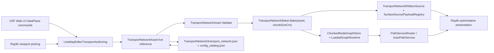

# ADR-0004: In-session Transport Network Editor Boundary

Status: Accepted

Related: [#462](https://github.com/MightyBubble/Ludots/issues/462), [#415](https://github.com/MightyBubble/Ludots/issues/415), [#451](https://github.com/MightyBubble/Ludots/issues/451), [#372](https://github.com/MightyBubble/Ludots/issues/372)

## Context

Epic #451 delivered the in-session Live Map Editor shell: Raylib viewport picking, CEF Web UI DataPlane commands, Core state mutation, runtime nav debug overlays, and in-process save. Epic #415 delivered the reusable transport-network Core chain:

```text
TransportNetworkAsset
  -> TransportNetworkBaker.Bake(asset, chunkSizeCm)
  -> graphChunks + ribbonChunks
  -> ChunkedNodeGraphStore / LoadedGraphRuntime
  -> TransportNetworkRibbonSource / SurfaceSourcePayloadRegistry
  -> Raylib surface/ribbon presentation
```

Epic #462 connects those two lines. The risk is drift: an editor could accidentally create a private road graph, bake a second ribbon format in JavaScript, write `.graph` directly, or encode cost in the transport asset.

## Decision

The in-session transport editor is a Live Map Editor capability slice, not a new editor runtime.

1. The live authoring source is exactly one mutable `TransportNetworkAsset` loaded through `TransportNetworkAssetLoader`.
2. The only derive step is `TransportNetworkBaker.Bake(asset, chunkSizeCm)`.
3. Rebuild correctness is whole-asset bake plus replacement of Core graph/ribbon derived outputs. Fine-grained incremental bake can be added later, but cannot change the SSOT.
4. Graph refresh goes through `ChunkedNodeGraphStore` and `LoadedGraphRuntime`; editor code must not write a private route graph.
5. Ribbon refresh goes through `TransportNetworkRibbonSource` and `SurfaceSourcePayloadRegistry`; Raylib/Core remains the authoritative viewport renderer. The Web UI must not reconstruct ribbon geometry. Runtime and editor callers use `TransportNetworkRibbonSource.ComposeDefaultSurfaceScopeId` so live edits replace the same derived ribbon scope instead of publishing a parallel ribbon.
6. Route validation reuses `GraphEdgeProjectionQuery`, `LoadedChunkSolvePrimer`, `PolylineGoalSnapQuery`, `PathServiceRouter` / `AutoPathService`, and `PathStore`.
7. The editor edits topology, geometry, area/tag, capacity, and flow only. Cost remains owned by `Navigation/pathing.json`, `AgentProfile` draft/beam, and optional `GraphEdgeCostOverlay`.
8. Save writes `TransportNetwork/transport_network.json`, ensures the `config_catalog.json` `Replace` entry, then round-trips through `TransportNetworkAssetLoader`.
9. Naming in reusable/editor code stays neutral: transport nodes, segments, areas, capacity, and flow. Road, water, and rail are data/configurations, not separate editor-owned systems.

## Consequences

- A transport edit is visible only after Core validates the asset and the baker derives graph/ribbon chunks.
- Deleted or moved segments cannot leave stale graph chunks because refresh clears the old graph source before loading the new baked chunks.
- Runtime and editor ribbon output share one Core scope convention; otherwise the editor would visually stack stale and freshly baked ribbons.
- The Web UI can expose dense controls, but it remains a control plane. It is not evidence for geometry, routing, or runtime rendering correctness.
- Save is part of the same topbar save story as #451: when a transport asset is loaded, `saveMap` saves map authoring assets and the transport asset together.

## Data Flow


