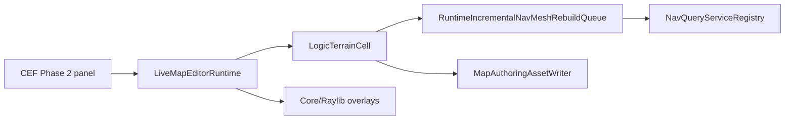

# ADR-0005: Live Map Editor Phase 2 Parity Boundary

Status: Accepted

Related: [#451](https://github.com/MightyBubble/Ludots/issues/451), [#473](https://github.com/MightyBubble/Ludots/issues/473), [#474](https://github.com/MightyBubble/Ludots/issues/474)

## Context

#451 Phase 2 asks the in-session CEF panel to cover the old React/Three.js editor feature surface while keeping the Core/Raylib editor path authoritative. The risk is parity drift: the panel could copy old UI concepts that have no live Core authoring field, call the old `Ludots.Editor.Bridge` HTTP path, or render a second 3D truth in JavaScript.

The current live Grid terrain SSOT is `LogicTerrainCell`:

- `HeightLevel`
- `WaterHeightLevel`
- `SurfaceFlags` (`Water`, `Ramp`, `Blocked`)
- `AreaId`
- `Cost`

The old React terrain byte layout also contains biome, vegetation, snow, mud, ice, and additional layer-oriented editor concepts. Those values are not live `LogicTerrainCell` fields and the Grid import path currently ignores them for Core `LogicTerrainField`.

## Decision

Phase 2 parity is implemented as controls over existing Core authoring state and derived runtime outputs.

1. The panel continues to use WebUI DataPlane commands and snapshots only. It does not call or migrate `Ludots.Editor.Bridge`.
2. Core/Raylib remains the only in-session 3D viewport. The Web UI may draw a 2D minimap inspector, but it must not reconstruct terrain, navmesh, transport, or entity geometry as a parallel world renderer.
3. Grid cell brush parity is bounded to `LogicTerrainCell`: set/raise/lower height, water height/bucket, area, cost, blocked, and ramp.
4. Territory parity maps to `AreaId` in this Grid path.
5. Biome, vegetation, snow, mud, ice, and layer paint are deferred until a Core-owned authoring field or sparse board-field SSOT exists. The panel must not serialize private fields to mimic the old byte layout.
6. Transport controls are available only when the focused map has exactly one `NodeGraph` board. No `NodeGraph` board and multiple `NodeGraph` boards are fail-fast states surfaced in the panel; controls are disabled instead of using a fallback board.
7. Live bake controls target only runtime-incremental CDT through `RuntimeIncrementalNavMeshRebuildQueue`. Recast runtime baking remains outside this editor path.
8. Path simulation selects layer/profile over `NavQueryServiceRegistry` / `NavMeshProfileRegistry`. `MaxPortals` is passed to `NavQueryService.TryFindPath` so the panel budget affects the authoritative Core query.
9. Entity palette comes from `EntityTemplateKeyRegistry.SnapshotMappings()`. Selected entity override editing writes strict JSON to `MapConfig.Entities[].Overrides` and persists through `MapAuthoringAssetWriter`; reload behavior remains bounded by the current `MapLoader` component override contract.
10. Obstacle brush parity writes authored geometry only: `ManifestationObstacleIntent2D`, optional `ManifestationObstaclePolygon2D`, and `RuntimeNavMeshStructuralObstacle`. Derived physics/nav components remain owned by the existing bridge and runtime dirty systems.
11. Raylib WYSIWYG terrain rendering may consume optional `IVisualTerrainRenderFeatureSource` metadata for live Grid terrain styling. This does not change `IVisualHeightmap` sampling semantics; water mesh, area tint, blocked tint, and ramp/cliff edge lines are derived render metadata from `LogicTerrainCell`.
12. Map/Board lifecycle parity writes `MapConfig.Boards[]` through Core authoring and marks reload required. `BoardConfig.NavigationEnabled` is a board setting only in this path; the editor does not auto-toggle `Feature.NavMesh:On` because that global map tag makes load fail-fast on missing `.ntil` assets.

## Consequences

- The in-session editor can be dense and close to the old UI without importing old transport, rendering, or save paths.
- No-map and no-NodeGraph states are visible authoring states, not hidden defaults.
- The Phase 2 panel can expose disabled controls only when the underlying Core contract is absent; adding those fields later requires a Core SSOT decision first.
- Saved Grid terrain remains reloadable through `.ltrn` because authored cells match `LogicTerrainBinary`.
- Raylib can visually match the in-scope React grid concepts without reviving a JS 3D renderer or encoding private biome/vegetation bytes.
- New map/add board/update/delete board commands reuse `MapAuthoringAssetWriter` and `GameEngine.LoadMap`; they do not hot-build boards inside the running session.

## Field Classification

| Old editor concept | Live Core SSOT | Phase 2 result |
|---|---|---|
| Height | `LogicTerrainCell.HeightLevel` | Go |
| Water | `LogicTerrainCell.WaterHeightLevel` + `SurfaceFlags.Water` | Go |
| Ramp | `LogicTerrainCell.SurfaceFlags.Ramp` | Go |
| Blocked | `LogicTerrainCell.SurfaceFlags.Blocked` | Go |
| Area / territory | `LogicTerrainCell.AreaId` | Go |
| Cost | `LogicTerrainCell.Cost` | Go |
| Map/Board lifecycle | `MapConfig.Boards[]` | Go with save+reload |
| Biome | none in live Grid `LogicTerrainCell` | Deferred |
| Vegetation | none in live Grid `LogicTerrainCell` | Deferred |
| Snow / mud / ice | none in live Grid `LogicTerrainCell` | Deferred |
| Layers | no live board-field SSOT in this path | Deferred |

## Data Flow

