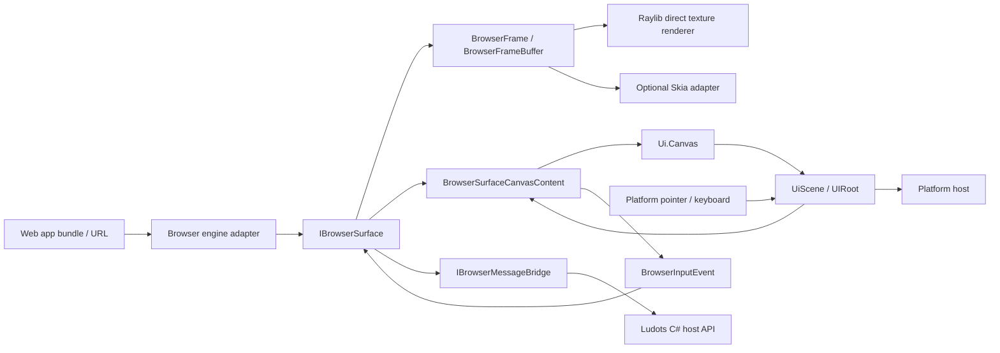

# Browser UI Runtime

This document defines Ludots' browser-backed UI runtime boundary. It exists for real web applications that require a browser engine, JavaScript, DOM APIs, networking, WASM, and web framework bundles. It is separate from the native Ludots UI Markup authoring path described in `ui_runtime_architecture.md`.

## 1 Goals And Boundaries

Goals:

- Run arbitrary web applications inside Ludots through a browser surface abstraction.
- Keep browser engine choice platform-neutral while limiting built-in providers to CEF and Ultralight.
- Reuse the existing Ludots UI runtime as the host composition layer instead of creating another UI tree.
- Keep pointer, keyboard, focus, and alpha hit-test semantics routed through Ludots UI.
- Allow platform adapters to render browser frames directly as native textures when performance matters.
- Keep web-to-host communication explicit through message and script bridge contracts.

Non-goals:

- Do not add UE5 or any commercial engine adapter back into Core.
- Do not turn `Ludots.UI.HtmlEngine` Markup into a browser.
- Do not introduce a JavaScript runtime into native Compose / Reactive / Markup.
- Do not bind Core contracts to CEF-specific types, HWNDs, OS web views, or UE textures.
- Do not add any provider outside CEF and Ultralight to the formal Core provider set.

## 2 BLUI Reference Shape

BLUI's useful pattern is its off-screen browser boundary:

- CEF renders into a BGRA pixel buffer.
- `OnPaint` provides dirty rectangles and a full buffer.
- The host copies dirty rectangles into a texture.
- Host input is translated into browser pointer, wheel, and key events.
- Host-to-web calls execute JavaScript.
- Web-to-host calls use browser process messages.

Ludots keeps this shape but removes UE-specific ownership. The Ludots boundary is a browser surface that emits frames, accepts input, accepts navigation, and exposes a message bridge.

## 3 Assembly Split

### 3.1 `Ludots.UI.Browser`

`src/Libraries/Ludots.UI.Browser/` contains platform-neutral contracts only:

| Type | Responsibility |
|------|----------------|
| `IBrowserRuntime` | Creates browser surfaces from a viewport and optional resource resolver. |
| `BrowserRuntimeInfo` | Identifies the concrete provider and its capabilities. |
| `BrowserEngineKind` | Formal built-in provider identity: `Cef` or `Ultralight`. |
| `BrowserEngineCapabilityProfiles` | Canonical capability profiles for CEF and Ultralight. |
| `IBrowserSurface` | Owns one browser view: navigation, resize, input, latest frame, frame events, lifecycle. |
| `IBrowserMessageBridge` | Web-to-host messages and host-to-web script/message calls. |
| `IBrowserResourceResolver` | Optional app-local resource loading hook. |
| `BrowserAppResourceResolver` | BCL-only resolver for local web app bundles such as `index.html`, JS, CSS, WASM, fonts, and assets. |
| `BrowserFrame` | Immutable frame snapshot: viewport, pixel format, pixels, row bytes, dirty rects, sequence. |
| `BrowserFrameBuffer` | Thread-safe owned buffer for full-frame and dirty-rect updates. |
| `BrowserInputEvent` | Pointer, wheel, and key input contract. |
| `BrowserNavigationRequest` | Navigation target. |
| `BrowserSurfaceCanvasContent` | Platform-neutral `Ui.Canvas(...)` payload that owns browser input forwarding, focus, viewport resize, and alpha hit-test. |

Dependency rule: `Ludots.UI.Browser` may reference the platform-neutral `Ludots.UI` runtime so browser surfaces can participate in `UiScene` hit testing and input focus. It must not reference SkiaSharp, CEF native types, Ultralight native types, Raylib, UE5, or any platform adapter.

### 3.2 `Ludots.UI.Browser.Skia`

`src/Libraries/Ludots.UI.Browser.Skia/` adapts browser frames into the Skia UI path for adapters that choose Skia presentation:

| Type | Responsibility |
|------|----------------|
| `SkiaBrowserFrameRenderer` | Converts `BrowserFrame` pixels into `SKImage` and draws into a destination `SKRect`. |
| `BrowserCanvasContent` | Extends `BrowserSurfaceCanvasContent` and implements `ISkiaUiCanvasContent` so Skia renderers can draw browser frames. |

`Ludots.UI.Skia` exposes `ISkiaUiCanvasContent` so Skia canvas nodes are extensible without making the native `Ludots.UI` assembly know about Skia.

## 4 Data Flow



The existing `UiScene` remains the composition, layout, hit-test, and focus owner. The browser surface is a canvas payload inside that scene. Rendering is adapter-owned: Skia can draw it through `Ludots.UI.Browser.Skia`, while Raylib can upload dirty rectangles directly to a Raylib `Texture2D` for a BLUI-like low-overhead path.

The current Raylib path is:

```text
CEF OnPaint -> BrowserFrame dirty rects -> BrowserSurfaceCanvasContent -> RaylibBrowserLayerRenderer -> Raylib Texture2D
```

This bypasses the Skia UI framebuffer for browser pixels. Mouse, wheel, keyboard, focus, and alpha hit-test still pass through `UIRoot` / `UiScene`, so gameplay input capture remains unified.

## 5 Message Bridge

The bridge is intentionally string-based at the contract layer:

- Browser-to-host: `MessageReceived` emits `BrowserScriptMessage(Channel, Payload)`.
- Host-to-browser: `PostMessageAsync` sends structured payloads to the web app.
- Host-to-browser script execution: `ExecuteScriptAsync` is available for engine adapters that support direct script execution.
- Browser applications must target Ludots-owned script facades, not provider private globals. Generic application messages use `window.ludotsBrowser`; DataPlane traffic uses `window.ludotsDataplane`.

Higher-level C# API binding, permission checks, serialization, and Ludots gameplay/service routing must be built above `IBrowserMessageBridge`, not inside the pixel renderer.

`src/Libraries/Ludots.WebUI/` already provides a Mod-facing event facade (`IWebUIBridge`, `IWebUIBridgeFactory`, `ModWebEventScope`). That library is not a browser surface runtime: it does not own frames, dirty rectangles, viewport resize, input forwarding, or packaged web app resources. Its intended relationship to Browser UI is:

- `Ludots.UI.Browser` remains the lower-level engine-neutral surface contract.
- `Ludots.WebUI` remains the higher-level Mod event API.
- Future `IWebUIBridge` implementations should route their transport through `IBrowserSurface.Messages` / `IBrowserMessageBridge`.
- `Ludots.UI.Browser` must not reference `Ludots.WebUI`; the dependency points from high-level facade to low-level browser surface, not the other way around.

## 6 WebUI DataPlane

`Ludots.WebUI` owns the WebUI DataPlane above this browser runtime. The DataPlane is the Mod-facing topic/event layer for feeding gameplay, collection, marker, and panel data into web applications.

The DataPlane is not another browser runtime. It must reuse existing Core infrastructure:

- `EntityCollectionStore` is the collection and window-query foundation for WebUI entity lists, inspectors, command-source panels, spatial query results, GAS graph result views, and debug lists.
- `MinimapMarkerBuffer` and `MinimapScreenMarkerBuffer` provide the model for high-frequency marker/entity topics: SoA fields, explicit capacity, bucket keys, staged/materialized buckets, stable ids, and drop diagnostics.
- `IBrowserMessageBridge` is only the browser transport for DataPlane messages when a browser surface is present.

Transport choices are adapter details:

- Ludots-started CEF is the built-in compatibility path for arbitrary web applications hosted through `Ludots.UI.Browser.Cef`.
- UE5 BLUI is an external commercial-engine transport adapter path. It may forward DataPlane messages through BLUI/CEF, but it does not enter Core and must not define collection, marker, or topic semantics.
- Provider globals such as CEF/CefSharp or BLUI-specific objects are adapter-private. The adapter may use them to install Ludots facades, but web app source and shipped Mod assets must not call them directly.

Both paths share the same `Ludots.WebUI` DataPlane vocabulary. Browser-side caches are derived views invalidated by Ludots-owned revision/sequence diagnostics, not a separate source of truth.

See `webui_dataplane_architecture.md` for the formal DataPlane boundary.

## 7 Engine Adapter Contract

A concrete engine adapter must implement:

- `IBrowserRuntime`
- `IBrowserSurface`
- `IBrowserMessageBridge`
- browser engine lifecycle and process ownership
- off-screen frame delivery into `BrowserFrameBuffer`
- pointer, wheel, key, focus, IME, and resize translation
- resource resolver integration for local app bundles
- local packaged web apps through `BrowserAppResourceResolver`

Formal built-in providers:

| Provider | Assembly | Role |
|----------|----------|------|
| CEF | `Ludots.UI.Browser.Cef` | Full Chromium compatibility path. Use when arbitrary web apps, Chrome-equivalent APIs, WebGL, and maximum web compatibility matter. |
| Ultralight | `Ludots.UI.Browser.Ultralight` | Lightweight game UI path. Use when Ludots controls the web bundle and wants a smaller, game-oriented runtime. |

CEF remains the compatibility baseline. Ultralight is a first-class optional provider, but it must not be documented as Chrome-equivalent. Provider-specific native handles, callbacks, and package layout stay inside provider assemblies.

### 7.1 CEF Process Lifetime

CEF is a process-scoped native runtime. Once `Cef.Shutdown()` has run, CefSharp does not support creating a fresh CEF runtime later in the same process. Ludots therefore treats CEF initialization, assembly resolution, custom-scheme registration, and the browser surface registry as a process-scoped host/runtime adapter implementation detail.

The CEF provider is host-owned Ludots infrastructure, not a Mod. Raylib, UE bridge hosts, and future hosts must install CEF from their composition root through the `Ludots.UI.Browser.Cef` host facade before game start when their resolved application configuration requires browser runtime support. A Mod may request or require `browserRuntime` as application configuration, and it may consume `IBrowserRuntime`; it must not ship, locate, initialize, register, or unload CEF.

Hosts that load a provider from `browserRuntime.providerAssemblyPath` should use `Ludots.UI.Browser.BrowserRuntimeProviderLoader`. The loader shadow-copies the provider output directory into a hash-addressed cache, loads the provider implementation through a collectible ALC, keeps browser contracts such as `IBrowserRuntime` in the host ALC, and resolves provider-private managed/native dependencies from the shadow-copied provider package. This prevents long-lived editor hosts from locking source build outputs such as `Ludots.UI.Browser.Cef.dll`.

`CefBrowserRuntime` is only the `IBrowserRuntime` facade exposed to a game engine or mod session. Disposing a `CefBrowserRuntime` releases the browser surfaces owned by that facade, but it must not call `Cef.Shutdown()` or unregister process-wide CEF state. Repeated editor sessions such as UE PIE must be able to create a new facade in the same host process.

The CEF process runtime is a deep internal module behind that facade. It owns the single CEF initialization path and the process-stable `ludots-app://` scheme handler. The surface resource registry used by that scheme handler must also be process-scoped rather than assembly-instance-scoped: repeated editor sessions may load `Ludots.UI.Browser.Cef` through a fresh host ALC while CEF still holds the first scheme handler instance. Newly created browser surfaces must therefore register their resource resolver in process storage that the original scheme handler can still read.

If a future host needs an explicit CEF shutdown hook, that hook must be host-owned and terminal: it may only run when the host process will not attempt to create another CEF runtime. It must not be reachable from `IBrowserRuntime.DisposeAsync`, mod unload, surface disposal, or ordinary editor play-session teardown. UE5 bridge integrations must follow the same rule: Ludots owns CEF bootstrap and process state; UE PIE/session reload is only an application lifecycle event and cannot own CEF shutdown or reinitialization.

## 8 Relation To Native UI

Native Ludots UI remains the default framework for engine UI:

- Compose and Reactive are C# authoring paths.
- Markup is HTML/CSS authoring mapped into native `UiScene`.
- Markup remains JavaScript-free.
- Browser UI is for real web apps that need browser semantics.

Use Browser UI when the application must run a web framework bundle, third-party web widget, JS/WASM app, or a DOM API that native Markup does not implement.

Use native UI when the screen belongs to Ludots runtime presentation and can be modeled in `UiScene`.

Choose CEF when "any web app" compatibility is the product requirement. Choose Ultralight when the app bundle is owned by Ludots and the priority is lightweight in-game UI.

## 9 Acceptance Evidence

Current contract tests:

- `src/Tests/UiBrowserTests/BrowserFrameBufferTests.cs`
- `src/Tests/UiBrowserTests/BrowserCanvasContentTests.cs`
- `src/Tests/UiBrowserTests/BrowserContractDependencyTests.cs`
- `src/Tests/UiBrowserTests/BrowserAppResourceResolverTests.cs`
- `src/Tests/UiBrowserTests/BrowserEngineContractTests.cs`

They verify dirty-rect copying, Skia frame drawing, existing `Ui.Canvas(...)` integration, and the platform-neutral dependency boundary.
