# Startup Entrypoints

This document describes the end-to-end startup path from launcher entrypoint to adapter app and first map load.

Current product entrypoints:

- web launcher
- launcher CLI

Both reuse the same backend.

## 1. Wrapper Scripts

- `scripts/run-mod-launcher.ps1`
  - without `cli`: build the web launcher, ensure the bridge is alive, open the launcher URL
  - with `cli`: forward to `src/Tools/Ludots.Launcher.Cli/Program.cs`
- `scripts/run-mod-launcher.cmd`
  - Windows wrapper that forwards arguments to `run-mod-launcher.ps1`

Canonical commands:

```powershell
.\scripts\run-mod-launcher.cmd
.\scripts\run-mod-launcher.cmd cli <command> ...
```

Canonical web URLs:

- product URL: `http://localhost:5299/launcher/index.html`
- redirect: `http://localhost:5299/` -> `/launcher/index.html`
- redirect: `http://localhost:5299/launcher` -> `/launcher/index.html`
- compatible static path: `http://localhost:5299/launcher/`
- non-entrypoint: `http://localhost:5299/index.html`

## 2. Shared Launcher Backend

Shared backend lives in `src/Tools/Ludots.Launcher.Backend`.

Core responsibilities:

- resolve selectors, bindings, presets, and dependency closure
- materialize a launch plan graph artifact for reproducible orchestration
- surface startup diagnostics
- build required mods and adapter apps
- export SDK ref DLLs
- write `launcher.runtime.json`
- launch the chosen adapter

CLI calls the backend directly.

Web launcher calls the same backend through:

- `src/Tools/Ludots.Editor.Bridge/Program.cs`

Bridge route contract:

| Route | Behavior |
|------|------|
| `/health` | returns `{ ok: true }` when bridge is ready |
| `/api/launcher/state` | launcher state + discovered mods |
| `/api/presets` | preset state APIs |
| `/` | 302 -> `/launcher/index.html` |
| `/launcher` | 302 -> `/launcher/index.html` |
| `/launcher/` | static launcher root |
| `/launcher/index.html` | canonical launcher document |

## 3. Resolve Stage

Selector inputs supported by the launcher:

- `$alias`
- `alias`
- `mod:<ModId>`
- `path:<mod-root>`
- `preset:<presetId>`

Resolve behavior:

1. load repository config and user overlay
2. scan configured roots recursively for `mod.json`
3. expand bindings and presets
4. resolve root mods
5. compute ordered dependency closure
6. compute startup diagnostics
7. persist launch planning metadata for build and runtime stages

Current startup data flow:

```mermaid
flowchart LR
    A["User intent<br/>selector / preset / adapter"] --> B["Launcher backend<br/>ResolvePlan(...)"]
    B --> C["Launch graph artifact<br/>artifacts/launcher/&lt;adapter&gt;.launch.graph.json"]
    C --> D["launcher.runtime.json<br/>adapter bootstrap carrier"]
    D --> E["GameBootstrapper"]
    E --> F["ResolvedModLoadPlan"]
    F --> G["GameEngine.InitializeWithConfigPipeline(...)"]
    G --> H["ModLoader.LoadResolvedPlan(...)"]
    H --> I["ConfigPipeline.MergeGameConfig()"]
    I --> J["Startup map load"]
```



Startup diagnostics include:

- `defaultCoreMod`
- `startupMapId`
- `startupInputContexts`
- conflict warnings for multi-root launches

## 4. Bootstrap Files

### 4.1 `launcher.runtime.json`

This is the runtime bootstrap written by the launcher.

Responsibilities:

- provide adapter bootstrap carrier data only
- point runtime at the launcher-owned graph artifact
- carry plan metadata links such as `LaunchGraphPath`, `LaunchGraphFullPath`, `PlanFingerprint`, `PlanSchemaVersion`, and `PlanGeneratedAtUtc`

Minimum product contract:

- `LaunchGraphPath` or `LaunchGraphFullPath`
- optional integrity metadata:
  - `PlanFingerprint`
  - `PlanSchemaVersion`
  - `PlanGeneratedAtUtc`

Rules:

- product bootstrap must include graph metadata
- runtime now rejects product bootstrap files that do not point to a launcher graph
- launcher no longer writes `ModPaths` into `launcher.runtime.json`

It is intentionally not the long-term store for preferences, presets, or repository scan config.
Current implementation evidence:

- `src/Tools/Ludots.Launcher.Backend/LauncherService.cs`
- `src/Core/Hosting/GameBootstrapper.cs`

### 4.2 Launcher Graph Artifact

Launcher graph artifacts represent resolved launch truth from selector intent.
They are generated by launcher orchestration and hold the runtime-authoritative plan metadata such as:

- expanded selectors and resolved roots
- ordered mod closure
- `orderedModIds`
- `plannedMods[].id`
- `plannedMods[].rootPath`
- adapter descriptor resolution
- build/runtime planning metadata
- diagnostics and conflict decisions

The runtime-readable graph shape is owned by Core in `src/Core/Hosting/LauncherGraphDocument.cs`.
`src/Tools/Ludots.Launcher.Backend/LauncherService.cs` writes that same contract, and
`src/Core/Hosting/GameBootstrapper.cs` reads it with strict camel-case JSON options. This keeps the
launcher output and runtime input on one DTO contract instead of maintaining parallel graph shapes.

Current default path:

- `artifacts/launcher/<adapter>.launch.graph.json`

Runtime-critical fields:

- `schemaVersion`
- `planFingerprint`
- `orderedModIds`
- `plannedMods[].id`
- `plannedMods[].rootPath`

Launcher-owned metadata envelope:

- `adapter`
- `buildMode`
- `selectors`
- `rootModIds`
- `plannedMods[].projectPath`
- `plannedMods[].mainAssemblyPath`
- `plannedMods[].kind`
- `plannedMods[].buildState`
- `plannedMods[].bindingNames`
- `runtimeArtifacts`
- `diagnostics`

Metadata outside the runtime-critical field set is diagnostic/tooling-owned, but it is still part of
the official launcher graph contract. Runtime bootstrap must accept these known fields and must not
silently ignore unknown graph fields.

Integrity metadata:

- `planFingerprint`
- `generatedAtUtc`

Current adapter apps still start from `launcher.runtime.json`, but runtime bootstrap now requires the linked launcher graph for ordered mod loading and graph integrity checks.
The bootstrap file remains the adapter-facing carrier, while graph artifacts act as the current runtime planning authority short of a separate lock contract.
Current implementation evidence:

- `src/Core/Hosting/LauncherGraphDocument.cs`
- `src/Tools/Ludots.Launcher.Backend/LauncherModels.cs`
- `src/Tools/Ludots.Launcher.Backend/LauncherService.cs`
- `src/Core/Hosting/GameBootstrapper.cs`
- `src/Tests/ArchitectureTests/LauncherBootstrapContractTests.cs`

### 4.3 Future Lock Artifact

Lock artifacts are a future strengthening step, not a current file contract.
They would freeze additional cross-environment inputs such as manifest hashes, shared-assembly policy, and SDK/export bands.

### 4.4 `game.json`

`game.json` is optional.

- product launcher path: not required
- direct adapter debug path: still allowed as an explicit content/bootstrap convenience file outside the product launcher contract

Gameplay configuration still comes from the merged config pipeline over core assets plus selected mods.

## 5. Adapter App Stage

Adapter entrypoints:

- Raylib: `src/Apps/Raylib/Ludots.App.Raylib/Program.cs`
- Web: `src/Apps/Web/Ludots.App.Web/Program.cs`

Both adapter apps accept an explicit bootstrap file path. If none is provided, they read `launcher.runtime.json`.

## 6. Engine Initialization Stage

`src/Core/Hosting/GameBootstrapper.cs` and `src/Core/Engine/GameEngine.cs` handle:

1. locating repository assets
2. restoring an ordered mod load plan from launcher graph metadata or explicit direct-debug input
3. validating graph order, mod roots, manifests, and dependency/version constraints against that plan
4. loading mods in launcher-defined dependency order without re-resolving
5. loading all code mods in a single launch-plan `ModLoadContext` so the plan shares one type universe across dependent mods
6. merging final `GameConfig`
7. starting systems and loading the selected startup map

Only one startup map is entered at runtime even for multi-root launch. The winning source is surfaced by launcher diagnostics.

## 7. Direct Debug Path

```powershell
dotnet run --project src/Apps/Raylib/Ludots.App.Raylib/Ludots.App.Raylib.csproj -c Release -- launcher.runtime.json
dotnet run --project src/Apps/Web/Ludots.App.Web/Ludots.App.Web.csproj -c Release -- launcher.runtime.json
```

This path is useful for debugger attachment, but it does not replace the product launcher contract.

## 8. Service Injection Boundary

Startup service ownership is being tightened around typed keys.

Current rule set:

- new startup/init code should use `CoreServiceKeys` or mod-local `*ServiceKeys`
- `GlobalContext` direct lookup is compatibility-only
- product startup correctness must not depend on ad-hoc string keys being written in the right order

Current evidence:

- `src/Core/Scripting/CoreServiceKeys.cs`
- `src/Core/Scripting/ServiceKey.cs`
- `mods/CoreInputMod/CoreInputServiceKeys.cs`
- `mods/CoreInputMod/Triggers/InstallCoreInputOnGameStartTrigger.cs`
- `src/Core/Modding/ModLoader.cs`
- `src/Core/Modding/ModLoadContext.cs`

## 9. Related Docs

- [Launcher CLI Runbook](../reference/cli_runbook.md)
- [Environment Setup](../conventions/03_environment_setup.md)
- [Unified Launcher RFC](../rfcs/RFC-0001-unified-launcher-cli-and-workspace.md)
- [Launcher SSOT and User-First Endgame](launcher_ssot_user_first.md)
