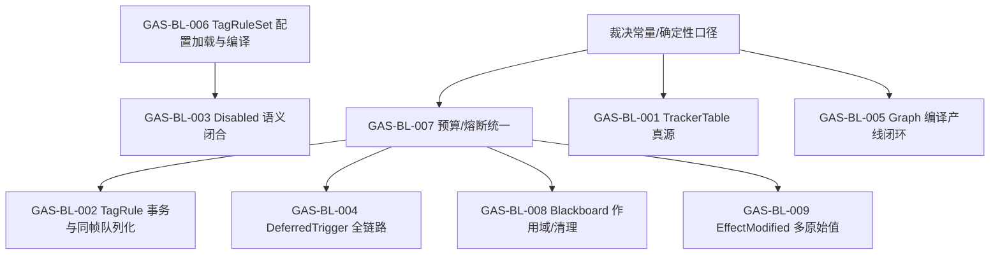

# GAS 功能缺口 Backlog（vNow）

本文件把“未实现 / 待落地 / 已实现但口径不闭合”的条目整理成可执行任务卡，便于按条验收关闭。

## 口径与约束（强制）

- 常量唯一真源：以 [10_关键裁决条款.md](file:///c:/AIProjects/Ludots/docs/08_%E8%83%BD%E5%8A%9B%E7%B3%BB%E7%BB%9F/01_%E6%8A%80%E6%9C%AF%E8%AE%BE%E8%AE%A1/10_%E5%85%B3%E9%94%AE%E8%A3%81%E5%86%B3%E6%9D%A1%E6%AC%BE.md) 附录A为准（禁止在其他位置重复定义）。  
- 禁止静默 fallback：任何“默认值继续跑/忽略异常”的路径必须明确为 L1（可丢弃、可观测）或 L2（熔断、可回滚）并可审计。  
- 时间单位：运行时只允许帧（durationFrames/periodFrames），秒制字段必须在加载/编译期拒绝。  
- 确定性：排序 tie-break 必须以裁决定义为准（Priority -> TemplateId -> EntityId，批次内排序 + 批次 FIFO）。  
- 热路径零 GC：热路径禁止托管分配；结构变更必须集中到 CommandBuffer/白名单系统。

参考文档：
- [98_GAS落地总汇报_vNow.md](file:///c:/AIProjects/Ludots/docs/08_%E8%83%BD%E5%8A%9B%E7%B3%BB%E7%BB%9F/98_GAS%E8%90%BD%E5%9C%B0%E6%80%BB%E6%B1%87%E6%8A%A5_vNow.md)
- [GAS_Design_Document_Analysis.md](file:///c:/AIProjects/Ludots/docs/arch-guide/concepts/GAS_Design_Document_Analysis.md)
- [10_关键裁决条款.md](file:///c:/AIProjects/Ludots/docs/08_%E8%83%BD%E5%8A%9B%E7%B3%BB%E7%BB%9F/01_%E6%8A%80%E6%9C%AF%E8%AE%BE%E8%AE%A1/10_%E5%85%B3%E9%94%AE%E8%A3%81%E5%86%B3%E6%9D%A1%E6%AC%BE.md)

## 总览表

状态说明：
- Missing：不存在对应实现
- Partial：有实现，但缺关键语义/验收口径
- Inconsistent：实现与裁决/文档口径冲突，或存在静默 fallback

| ID | 优先级 | 状态 | 标题 | 主要依赖 |
|---|---|---|---|---|
| GAS-BL-001 | P0 | Missing | TrackerTable 真源（Stack/索引/查询/可控预算） | 常量表（A）/StableKey 口径 |
| GAS-BL-002 | P0 | Missing | TagRule 事务上下文与同帧队列化（裁决XI/X） | 预算/熔断分级（GAS-BL-007） |
| GAS-BL-003 | P0 | Partial | Disabled 语义闭合（Present vs Effective）+ TagCount fallback 限制（裁决Y） | GAS-BL-006 |
| GAS-BL-004 | P0 | Partial | DeferredTrigger 全链路（收集真实差分 + 处理端生效） | GAS-BL-007 |
| GAS-BL-005 | P0 | Partial | Graph 编译产线闭环 + 静态预算审计 | 产物格式/加载器 |
| GAS-BL-006 | P1 | Partial | TagRuleSet 配置加载与编译（Core+Mods 合并、fail-fast） | TagRegistry/规则编译 |
| GAS-BL-007 | P1 | Inconsistent | 预算/熔断统一与可观测性（清理 silent fallback） | GasBudget/错误码约定 |
| GAS-BL-008 | P2 | Partial | Blackboard KeyRegistry/作用域/清理机制 | GAS-BL-007 |
| GAS-BL-009 | P2 | Partial | EffectModified 扩展为多 modifier 原始值记录 | GAS-BL-007 |

## 依赖图（Mermaid）

## 任务卡

### GAS-BL-001（P0）TrackerTable 真源（Stack/索引/查询/可控预算）

- 目标：落地裁决SK“TrackerTable 是堆叠(Stack)唯一真源”，提供固定容量、确定性写入顺序、可控探测上限的索引表与维护系统。
- 现状证据：GAS 代码下无 Tracker/TrackerTable 相关实现（全仓扫描无匹配）。裁决常量已定义 `MAX_TRACKER_TABLE_SIZE/LOAD_FACTOR/MAX_PROBE`。
- 影响：Effect 堆叠、筛选、范围查询无法兑现 O(1) 与预算；上层玩法只能退回到遍历/临时结构（不可控）。
- 主要改动面（提示，不是实现清单）：
  - 新增 TrackerTable 数据结构与 API（Add/Remove/Query/维护）
  - 新增维护系统（按裁决BB：Priority -> TemplateId -> EntityId 的确定性写入顺序）
  - 与 Effect 堆叠/生命周期系统对接（例如 [EffectLifetimeSystem.cs](file:///c:/AIProjects/Ludots/src/Core/Gameplay/GAS/Systems/EffectLifetimeSystem.cs) / [EffectStack.cs](file:///c:/AIProjects/Ludots/src/Core/Gameplay/GAS/Components/EffectStack.cs)）
- 验收（建议新增 NUnit 测试）：
  - `TrackerTable_Overflow_TriggersBudgetFuse_L2`
  - `TrackerTable_OpenAddressing_ProbeLimit_StopsAndFuses`
  - `TrackerTable_DeterministicWriteOrder_IsStableAcrossRuns`
  - `EffectStack_Operations_AreReflectedInTrackerTable_OnlySourceOfTruth`

### GAS-BL-002（P0）TagRule 事务上下文与同帧队列化（裁决XI/X）

- 目标：实现裁决XI/X：TagRule 事务内禁止递归进入响应链 Resolve；事务内创建的新 Effect 必须进入同帧队列并在 Phase3 尾部 Flush 一次。
- 现状证据：代码内未发现 `inTagRuleTransaction`、`PendingAfterTagRuleCommitQueue` 或 Flush 点实现；[TagRuleTransaction.cs](file:///c:/AIProjects/Ludots/src/Core/Gameplay/GAS/TagRuleTransaction.cs) 目前只返回 false，不产生 BudgetFuseEvent。
- 影响：TagRule + Response/Graph 组合场景存在爆栈/无限 while 风险；同时缺失“同帧闭合但不递归”的确定性语义。
- 主要改动面（提示）：
  - 引入 per-world 上下文状态（inTagRuleTransaction）
  - 引入 PendingAfterTagRuleCommitQueue 与 Phase3 Flush 点
  - 与 Graph CreateEffect / 回调 CreateEffect / TagRuleSet 事务一致性对齐
- 验收（建议新增 NUnit 测试）：
  - `TagRuleTransaction_CreateEffect_DoesNotResolveUntilFlush`
  - `TagRuleTransaction_ProcessedSet_RepeatedOps_AreBlocked`
  - `TagRuleTransaction_StepBudgetExceeded_EmitsBudgetFuseEvent`

### GAS-BL-003（P0）Disabled 语义闭合（Present vs Effective）+ TagCount fallback 限制（裁决Y）

- 目标：把 DisabledIfTags 的语义“从局部实现”提升为系统性口径：条件检查/Graph/TagCount/事件源一致遵循 Present vs Effective，并强制裁决Y（TagCount 禁止 UsePresent fallback）。
- 现状证据：
  - TagOps 已提供 Effective 判断：[TagOps.HasTag](file:///c:/AIProjects/Ludots/src/Core/Gameplay/GAS/TagOps.cs#L22-L46)
  - Graph 运行时 API 仍只看 Present：[GasGraphRuntimeApi.HasTag](file:///c:/AIProjects/Ludots/src/Core/Gameplay/GAS/Graph/GasGraphRuntimeApi.cs#L38-L42)
  - TagCount 存在容器实现：[TagCountContainer.cs](file:///c:/AIProjects/Ludots/src/Core/Gameplay/GAS/Components/TagCountContainer.cs)，但与 Disabled 口径与 Presence 一致性（裁决AE）未闭合
- 依赖：GAS-BL-006（规则来源需要可加载/可编译）。
- 验收（建议新增 NUnit 测试）：
  - `TagSense_Effective_RespectsDisabledIfTags`
  - `Graph_HasTag_UsesEffectiveSense_WhenRequested`
  - `TagCount_Fallback_UsePresent_IsRejectedAtCompileOrLoad`
  - `TagCount_ClampAndPresenceConsistency_Holds`

### GAS-BL-004（P0）DeferredTrigger 全链路（收集真实差分 + 处理端生效）

- 目标：落地“属性/Tag/TagCount 变化触发器”的闭环：收集端记录真实 Old/New 差分，处理端根据配置创建 Effect/发事件，并按裁决BC 执行预算与溢出策略。
- 现状证据（占位/空实现）：
  - 收集端 OldValue 以 0 占位、WasPresent=false 占位、TagCount 变化未实现、TagId 扫描硬编码 0..255：
    - [DeferredTriggerCollectionSystem.cs](file:///c:/AIProjects/Ludots/src/Core/Gameplay/GAS/Systems/DeferredTriggerCollectionSystem.cs#L37-L105)
  - 处理端三类触发器空实现：
    - [DeferredTriggerProcessSystem.cs](file:///c:/AIProjects/Ludots/src/Core/Gameplay/GAS/Systems/DeferredTriggerProcessSystem.cs#L51-L101)
  - 预算逻辑存在但可观测性/策略未与裁决BC 对齐：
    - [DeferredTriggerQueue.cs](file:///c:/AIProjects/Ludots/src/Core/Gameplay/GAS/DeferredTriggerQueue.cs#L25-L77)
- 验收（建议新增 NUnit 测试）：
  - `DeferredTrigger_AttributeChanged_RecordsOldAndNew`
  - `DeferredTrigger_TagChanged_RecordsWasPresentAndIsPresent`
  - `DeferredTrigger_TagCountChanged_IsDetectedAndQueued`
  - `DeferredTrigger_BudgetExceeded_DefersToNextFrame_AndReports`
  - `DeferredTrigger_Process_CreatesEffectOrEvent_AsConfigured`

### GAS-BL-005（P0）Graph 编译产线闭环 + 静态预算审计

- 目标：补齐“authoring → 编译 → 产物 → 加载 → 运行时”的闭环，并提供静态预算审计结果（步数/寄存器/查询集合上限等），满足设计文档的“白名单 + 可审计预算”要求。
- 现状证据：
  - 已有编译/验证/产物/加载代码：
    - [GraphCompiler.cs](file:///c:/AIProjects/Ludots/src/Core/Gameplay/GAS/Graph/GraphCompiler.cs)
    - [GraphValidator.cs](file:///c:/AIProjects/Ludots/src/Core/Gameplay/GAS/Graph/GraphValidator.cs)
    - [GraphProgramBlob.cs](file:///c:/AIProjects/Ludots/src/Core/Gameplay/GAS/Graph/GraphProgramBlob.cs)
    - [GraphProgramLoader.cs](file:///c:/AIProjects/Ludots/src/Core/Gameplay/GAS/Graph/GraphProgramLoader.cs)
  - vNow 汇报仍将“Graph 编译产线/静态预算估算”列为未落地项：
    - [98_GAS落地总汇报_vNow.md:L43-L50](file:///c:/AIProjects/Ludots/docs/08_%E8%83%BD%E5%8A%9B%E7%B3%BB%E7%BB%9F/98_GAS%E8%90%BD%E5%9C%B0%E6%80%BB%E6%B1%87%E6%8A%A5_vNow.md#L43-L50)
- 验收（建议新增 NUnit 测试 + 构建期校验点）：
  - `GraphCompile_Rejected_WhenNodeNotWhitelisted`
  - `GraphCompile_EmitsBudgetDiagnostics_WhenRegistersExceeded`
  - `GraphCompile_Rejects_IllegalTimeUnits_AndUsePresentOnTagCount`
  - `GraphBlob_Load_PatchesSymbols_ToIds_AndFailsFastOnUnknown`

### GAS-BL-006（P1）TagRuleSet 配置加载与编译（Core+Mods 合并、fail-fast）

- 目标：让 TagRuleSet 具备与 EffectTemplate 同等级别的“配置入口 + Core/Mods 合并 + 稳定 ID + fail-fast”链路，替代手工/测试注册。
- 现状证据：
  - 规则结构与编译器已存在：[TagRuleSet.cs](file:///c:/AIProjects/Ludots/src/Core/Gameplay/GAS/Components/TagRuleSet.cs)、[TagRuleRegistry.cs](file:///c:/AIProjects/Ludots/src/Core/Gameplay/GAS/TagRuleRegistry.cs)
  - 系统侧仍是空 Update（仅注释）：[TagRuleSetSystem.cs](file:///c:/AIProjects/Ludots/src/Core/Gameplay/GAS/Systems/TagRuleSetSystem.cs#L11-L29)
- 验收（建议新增 NUnit 测试）：
  - `TagRuleSet_Load_MergesCoreAndMods_Deterministically`
  - `TagRuleSet_Load_FailsFast_OnUnknownTagsOrInvalidIds`
  - `TagRuleSet_DisabledIfAndRemoveIf_AffectEffectiveSense`

### GAS-BL-007（P1）预算/熔断统一与可观测性（清理 silent fallback）

- 目标：按裁决AF/BC，把所有预算超限/非法配置/未知分支统一为“L1 丢弃可观测 / L2 熔断可回滚”，并禁止静默继续跑。
- 现状证据（典型不一致点）：
  - 未知 ModifierOp 回退 current：
    - [EffectProposalProcessingSystem.cs:L672-L688](file:///c:/AIProjects/Ludots/src/Core/Gameplay/GAS/Systems/EffectProposalProcessingSystem.cs#L672-L688)
  - 固定容量结构溢出多处是 silent return（例如 Blackboard、TagCountContainer）。
- 验收（建议新增 NUnit 测试 + 日志/事件审计点）：
  - `BudgetFuse_L2_StopsOperation_AndKeepsWorldConsistent`
  - `BudgetFuse_CarriesFingerprint_ForDiagnosis`
  - `L1_Drop_IsObservable_AndDoesNotAllocate`

### GAS-BL-008（P2）Blackboard KeyRegistry/作用域/清理机制

- 目标：补齐设计文档中的 Blackboard 底座（KeyRegistry + 固定槽 + 作用域清理），并对溢出/失效提供可观测 L1 行为。
- 现状证据：已有固定槽 buffer，但无 KeyRegistry/作用域/清理语义，且溢出 silent return：
  - [BlackboardFloatBuffer.cs](file:///c:/AIProjects/Ludots/src/Core/Gameplay/GAS/Components/BlackboardFloatBuffer.cs)
  - [BlackboardIntBuffer.cs](file:///c:/AIProjects/Ludots/src/Core/Gameplay/GAS/Components/BlackboardIntBuffer.cs)
- 验收（建议新增 NUnit 测试）：
  - `Blackboard_ScopeCleanup_RemovesTransientEntries`
  - `Blackboard_Overflow_IsObservable_L1`

### GAS-BL-009（P2）EffectModified 扩展为多 modifier 原始值记录

- 目标：把 Modify 的审计/回滚从“只记录一个原始值”升级为“记录全部 modifier 的原始值/顺序”，避免复杂链路下无法回滚或难以追踪。
- 现状证据：当前仅有单值字段：
  - [EffectModified](file:///c:/AIProjects/Ludots/src/Core/Gameplay/GAS/Components/ResponseChainComponents.cs#L120-L127)
- 验收（建议新增 NUnit 测试）：
  - `EffectModified_RecordsAllOriginalValues_InStableOrder`
  - `Rollback_RevertsAllModifiers_WithoutAllocations`
