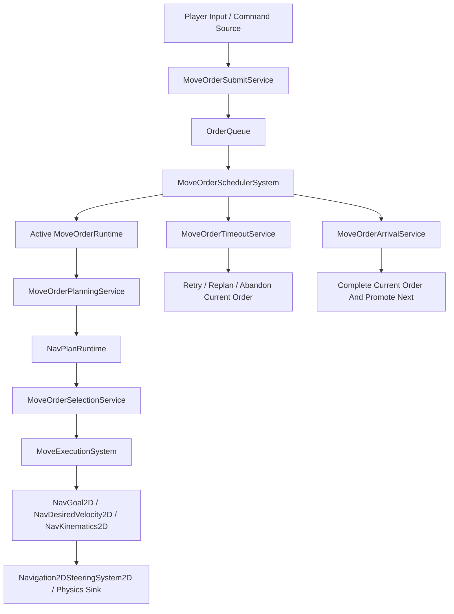

# RFC-0059 路网移动 Order、Nav Runtime 与多策略路径演示统一方案

本提案用于解决 Issue #70 在 road-network showcase 验收中暴露出的核心边界问题：`玩家 order 队列`、`nav path 采样点`、`move 执行状态` 当前被混写在同一条 `roadMoveFollow` 语义里，导致 RTS 风格的 waypoint 队列、即时改派、超时放弃和多策略寻路都无法用干净的分层表达。

## 1 问题陈述

当前 road showcase 已经证明以下能力可运行：

* `src/Core/Navigation/GraphWorld/LoadedGraphRuntime.cs` 已提供 map-scoped loaded graph runtime。
* `src/Core/Navigation/Pathing/AutoPathService.cs` 已支持 graph / navmesh 选择。
* `src/Core/Navigation/NavMesh/NavAreaCostTable.cs` 已具备 navmesh area cost 能力。
* `src/Core/Gameplay/GAS/Orders/OrderQueue.cs`、`OrderSubmitter.cs` 已具备 order 队列与提交入口。
* `src/Core/Navigation2D/Components/NavGoal2D.cs`、`NavDesiredVelocity2D.cs`、`NavKinematics2D.cs` 已提供 move sink 所需的导航 / 运动组件。

但当前 road showcase 的执行层把以下三层混为一体：

1. 玩家语义上的 move order / queued waypoint。
2. 导航语义上的 path sample / spline sample / corridor point。
3. 执行语义上的当前跟随点、超时、完成检测。

这会直接导致下列错误语义：

* `shift` 连点应形成多个排队 order，但现在更像单个 follow order 内的点列。
* 一段路的曲线 sample 本应是 nav runtime 私有数据，但现在被塞进 order payload。
* 中途改派应清掉 active nav runtime 与 queued order，而不是继续消费旧 waypoint。
* timeout / retry / abandon 应作用于 active order，而不是 path sample index。

## 2 目标

本 RFC 提议一套统一合同，同时覆盖 road graph、navmesh、cost area 与多 agent 策略：

* 把 `玩家 order` 与 `nav runtime` 彻底分层。
* 支持 RTS 语义的 queued waypoint，即 `shift 点1 点2 点3 = 三个 order`。
* 支持 immediate retarget，即中途右键新地点时清理当前 nav runtime 和旧队列。
* 支持 active order 级别的 timeout / retry / abandon。
* 让 graph、navmesh、cost area、agent profile、selection policy 都通过同一套 pathing contract 演示。
* move 层只输出 `desired speed / desired velocity / goal`，最终由 sink 写入物理速度。

## 2.1 当前实现状态（2026-03-22）

Issue #70 对应的 showcase 运行时已经按本 RFC 的核心边界落地到 mod 层，当前实现不再把 road-follow 策略焊进 Core：

* `mods/showcases/road_network/RoadNetworkShowcaseMod/Systems/RoadMoveOrderBindingSystem.cs`
  * 负责把 active `roadMoveFollow` order 绑定到 showcase-owned runtime。
* `mods/showcases/road_network/RoadNetworkShowcaseMod/Systems/RoadMovePlanSelectionSystem.cs`
  * 负责从 `RoadNavPlanStore` 读取当前 nav plan，并选择本帧局部跟随目标。
* `mods/showcases/road_network/RoadNetworkShowcaseMod/Systems/RoadMoveExecutionSystem.cs`
  * 负责把本帧执行意图下沉到 `NavGoal2D` / `NavKinematics2D`。
* `mods/showcases/road_network/RoadNetworkShowcaseMod/Systems/RoadMoveLifecycleSystem.cs`
  * 负责 arrival、timeout、refresh、abandon 与 active order 完成。
* `mods/showcases/road_network/RoadNetworkShowcaseMod/Gameplay/RoadMoveRuntimeService.cs`
  * 负责 `RoadMoveOrderRuntime` / `RoadNavPlanRuntime` 组件绑定与清理。
* `mods/showcases/road_network/RoadNetworkShowcaseMod/Gameplay/RoadNavPlanStore.cs`
  * 负责 showcase-owned nav sample plan 存储，不污染 authored order 队列。

本轮修复同时补上了两个关键稳定性语义：

* `mods/showcases/road_network/RoadNetworkShowcaseMod/Gameplay/RoadMoveRuntimeService.cs`
  * 修复 runtime bind 只写值拷贝、不写回 ECS world 的缺陷。
* `mods/showcases/road_network/RoadNetworkShowcaseMod/Gameplay/RoadRouteFinalTargetResolver.cs`
  * 在 preserved final target 缺失时，回退到最后一个 sampled waypoint，避免 execution-slice route 被 arrival 层立即误判完成。

## 3 非目标

以下内容不在本 RFC 范围内：

* 不把 road showcase 的业务策略直接焊进 Core。
* 不在本提案里定义具体产品地图、美术规范或剧情规则。
* 不用兼容旧的 `roadMoveFollow` 单订单大列表语义。

## 4 复用优先清单

### 4.1 已有可复用基础设施

* Registry
  * `src/Core/Gameplay/GAS/Orders/OrderTypeRegistry.cs`
  * `src/Core/Scripting/CoreServiceKeys.cs`
  * `src/Core/Navigation/NavMesh/NavMeshProfileRegistry.cs`
* Pipeline
  * `src/Core/Config/ConfigPipeline.cs`
  * `src/Core/Navigation/Pathing/AutoPathService.cs`
  * `src/Core/Navigation/Pathing/PathServiceRouter.cs`
* System
  * `src/Core/Gameplay/GAS/Systems/MoveToWorldCmOrderSystem.cs`
  * `src/Core/Navigation2D/Systems/NavArrivalSystem.cs`
  * `src/Core/Ludots.Physics2D/Systems/Navigation2DSteeringSystem2D.cs`
* Runtime / Service
  * `src/Core/Navigation/GraphWorld/LoadedGraphRuntime.cs`
  * `src/Core/Navigation/GraphWorld/WorldGridLoadedChunks.cs`
  * `src/Core/Navigation/NavMesh/NavAreaCostTable.cs`
  * `src/Core/Navigation/Pathing/PathStore.cs`

### 4.2 现阶段缺口

* 缺少 `active move order runtime` 与 `nav plan runtime` 的标准分层合同。
* 缺少 `queued waypoint -> queued order` 的规范表达。
* 缺少针对 active order 的统一 timeout / retry / abandon policy。
* 缺少同一 showcase 内 graph / navmesh / cost / strategy 的统一验收矩阵。

## 5 核心数据边界

### 5.1 Player Order 层

`MoveOrder` 只表达玩家意图，不包含 path sample。

建议字段：

* `OrderId`
* `Actor`
* `SubmitMode`
* `GoalKind`
* `GoalWorldCm` / `GoalEntity`
* `QueuePolicy`
* `PlannerPolicyRef`
* `ExecutionPolicyRef`

### 5.2 Active Order Runtime 层

`MoveOrderRuntime` 只表达当前 active order 的执行生命周期。

建议字段：

* `ActiveOrderId`
* `LifecycleState`
* `StartedAtStep`
* `LastProgressStep`
* `TimeoutCount`
* `LastFailureReason`
* `PlannerRevision`
* `NavPlanHandle`

### 5.3 Nav Runtime 层

`NavPlanRuntime` 只表达当前 active order 对应的一次导航结果。

建议字段：

* `PlanHandle`
* `Domain`
  * `RoadGraph`
  * `NavMesh`
  * `Hybrid`
* `FinalGoalWorldCm`
* `CurrentSampleIndex`
* `CurrentSegmentT`
* `CorridorRevision`
* `PathSampleCount`
* `CostSignature`

### 5.4 Move Execution 层

`MoveExecutionState` 只表达本帧运动意图。

建议字段：

* `DesiredGoalCm`
* `DesiredDirection`
* `DesiredSpeedCmPerSec`
* `DesiredVelocityCmPerSec`
* `ArrivalRadiusCm`

## 6 系统分层

### 6.1 查

职责：

* 读取 active order。
* 读取 actor 当前位置、当前 edge projection、阻塞状态、domain availability。
* 读取 planner profile / execution profile / cost profile。

### 6.2 算

职责：

* 对 active order 生成 `NavPlanRuntime`。
* 支持 graph、navmesh、hybrid 三种 domain。
* 支持 area cost / path strategy / agent profile。

### 6.3 选

职责：

* 从 `NavPlanRuntime` 中选择当前局部跟随目标。
* 选择对象是 `path sample / corridor target`，不是玩家 queued waypoint。
* 必须支持 mid-segment retarget，而不是只按 waypoint index 顺序消费。

### 6.4 走

职责：

* 把选择结果写到 `NavGoal2D` 或 `NavDesiredVelocity2D`。
* 再由 `Navigation2DSteeringSystem2D` 与 physics sink 处理最终速度。

### 6.5 Check 抵达

职责：

* 判断当前 active order 是否完成。
* 完成后提升下一个 queued order，而不是推进 path sample 列表。

### 6.6 超时放弃

职责：

* 检测 active order 是否长时间无进展。
* 决策 `retry current order / replan current order / abandon current order / fail queue`。

## 7 SubmitMode 语义

### 7.1 Immediate

新 `MoveOrder` 提交时：

* 清除 active `NavPlanRuntime`
* 清除 active `MoveOrderRuntime`
* 清除 queued `MoveOrder`
* 插入新的 active order

### 7.2 Queued

新 `MoveOrder` 提交时：

* 保留 active order
* 保留 active nav runtime
* 仅把新 order 追加进队列

## 8 Path Domain 与策略统一

### 8.1 Domain

* `RoadGraph`
  * 强约束在道路网络上移动。
* `NavMesh`
  * 自由地表移动，受 area cost 影响。
* `Hybrid`
  * 优先 road graph，离路后切 navmesh，或按策略切换。

### 8.2 PlannerPolicy

建议统一到 showcase 可配置表：

* `PreferRoad`
* `PreferNavMesh`
* `PreferHybrid`
* `Fastest`
* `Safest`
* `Cheapest`
* `AvoidEnemyZone`
* `AvoidMud`

### 8.3 ExecutionPolicy

* `Courier`
* `Vanguard`
* `Siege`
* `Cavalry`
* `HeavyInfantry`

每个 profile 至少影响：

* max speed
* acceleration
* arrival radius
* timeout tolerance
* allowed domains
* area cost weights

## 9 Cost 区域与统一成本模型

统一成本由三部分组成：

* `base path cost`
* `domain modifier`
  * road bonus
  * navmesh area penalty
* `strategy modifier`
  * planner policy
  * agent profile

建议最小 cost 区域：

* `Road`
* `Plain`
* `Forest`
* `Mud`
* `ShallowWater`
* `EnemyThreat`

## 10 Showcase 设计

### 10.1 Showcase A：Road Order Semantics

目标：

* 验证 `shift` 队列 = 多个 order，不是一个 sample list。
* 验证 immediate retarget 会清理 active nav runtime 与 queued orders。
* 验证 timeout 作用于 active order。

交互：

* `Right Click`
* `Shift + Right Click`
* `Ctrl + Right Click` 切换 planner policy

### 10.2 Showcase B：Graph / NavMesh / Hybrid

目标：

* 同一目标在不同 domain 策略下走出不同路线。
* graph、navmesh、hybrid 三种 plan 都可视化。

### 10.3 Showcase C：Cost Region Matrix

目标：

* 同一路径在不同 area cost 权重下做不同决策。

场景矩阵：

* courier: 宁可绕路避泥地
* siege: 强烈偏向 road
* scout: 可穿 forest
* cavalry: 高惩罚 shallow water

### 10.4 Showcase D：Blocked / Timeout / Replan

目标：

* 第二段 order 半路堵住时，只影响当前 active order。
* 验证 retry、replan、abandon 三个分支。

## 11 最小验收产物

每个 showcase 必须输出：

* `battle-report.md`
* `trace.jsonl`
* `path.mmd`
* raylib launcher `summary.json`
* 可读截图

最少覆盖：

* queued waypoint chain
* immediate retarget clear
* road graph preference
* navmesh area cost preference
* hybrid switch
* timeout retry / abandon

## 12 迁移策略

### 12.1 Phase 1

* 保留现有 baseline showcase 作为回归基线。
* 新增 `MoveOrderRuntime` / `NavPlanRuntime` 合同，不再把 path sample 塞进 queued order。

### 12.2 Phase 2

* 用 scheduler + planner + selection + execution 重写 road showcase 跟随链路。
* 让 timeout 与 arrival 基于 active order。

### 12.3 Phase 3

* 引入 unified showcase，联通 road graph、navmesh、cost area、planner profile 与 execution profile。

## 13 风险

* 当前 `MoveToWorldCmOrderSystem` 与 showcase 自定义 follow 订单存在职责重叠，需要先界定 Core 与 showcase 边界。
* `RoadRouteQueryService` 过胖，迁移时应先拆 query / scoring / variant / projection。
* 顶层 `mods/showcases/chunk_streaming/` 与子目录 `ChunkStreamingShowcaseMod/` 目前存在重复壳，需要在迁移中清理。

## 14 相关文档

* Issue：[#70](https://github.com/MightyBubble/Ludots/issues/70)
* 架构索引：见 [../architecture/README.md](../architecture/README.md)
* 文档治理：见 [../conventions/04_documentation_governance.md](../conventions/04_documentation_governance.md)

## 15 验收证据

当前 RFC 已有对应的代码、测试与 launcher 证据：

* 测试
  * `src/Tests/GasTests/RoadNetworkShowcaseTests.cs`
  * `src/Tests/GasTests/ChunkStreamingShowcaseTests.cs`
* Headless acceptance artifacts
  * `artifacts/acceptance/road_network_showcase_strategy_matrix/battle-report.md`
  * `artifacts/acceptance/road_network_showcase_strategy_matrix/trace.jsonl`
  * `artifacts/acceptance/road_network_showcase_strategy_matrix/path.mmd`
  * `artifacts/acceptance/road_network_showcase_timeout/battle-report.md`
  * `artifacts/acceptance/road_network_showcase_timeout/trace.jsonl`
  * `artifacts/acceptance/road_network_showcase_timeout/path.mmd`
  * `artifacts/acceptance/chunk_streaming_showcase/battle-report.md`
  * `artifacts/acceptance/chunk_streaming_showcase/trace.jsonl`
  * `artifacts/acceptance/chunk_streaming_showcase/path.mmd`
* Launcher screenshots
  * `artifacts/acceptance/launcher-road-network-showcase-raylib-codex-20260322-runtimefix/screens/000_start.png`
  * `artifacts/acceptance/launcher-road-network-showcase-raylib-codex-20260322-runtimefix/screens/002_command_accepted.png`
  * `artifacts/acceptance/launcher-road-network-showcase-raylib-codex-20260322-runtimefix/screens/003_column_advancing.png`
  * `artifacts/acceptance/launcher-road-network-showcase-raylib-codex-20260322-runtimefix/screens/004_chunk_shifted.png`
  * `artifacts/acceptance/launcher-chunk-streaming-showcase-raylib-codex-20260322-runtimefix/screens/000_overview.png`
  * `artifacts/acceptance/launcher-chunk-streaming-showcase-raylib-codex-20260322-runtimefix/screens/002_red_capital.png`

本轮已验证的边缘场景包括：

* authored order payload 不再被 runtime waypoint cursor 覆写。
* 长距离跨 chunk 道路移动可完成，不会在首段或首 chunk 停住。
* 曲线路网 sample 会保留为运行时 nav plan，不再把执行游标混进 authored waypoint。
* timeout refresh 与 timeout abandon 两个分支都能稳定复现。
* strategy matrix 中不同 planner / execution profile 会产生不同 corridor 选择与不同移动包络。
