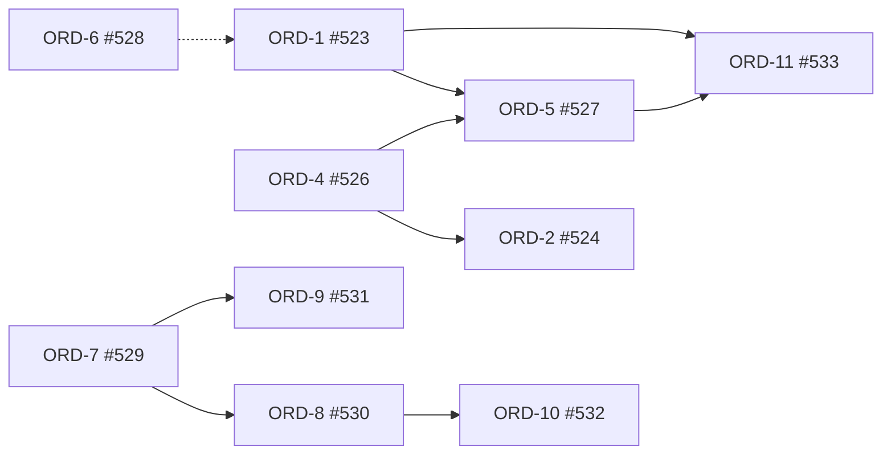

# RFC-0061 Interaction → EntityView → Order → MassNav 职责边界收敛

Status: Implemented (Epic #522 Phase A–D, 2026-07-04)  
Tracking Epic: [#522](https://github.com/MightyBubble/Ludots/issues/522)  
Architecture follow-up: `gitbook/architecture/`（Phase D 回写）  
Supersedes-in-spirit: 将 RFC-0059 selection-container 模型从 **gameplay SSOT hub** 收敛为 **EntityView + EntityCollection** 消费面

## 1. Problem

当前存在 **路径分裂** 与 **职责越界**：

| 违规 | 现状 |
|------|------|
| MassNav 读 Input | `MassNavigationLocalCommandInputSystem` / `MassNavigationControlSystem` 直接读 `AuthoritativeInput` |
| MassNav 读 Selection | `MassNavigationSelectionSyncSystem`、`SubmitMoveCommand` 读 `SelectionContextRuntime`；runtime 内 mirror `SelectedEntities` |
| MassNav 写 Selection | `BindLocalSelectionOwner`、`ClearSelection` |
| MassNav 旁路 OrderQueue | `MassNavigationSimulationRuntime.SubmitMoveCommand` → `OrderBufferSystem.SubmitOrder` |
| Selection 作全栈 hub | Order / MassNav / Minimap / Camera 各读 `SelectionRuntime` 或 view；与 `EntityCollectionStore` 双轨 |

这与 `gitbook/contributing/coding-standards.md` **禁止跨越职责** 冲突。

## 2. Decision

### 2.1 单向依赖（目标数据流）

```text
CastProfile (ScreenBox / ScreenPoint / …)
  → EntityCollectionStore
    → EntityView profile (viewKey → collectionKey + role)
      → OrderQueue（唯一 order intake）
        → OrderBufferSystem
          → MassNavigationOrderIngestionSystem（纯 execution）
            → NavGroupRuntime → MassNavigationFlowSolver
```

### 2.2 域边界

| 域 | 拥有 | 禁止 |
|----|------|------|
| **Interaction** | Cast profiles、acquisition collections、pointer semantic | OrderBuffer、NavGroup、Performer |
| **EntityView** | viewKey → collection + role 配置 SSOT | Raw input、OrderBuffer |
| **Order** | OrderQueue intake、mapping、OrderBuffer | MassNav solver、screen hit test |
| **MassNavigation** | Agent binding、ingestion、NavGroup、Flow、ECS writeback | AuthoritativeInput、SelectionRuntime、SubmitOrder from input |

### 2.3 三条铁律

1. **OrderQueue 统一 intake** — 生产路径禁止 `OrderBufferSystem.SubmitOrder`（test/evidence 白名单除外）
2. **MassNav 不读 Input / Selection** — 只消费 OrderBuffer 中已提交的 movement order
3. **Selection Gameplay SSOT 退役** — 命令目标集由 EntityView + `EntityCollectionRoleKind.CommandSource` 表达；`SelectionRuntime` 逐步 deprecated

## 3. Rejected Alternatives

- **保留 MassNav 私有 input/selection sync** —  perpetuates split; violates hexagonal boundaries
- **整包 merge 历史 `codex/mass-nav-*` 分支** — 落后 main 数百 commit，边界更脏
- **仅文档重命名 Selection → View** — 不删越界代码，无收敛

## 4. Implementation Phases & Issues

### Phase A — MassNav 停止跨越 Input / Selection

| ID | Issue | Summary |
|----|-------|---------|
| ORD-1 | [#523](https://github.com/MightyBubble/Ludots/issues/523) | 删除 `MassNavigationLocalCommandInputSystem`；Command move 走 InputOrderMapping + OrderQueue |
| ORD-2 | [#524](https://github.com/MightyBubble/Ludots/issues/524) | 删除 `MassNavigationSelectionSyncSystem` 与 `SelectedEntities` mirror |
| ORD-3 | [#525](https://github.com/MightyBubble/Ludots/issues/525) | 迁出 `BindLocalSelectionOwner` / scene reset `ClearSelection` |
| ORD-4 | [#526](https://github.com/MightyBubble/Ludots/issues/526) | `SubmitMoveCommand` 迁出 simulation runtime 到 Order intake |

**Exit criteria:** MassNav 目录无 `AuthoritativeInput` / `SelectionContextRuntime` 引用（ingestion 读 OrderBuffer 除外）。

### Phase B — Order intake 统一

| ID | Issue | Summary |
|----|-------|---------|
| ORD-5 | [#527](https://github.com/MightyBubble/Ludots/issues/527) | 禁止生产 `SubmitOrder` bypass；全走 OrderQueue |
| ORD-6 | [#528](https://github.com/MightyBubble/Ludots/issues/528) | Context-scoped Command semantic intent（收敛 #503） |

**Exit criteria:** `rg SubmitOrder src/` 仅 test/evidence 白名单。

### Phase C — Selection → EntityView + Collection

| ID | Issue | Summary |
|----|-------|---------|
| ORD-7 | [#529](https://github.com/MightyBubble/Ludots/issues/529) | `EntityViewProfile` 配置 SSOT |
| ORD-8 | [#530](https://github.com/MightyBubble/Ludots/issues/530) | Order/command consumer 迁移到 EntityView + collection |
| ORD-9 | [#531](https://github.com/MightyBubble/Ludots/issues/531) | 默认 preview-only acquisition；退役 dual-write |

**Exit criteria:** 新 command 路径不读 `SelectionRuntime`；`commitToFormalSelection` 默认 false。

### Phase D — 文档、验收、清理

| ID | Issue | Summary |
|----|-------|---------|
| ORD-10 | [#532](https://github.com/MightyBubble/Ludots/issues/532) | 更新 formal docs + gh-pages dataflow |
| ORD-11 | [#533](https://github.com/MightyBubble/Ludots/issues/533) | Formation showcase 回归 + obsolete test 清理 |

## 5. Dependency Graph



## 6. Related Work

- [#503](https://github.com/MightyBubble/Ludots/issues/503) — Command context semantic（ORD-6）
- [#519](https://github.com/MightyBubble/Ludots/issues/519) — Performer overlay / owner-payload（orthogonal；不阻塞本 Epic Phase A）
- RFC-0059 Entity Selection Container — 本 RFC **收敛**其 consumer 模型，非否定 container 关系实体设计
- `docs/reference/ludots-selection-order-dataflow.html` — Phase D 更新目标态图

## 7. Acceptance (Epic #522)

- [ ] Formation capability showcase playable：框选 + 右键 move 走 OrderQueue → ingestion → movement
- [ ] MassNav Core 无 Input/Selection import（ingestion + nav components only）
- [ ] 正式文档与 Epic issue 子项全部关闭
