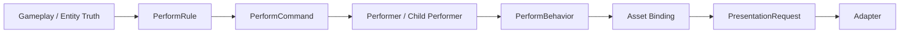

# Performer 统一编排架构 RFC

Status: Proposed
Owner: Codex + 用户协作草案
Last Updated: 2026-04-17

## 1. 目标

本文重新定义 Ludots 表现层的唯一真相：

- 上游只有 gameplay / entity truth
- 运行时只有 performer 与其 rule 驱动出的子 performer 关系
- 语义变化只通过 behavior 表达
- 可渲染/可播放/可实例化内容只作为 asset binding 进入 adapter
- `PresentationRequest` 只作为输出闸口

因此，目标架构中不再保留以下概念作为正式中心语义：

- `entity visual`
- `model behavior`
- `prefab mesh kind`
- `part`

它们的问题不是名字老，而是都会把“一个演出对象到底是什么”拆成多套平行真相。

本 RFC 的目标不是再找一组更好听的词，而是把表现层收束成一条不可歧义的链路：

`Entity / Gameplay Truth -> Performer / Child Performer Creation -> Behaviors -> Asset Bindings -> PresentationRequest -> Adapter`

## 2. 第一性定义

从第一性出发，表现系统里只有五类事实：

1. 上游事实
- entity 身份
- gameplay tag / attr / state
- 时间与触发事件
- viewer / audience / visibility / phase

2. 运行时演出对象
- `Performer`
- 它是唯一可持续存在、可激活/关闭、可被相位控制、可产出表现输出的运行时对象

2.5 命令分层
- `PerformCommand` 表示 performer 领域语义中的“要发生什么”
- `PresentationCommand` 只是当前实现里系统总线上的传输包
- 它属于 transport / compatibility surface，不应与 performer 领域真相并列

3. performer 创建关系
- performer 可以创建子 performer
- 这只是运行时创建关系，不自动意味着任何空间、生命周期或参数继承
- 现有参数传递与联动必须优先复用 performer 自身的 `bindings + override` 机制
- 不再另设 `part` 语义层

4. 行为
- attachment
- grounding
- animation
- movement along spline
- material / postprocess reaction
- attr mapping
- audio emission
- VFX emission

5. 资产绑定
- mesh / material / decal / vfx / sound / spline asset / animation controller 等只作为 asset binding 存在
- adapter 决定具体怎么实现

结论：

- `Performer` 是“谁在演”
- `Behavior` 是“它如何演”
- `AssetBinding` 是“它拿什么演”

这三者之外，不再需要额外的 `model`、`prefab category`、`part hierarchy` 来解释同一件事。

## 3. 铁匠铺例子

以下例子定义本 RFC 的目标心智模型。后续设计、任务拆分、测试、UAT 都必须能回到这个例子解释清楚。

### 3.1 例子描述

存在一个铁匠铺建筑 entity。

它不是“一个主模型 + 若干附属物 + 若干特效”的组合真相。

它的正确表达应该是：

- 一个建筑 entity 作为 gameplay truth source
- 一组 performer 通过 rule 创建关系构成整组建筑演出
- 每个 performer 通过 behavior 表达自己的空间、材质、动画、显隐、衰减与资产映射
- 每个 performer 只通过 asset binding 把语义交给 adapter

### 3.2 该例子的 performer 关系

以铁匠铺为例：

1. 建筑根 performer
- 绑定建筑 entity
- 作为整组建筑演出的根触发源

2. 三块建筑部件 performer
- 由建筑 performer 创建出来
- 表示三块独立建筑体块
- 各自通过 rule 显式激活 grounding / material / attr mapping behavior
- 所有坐标、地形、血量、区域、激活差异都优先通过现有 performer 参数黑板传入

3. 烟囱烟雾 performer
- 由建筑或烟囱对应的 performer 创建出来
- 只有在 rule 激活 attachment behavior 时才跟随建筑
- 带有 VFX asset binding
- 跟随偏移、淡出权重、激活状态等也优先通过现有 performer 参数黑板驱动

4. 表演人物 performer
- 作为独立 performer 存在
- 只有在 rule 明确把 `working` tag 映射成激活条件时才与建筑工作状态关联
- 不等于建筑部件
- 路径位置、移动进度、动画权重、淡出权重同样优先通过现有 performer 参数黑板驱动

5. 路径 performer
- 纯表演 spline performer
- 只负责提供可消费路径 asset binding
- 自身只是 asset binding + 路径语义 carrier

关键点：

- 三块建筑不是 `part`
- 烟雾不是“特效挂点”
- 路径不是“辅助数据”
- 人物不是“附带动画模型”

它们都是 performer，只是 rule、behavior 和 asset binding 不同。

### 3.3 行为拆解

铁匠铺例子中涉及的行为应表达为：

1. child performer creation
- 建筑 performer 可以创建建筑部件 performer
- 建筑 performer 或烟囱 performer 可以创建烟雾 performer
- 这一步只建立“谁创建了谁”，不默认附带空间或生命周期语义
- 如果子 performer 需要共享某个上游值，应通过现有 param blackboard 机制显式透传

2. attachment behavior
- 烟囱烟雾跟随建筑
- 只跟随建筑空间变化
- 不吸附地面
- 只有在 rule 显式激活 attachment behavior 时才成立
- attachment 所需的 anchor、偏移、跟随权重、旋转/缩放策略都应走现有参数黑板，不另起一套真相

3. grounding behavior
- 建筑部件 performer 吸附地面
- 造在山上时，各建筑部件依山摆放
- 烟囱烟雾不参与 grounding
- grounding 不因为“它是子 performer”而自动成立
- grounding 输入例如地面高度、法线、区域材质上下文，也应优先通过现有参数黑板传递

4. material behavior
- 南方建筑显示红土砖块
- 北方建筑显示黑土
- 这是 performer 的 material behavior
- 不是换一套“北方 prefab / 南方 prefab”

5. attr mapping behavior
- 建筑部件 performer 根据建筑 entity 血量映射三档资产状态：
  - 完整
  - 破损
  - 废墟
- 这是 attr -> asset binding 的映射行为
- 不是 prefab 自己“长出三种状态”

6. tag-driven activation / fade behavior
- 烟囱 performer 与人物 performer 受建筑 entity 的 `working` tag 控制
- 当 `working` tag 不存在或被抑制时：
  - 烟囱淡出
  - 人物淡出
- 这是 material behavior / postprocess behavior / fade behavior
- 不是 entity visual 的特殊隐藏逻辑
- 也不是子 performer 默认与父 performer 共享生命周期
- `working`、fade weight、抑制态等应优先落到现有参数黑板与 rule 计算，而不是新增隐藏联动容器

7. movement behavior
- 表演人物 performer 消费路径 performer
- 沿纯表演 spline performer 移动

8. animation behavior
- 表演人物 performer 播放走路动画
- 这属于人物 performer 的 animation behavior

9. audio behavior
- working 时有锤击、火焰、脚步、风箱声
- 非 working 时这些音效停用或衰减
- 音效也应作为 performer behavior，而不是旁路系统

10. VFX behavior
- 烟囱烟雾
- 锻造火星
- 热浪/火焰扭曲

### 3.4 这个例子排除了什么

该例子明确排除以下旧心智：

1. “建筑先有一个主模型”
- 错
- 只有 root performer 和子 performer

2. “三块小建筑是 prefab parts”
- 错
- 它们在运行时是被创建出来的 performer

3. “南北材质不同，所以要两套 prefab”
- 错
- 这是 material behavior

4. “山地摆放属于 prefab grounding”
- 错
- 这是建筑部件 performer 的 grounding behavior

5. “人物只是建筑附属装饰”
- 错
- 人物是独立 performer

7. “子 performer 默认继承父 performer 的坐标、生命周期、显隐和淡出”
- 错
- 这些都只能由 rule 显式激活对应 behavior

6. “路径只是动画辅助曲线”
- 错
- 路径本身也是纯表演 performer

## 4. 目标架构

### 4.1 运行时分层

目标运行时只有以下层：

1. `Performer`
- 唯一运行时演出对象
- 管理 identity、lifetime、scope、phase consumption，以及“可创建哪些子 performer”的规则
- 复用现有参数黑板作为 performer 之间透传与投影的唯一参数真相

2. `PerformRule`
- 决定什么时候创建、激活、停用、销毁 performer 或 behavior
- 也决定是否启用 attachment、grounding、fade、param pass-through 等语义
- 所有跨 performer 联动优先转成现有 `paramKey + binding + override + graph` 机制

3. `PerformCommand`
- 一次性命令层
- create / destroy / attach / detach / activate / deactivate / pulse / set-param

补充说明：

- `PerformCommand` 是目标架构里的 performer 语义命令
- 当前代码中的 `PresentationCommand` 只是承载这些语义的过渡命令包
- 后续若两者继续共存，必须保持“领域语义在 `PerformCommand`，传输壳在 `PresentationCommand`”这一单向关系

4. `PerformBehavior`
- 真正的运行时语义层
- 负责 attachment / grounding / movement / animation / material / audio / VFX / attr mapping / fade

5. `AssetBinding`
- 仅表达“这个 performer 当前绑定了什么资产语义”
- 例如 mesh asset、material asset、vfx asset、sound asset、spline asset、animation controller asset

6. `PresentationRequest`
- 最终输出闸口

这里的 `Presentation` 一词只保留给两类边界对象：

- `PresentationCommand`
  - 过渡期系统总线/调度包
- `PresentationRequest`
  - adapter 输出闸口

而 `Performer` / `PerformRule` / `PerformCommand` / `PerformBehavior` 属于演出领域本体。

### 4.2 逻辑链

### 4.3 关键约束

1. child performer 关系只表示创建关系
- 不再存在 `part` hierarchy
- child performer 关系本身不自动附带坐标透传、生命周期共享、显隐继承

2. attachment / grounding / fade 必须显式激活
- 任何坐标透传、生命周期共享、跟随、淡出都不能默认成立
- 只有 rule 显式激活对应 behavior 时才成立

3. 参数联动只允许扩展现有 performer 参数黑板
- 现有 `bindings + binding index + per-instance override + set-param` 是参数真相
- 新需求只能在这套机制上扩展 param key、binding source、graph 计算或 override 流
- 不允许再引入第二套 performer 联动参数容器

4. 行为只属于 behavior
- attachment / grounding / fade / attr mapping / movement / animation / audio / VFX 都不属于 asset 类型

5. 资产只属于 asset binding
- 资产决定“资源是什么”
- 不决定“运行时如何被控制”

6. 地理/环境差异优先落 behavior
- 南北材质差异、山地摆放差异都优先落在 behavior，而不是复制 asset 结构

## 5. 术语收束

目标术语应收束为：

| 旧术语 | 处理方式 | 新语义 |
| --- | --- | --- |
| `entity visual` | 删除为架构真相 | entity 只提供上游 gameplay truth |
| `model behavior` | 删除为架构中心术语 | 归入 `AssetBindingBehavior` / `MaterialBehavior` / `AnimationBehavior` |
| `prefab mesh kind` | 删除为架构术语 | 改为 adapter-facing asset binding |
| `part` | 删除 | 改为 performer create-child 关系 |
| `prefab` | 退化为 legacy authoring 来源 | 不再作为目标运行时概念中心 |
| `PresentationCommand` | 降级为 transport / compatibility surface | 不与 performer 领域命令并列 |
| `PerformCommand` | 保留为 performer 领域命令 | 表示演出领域中的 create / destroy / set-param 等语义 |
| `performer` | 保留并提升 | 唯一演出运行时对象 |
| `behavior` | 保留并扩张 | 唯一运行时语义承载体 |
| `asset binding` | 明确提升 | 唯一资产接入语义 |

命名原则：

- 不再用 `model` 指代一类高于其他行为的特权对象
- 不再用 `prefab` 指代目标运行时编排单元
- 不再用 `part` 指代运行时层级
- `Presentation*` 只保留给边界/传输/输出对象
- `Perform*` / `Performer*` 才属于演出领域语义

## 6. 对当前系统的判断

### 6.1 已具备迁移价值的部分

- `src/Core/Presentation/Systems/PerformerRuleSystem.cs`
- `src/Core/Presentation/Systems/PerformerRuntimeSystem.cs`
- `src/Core/Presentation/Systems/PerformerEmitSystem.cs`
- `src/Core/Presentation/Perform/PerformAudienceContext.cs`
- `src/Core/Presentation/Perform/PerformPhaseInput.cs`
- `src/Core/Presentation/Perform/PerformPhaseResult.cs`
- `src/Core/Presentation/Perform/PerformPhaseResolver.cs`

这些部分说明：

- performer 主骨架已存在
- phase 输入契约已开始形成
- 可在此基础上继续收束

### 6.2 仍然过期的路径

以下路径仍然代表旧架构：

- `src/Core/Presentation/Systems/EntityVisualEmitSystem.cs`
- `src/Core/Presentation/Systems/AnimatorRuntimeSystem.cs`
- `src/Core/Presentation/Assets/PresentationBehaviorResolver.cs`
- `src/Core/Presentation/Assets/PrefabPart.cs`
- `src/Core/Presentation/Assets/PrefabFinalizationPipeline.cs`

它们的问题不是“写得差”，而是仍在表达旧心智：

- entity-owned visual
- animator-owned visual lane
- state-to-prefab resolver
- grounding/attachment 掺入 asset authoring

### 6.3 结论

因此当前迁移的核心不是“补更多 prefab 规则”，而是：

- 让所有运行时演出对象都变成 performer
- 让所有运行时语义都变成 behavior
- 让所有资源接入都变成 asset binding

## 7. UAT 驱动的任务分层

本 RFC 以后续 UAT 为中心，而不是以类名或子系统为中心拆任务。

### Layer 1: 场景 truth

目标：

- 把铁匠铺场景的 gameplay truth 定义清楚

任务：

1. 建筑 entity 提供：
- 血量 attr
- `working` tag
- 地理/区域标签
- 地形/山地上下文

2. audience truth 提供：
- viewer / relation / phase / visibility

完成标准：

- 不需要读 adapter 代码也能解释“为什么这个 performer 现在应出现/消失/换资产”

### Layer 2: performer creation graph

目标：

- 定义铁匠铺场景中谁创建谁，以及创建后需要哪些显式 behavior

任务：

1. 建筑根 performer
2. 三个建筑部件 performer
3. 烟囱烟雾 performer
4. 表演人物 performer
5. 路径 spline performer
6. 可选补充：
- 锻造火星 performer
- 音效 performer

完成标准：

- 不再使用 `part`
- 每个运行时对象都能回答：
  - 它是谁创建出来的
  - 它为什么存在
  - 它是否通过 rule 显式开启了 attachment / grounding / fade
  - 它依赖哪些现有 param keys / bindings / overrides

### Layer 3: behavior packing

目标：

- 给每个 performer 配齐行为组合

任务：

1. 建筑部件 performer
- grounding behavior
- material behavior
- attr mapping behavior

2. 烟囱烟雾 performer
- attachment behavior
- VFX behavior
- fade behavior

3. 表演人物 performer
- movement along spline behavior
- animation behavior
- fade behavior
- audio behavior

4. 路径 performer
- spline asset binding behavior

完成标准：

- 每个用户可见变化都能定位到某个 behavior
- 不再需要“model behavior / prefab kind”来解释
- 所有行为输入都能回溯到现有 performer 参数黑板

### Layer 4: asset binding

目标：

- 明确 performer 绑定了哪些资产，而不是让资产决定行为

任务：

1. 建筑部件 performer
- 三档建筑体块 asset binding：
  - 完整
  - 破损
  - 废墟

2. 烟囱 performer
- 烟雾 VFX asset binding

3. 表演人物 performer
- 人物 mesh/material/animation controller asset binding

4. 路径 performer
- spline asset binding

5. 音效 performer
- 锤击声
- 火焰声
- 脚步声
- 风箱声

完成标准：

- 资产只回答“绑定什么”
- 行为回答“何时/如何使用这些资产”

### Layer 5: UAT evidence

目标：

- 用一个铁匠铺场景证明整个链路成立

任务：

1. 场景截图 / 视频 / trace
2. battle report
3. path artifact
4. 玩家第一视角 evidence
5. adapter-visible output evidence

完成标准：

- 用户能一眼看出行为变化
- 开发者能从 trace 回到 performer / behavior / asset binding

## 8. 铁匠铺 UAT Checklist

以下 checklist 是本 RFC 推荐的第一性 UAT。

### 8.1 hierarchy

- 建筑 entity 创建后，存在 1 个根 performer。
- 三块建筑体块以被创建出来的 performer 形式存在，而不是 `part`。
- 烟雾 performer 是被创建出来的 performer，不是硬编码挂点特效。
- 人物 performer 是独立 performer，不是建筑体块的一部分。
- 路径是 spline performer，不是隐藏辅助数据。
- 没有任何 performer 因为“是子 performer”就自动继承坐标或生命周期。
- 所有跨 performer 的联动输入都能指出使用了哪些现有 param keys / bindings / overrides。

### 8.2 grounding / attachment

- 建在平地时，三块建筑部件正确落地。
- 建在山上时，三块建筑部件各自依山摆放。
- 烟囱烟雾只跟随建筑，不参与地面吸附。
- 人物沿路径移动时，不因为建筑 grounding 改变而丢失路径跟随。
- 验证项必须证明 attachment / grounding 是 rule 显式激活的 behavior，而不是默认子级继承。

### 8.3 material / region variation

- 南方区域材质显示红土砖块。
- 北方区域材质显示黑土。
- 材质切换通过 material behavior 生效，而不是切 prefab。

### 8.4 attr / damage variation

- 高血量时建筑部件显示完整资产。
- 中血量时建筑部件显示破损资产。
- 低血量时建筑部件显示废墟资产。
- 三档切换通过 attr mapping behavior 生效。

### 8.5 tag-driven activation

- `working` tag 存在时：
  - 烟囱烟雾存在
  - 人物存在
  - 锻造音效存在
- `working` tag 被抑制或不存在时：
  - 烟囱淡出
  - 人物淡出
  - 锻造相关音效停用或衰减

### 8.6 animation / movement / spline

- 人物 performer 能沿内部路线行走。
- 行走不是 world teleport，而是 spline-driven movement。
- 人物 walk 动画正常播放。
- working 停止后，动画和移动共同淡出或停用。

### 8.7 VFX / audio

- 烟囱烟雾 VFX 正常出现。
- 锻造火星 VFX 可选出现。
- 锤击音效与人物/工作节奏一致。
- 脚步声与人物 movement 同步。
- 音效随 `working` tag 停用或淡出。

### 8.8 visibility / audience

- 至少两种 audience 下，能看到不同的 performer projection 或激活状态。
- hidden / culled / debug / observer 路径不破坏行为语义。
- phase 变化时 performer 不丢失 identity。

## 9. 过期描述清理清单

以下表述应在后续文档中持续清理：

- “主模型”
- “附属 part”
- “prefab kind 决定表现”
- “entity visual 负责主要表现，performer 负责附加表现”
- “地面吸附属于 prefab grounding”
- “材质变化需要换 prefab”

这些描述一旦继续保留，就会把系统重新拉回双主线。

## 10. 决策

本 RFC 的建议结论如下：

1. 目标架构只保留 `Performer + Behavior + AssetBinding + PresentationRequest`。
2. `part` 彻底退出正式架构术语，统一改为 performer create-child 关系。
3. `model` 不再作为高于其他行为的目标架构术语存在。
4. `prefab` 不再作为目标运行时中心概念，只能作为 legacy authoring 来源或过渡词。
5. attachment、grounding、material、attr mapping、animation、movement、audio、VFX 全部视为 behavior。
6. 不假定任何 performer 坐标透传、生命周期共享、显隐继承，除非 rule 显式激活对应 behavior。
7. 所有 performer 参数透传与联动必须优先复用现有 `bindings + override + set-param` 黑板机制，只允许扩展，不允许另起真相。
8. `PerformCommand` 是 performer 领域命令，`PresentationCommand` 只是当前过渡期 transport 壳，不得并列描述为两套领域真相。
9. 铁匠铺例子应作为后续任务拆分、测试、UAT 和 code review 的共同对照样例。

## 11. 相关证据

- `docs/rfcs/perform-architecture-unification/01_execution_plan.md`
- `docs/rfcs/perform-architecture-unification/02_cross_review.md`
- `docs/rfcs/perform-architecture-unification/03_phase_system_design.md`
- `docs/rfcs/perform-architecture-unification/04_development_plan.md`
- `src/Core/Presentation/Systems/PerformerRuleSystem.cs`
- `src/Core/Presentation/Systems/PerformerRuntimeSystem.cs`
- `src/Core/Presentation/Systems/PerformerEmitSystem.cs`
- `src/Core/Presentation/Performers/PerformerDefinition.cs`
- `src/Core/Presentation/Performers/PerformerParamBinding.cs`
- `src/Core/Presentation/Performers/PerformerInstanceBuffer.cs`
- `src/Core/Presentation/Perform/PerformAudienceContext.cs`
- `src/Core/Presentation/Perform/PerformPhaseInput.cs`
- `src/Core/Presentation/Perform/PerformPhaseResult.cs`
- `src/Core/Presentation/Perform/PerformPhaseResolver.cs`
- `src/Core/Presentation/Assets/PresentationBehaviorResolver.cs`
- `src/Core/Presentation/Assets/PrefabPart.cs`
- `src/Core/Presentation/Assets/PrefabFinalizationPipeline.cs`

## 12. 后续文档

- 执行落地方案：`docs/rfcs/perform-architecture-unification/01_execution_plan.md`
- Subagent 交叉复核摘要：`docs/rfcs/perform-architecture-unification/02_cross_review.md`
- 相位系统设计稿：`docs/rfcs/perform-architecture-unification/03_phase_system_design.md`
- 开发计划：`docs/rfcs/perform-architecture-unification/04_development_plan.md`
