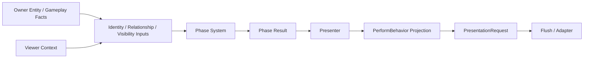

> Historical design note. References to SelectionRuntime are pre-retirement context; current architecture
> uses EntityCollectionStore / `collection.command.source` for command actor sets.
# 相位系统设计稿

Status: Proposed
Last Updated: 2026-04-16

## 1. 文档目标

本文专门补充 `Presenter` 统一编排 RFC 中最容易跑偏、但又最关键的一块：相位系统。

这里的核心目标不是继续讨论 `selection`、HUD 或具体某个 showcase，而是明确：

- 什么是表现层相位
- 相位系统和 `Presenter` 的边界在哪里
- 相位系统和 `player` / `team` / `relationship` / visibility 上游的关系是什么
- 多玩家看到不同演出时，系统应如何建模

本文供后续开发直接接手，不作为正式 SSOT，正式结论仍需在 RFC 接受后回写到 `gitbook/architecture/`。

## 2. 核心结论

一句话定义：

> 相位系统负责给定某个“观看者上下文”后，计算当前语义对象在该观看者视角下处于什么表现相位；`Presenter` 只消费相位结果并投影出对应行为与输出。

因此：

- `Presenter` 不是相位真相
- `Presenter` 也不是 visibility truth
- `selection` 更不是相位系统
- `PerformPhaseResult` 也不应变成第二套 presenter 参数黑板

更准确的职责划分应该是：

1. 上游 identity / relation / visibility 基建
- 负责提供“谁在看”“与谁是什么关系”“是否可见”“是否有视野”“是否处于某种观察模式”

2. 相位系统
- 负责把这些上游输入折叠成表现层可消费的 phase result
- 建议由 `PerformPhaseResolver` 统一承担 raw facts -> `PerformPhaseInput` -> `PerformPhaseResult` 的折叠责任

3. `Presenter`
- 负责根据 phase result 决定哪些 behavior active、哪些 behavior suspended、哪些 output variant 生效
- 具体投影参数仍优先写回现有 presenter 参数黑板，由 binding / override / set-param 流消费

4. `PresentationRequest`
- 负责承载最终输出包

## 3. 不要混淆的三个概念

### 3.1 `selection`

`selection` 只是“当前选中了什么”的控制态概念。

它服务于：

- 输入
- 命令
- 面板
- 相机 follow / viewed selection

相关基建：

- `src/Core/Input/Selection/SelectionRuntime.cs`
- `src/Core/Input/Selection/SelectionViewRuntime.cs`
- `src/Core/Input/Selection/SelectionContextRuntime.cs`
- `docs/architecture/entity_selection_architecture.md`

它不应该承担：

- 观众关系真相
- visibility truth
- presenter phase truth

### 3.2 visibility

visibility 是“当前某观看者是否应看见某对象”的上游结果。

它可能来自：

- `CullState`
- `LOD`
- fog / vision
- debug / replay / observer 模式
- 其他 gameplay 或客户端投影规则

visibility 不属于 presenter 自己。

### 3.3 phase

phase 不是简单的 visible / hidden。

phase 更像是：

- 这个观看者视角下，当前对象应该进入哪种表现模式

例如同一个单位在不同观看者看来，可以分别处于：

- `VisibleFull`
- `VisibleSimplified`
- `Hidden`
- `FogGhost`
- `ObserverDebug`

因此 phase 是表现层消费用的“语义投影结果”，不是基础 identity truth。

## 4. 当前仓库里的真实上游基建

为了避免假设，这里只记录当前仓库里已经存在的可复用入口。

### 4.1 `player` 与 `team`

当前 Core 中并没有硬编码的 `PlayerEntity` / `TeamEntity` 大类。

已有基础组件位于：

- `src/Core/Gameplay/Components/IdentityComponents.cs`

其中：

- `PlayerOwner`
- `Team`

都是普通 ECS 组件。

这意味着后续 phase system 不能默认把“观看者”硬编码成某个 player class。

### 4.2 team meta-entity

当前存在 team meta-entity 的辅助设施：

- `src/Core/Gameplay/Relationships/RelationshipTeamBootstrapper.cs`
- `src/Core/Gameplay/Teams/TeamEntityLookup.cs`

这说明：

- `teamId` 是基础 identity
- team meta-entity 是额外可挂 tag / attribute / effect / callback 的载体

phase system 应允许利用 team meta-entity，但不能强依赖它是唯一 team 真相。

### 4.3 relationship

当前至少有两层关系能力：

1. team-to-team 关系
- `src/Core/Gameplay/Teams/TeamManager.cs`
- `src/Core/Gameplay/Teams/RelationshipFilter.cs`

2. entity-to-entity typed relationship graph
- `src/Core/Gameplay/Relationships/RelationshipRuntime.cs`
- `src/Core/Gameplay/Relationships/RelationshipCatalogRuntime.cs`

这意味着 phase system 不能简单预设“关系 = team hostility/friendly”。

有的表现规则可能要看：

- team relation
- entity relationship edge
- team meta-entity tags
- 未来其他 projection context

### 4.4 local player / viewer 入口

当前有一个常用但不应被绝对化的入口：

- `src/Core/Input/Systems/LocalPlayerEntityResolverSystem.cs`
- `src/Core/Scripting/CoreServiceKeys.cs`

也就是：

- `CoreServiceKeys.LocalPlayerEntity`

这可以作为默认 viewer 来源，但不应直接等同于完整 phase model。

## 5. 推荐相位系统边界

### 5.1 phase system 的职责

phase system 应负责：

- 接收一个语义对象 owner
- 接收一个 viewer context 或更上游 projection context
- 接收 visibility / relation / mode 等输入
- 输出 presenter 可消费的 phase result

### 5.2 phase system 不负责

phase system 不应负责：

- 存储 presenter 生命周期
- 直接发 adapter output
- 直接承担 selection state
- 直接成为 player/team/relationship 的真相来源

### 5.3 `Presenter` 的职责

`Presenter` 只做两件事：

1. 保存语义演出实例真相
2. 根据 phase result 投影行为

所以同一个 presenter：

- 在 player A 看来可能是完整模型 + HUD + indicator
- 在 player B 看来可能是简化模型
- 在 observer 看来可能多一层 debug overlay

这不是三个 presenter。

这是：

- 一个 presenter
- 三份 phase-driven projection

## 6. 推荐数据流

关键点：

- 上游算输入
- 相位系统算 phase result
- presenter 按结果投影
- presenter 间参数透传仍优先走现有参数黑板，不新增 phase-specific linkage container

## 7. 推荐术语

为了让后续开发不跑偏，建议统一以下术语：

### `Phase Input`

指上游提供给 phase system 的输入。

可能包含但不限于：

- owner entity
- viewer entity
- team relation
- relationship edge facts
- cull / LOD
- vision / fog
- debug / observer mode

### `Phase Result`

指 phase system 产出的、供 presenter 消费的投影结果。

例如：

- `VisibleFull`
- `VisibleReduced`
- `Hidden`
- `Ghosted`
- `ObserverDebug`

### `Behavior Projection`

指同一个行为在不同 phase result 下的不同输出形态。

例如：

- `ModelPerformBehavior` 在 `VisibleFull` 下输出完整模型
- 在 `Ghosted` 下输出半透明 last-known 形态
- 在 `Hidden` 下不输出

## 8. 推荐 phase result 结构

这里先给概念结构，不锁死具体字段实现。

建议至少表达三类信息：

1. 是否激活
- behavior 是否应该 active / suspended / muted

2. 输出变体
- 使用哪个 visual / hud / sound variant

3. 输出质量
- full / reduced / culled / debug

也就是说 phase result 不一定是单个 enum，也可以是：

- mode
- variant key
- quality flags

组成的结构化结果。

## 9. 推荐行为侧设计

后续 `PerformBehavior` 不应直接写死“敌我显示规则”。

更合理的方式是：

1. phase system 先给 phase result
2. behavior 再根据 phase result 选择 projection branch
3. branch 需要的具体数值、权重、偏移、variant key，优先通过现有 presenter 参数黑板提供

例如：

### `ModelPerformBehavior`

- `VisibleFull` -> 完整模型
- `VisibleReduced` -> 简化模型
- `Ghosted` -> 幽灵态模型
- `Hidden` -> 不输出

### `WorldHudPerformBehavior`

- `VisibleFull` -> 完整血条/名字/状态
- `VisibleReduced` -> 简化条
- `Hidden` -> 不输出
- `ObserverDebug` -> 输出调试 HUD

### `IndicatorPerformBehavior`

- owner 可以看到完整技能圈
- ally 看到团队版投影
- enemy 看不到或只看结果

这些都不该通过复制多个 presenter 实例来实现。

## 10. 设计约束

### 10.1 不把 phase system 写成 player/team 硬编码器

phase system 可以复用：

- `PlayerOwner`
- `Team`
- `TeamManager`
- `RelationshipRuntime`

但不能反过来要求所有相位都必须经由 player/team 二元关系。

### 10.2 不把 selection 重新带回相位

selection 可能影响 UI 看到什么，但不应作为 presenter audience phase truth。

### 10.3 不把 presenter 变成 policy owner

presenter 不拥有：

- relation truth
- visibility truth
- viewer truth

presenter 也不应新增第二套参数真相：

- 现有 `bindings + override + set-param` 应继续作为参数真相
- 相位系统只负责决定“该投影什么”
- 不负责另建一套“怎么把值传给 presenter”的黑板

presenter 只消费结果。

## 11. 对后续实现的建议顺序

### Step 1

先设计一个独立 phase contract，不和 selection 合并，不和 request 合并。

### Step 2

明确 phase system 从哪些现有基建取输入：

- `PlayerOwner`
- `Team`
- `TeamManager`
- `RelationshipRuntime`
- `CullState`
- `LOD`

### Step 3

先让 HUD / indicator / spline 这类行为消费 phase result。

### Step 4

再让 model / animator 行为接入 phase result。

## 12. 给后续开发者的落地提示

接手开发时最容易犯的错有三个：

1. 用 `selection` 代替 audience
2. 把 `LocalPlayerEntity` 当成完整相位模型
3. 为不同玩家复制多个 presenter

应该坚持的原则是：

- 一个语义对象，一个 presenter
- 多个观看者，多份 phase projection
- 上游算相位输入，phase system 算相位结果，presenter 消费结果
- presenter 参数透传与数值投影优先复用现有参数黑板，只允许扩展 param key / binding source / override 流

## 13. UAT 验收标准

相位系统后续开发必须以 UAT 作为最终完成标准，而不是只以单元测试或 headless 结果作为完成标准。

### 13.1 必须满足的三层证据

1. 代码层证据
- phase contract、phase resolver、presenter projection 有对应测试覆盖

2. headless 验收证据
- 必须生成：
  - `artifacts/acceptance/<feature>/battle-report.md`
  - `artifacts/acceptance/<feature>/trace.jsonl`
  - `artifacts/acceptance/<feature>/path.mmd`

3. 用户第一视角可见证据
- 必须证明“玩家真的看到了相位差异”
- 不能只停留在内部 buffer、debug log、或 request 对比

### 13.2 用户第一视角可见证据要求

每个 phase system 相关功能点，至少要提供一类用户第一视角证据：

- 第一视角录像或逐帧截图
- launcher evidence
- showcase 运行截图与对应说明
- adapter-visible output 记录

证据必须能回答：

- 哪个 viewer 在看
- 他此刻应该看到什么
- 实际画面上看到了什么
- 与另一个 viewer 的画面差异是什么

### 13.3 不合格的“伪通过”

以下都不能单独作为验收通过：

- 只有 unit test
- 只有 architecture test
- 只有 `PresentationRequest` 差异
- 只有 runtime log
- 只有开发者口头说明“理论上会显示不同”

### 13.4 推荐最小 UAT 场景

至少应准备一个最小 showcase，证明：

- 同一个语义对象
- 不同 viewer / audience context
- 呈现出不同 phase projection
- 且差异是用户肉眼可见的

推荐最小场景可以从以下行为开始：

- HUD 差异
- indicator 差异
- model visible / hidden / ghosted 差异

### 13.5 UAT 通过定义

只有当以下三件事同时成立时，phase system 相关开发才算完成：

1. automated tests 通过
2. headless acceptance artifacts 完整
3. 用户第一视角可见证据完整且能解释 phase 差异

## 14. 相关文档

- 主 RFC：
  - `docs/rfcs/perform-architecture-unification/00_overview.md`
- 执行计划：
  - `docs/rfcs/perform-architecture-unification/01_execution_plan.md`
- 交叉复核：
  - `docs/rfcs/perform-architecture-unification/02_cross_review.md`
- 开发计划：
  - `docs/rfcs/perform-architecture-unification/04_development_plan.md`
- 当前 presenter 架构：
  - `gitbook/architecture/presentation-presenter-current-architecture.md`
- 选择架构：
  - `docs/architecture/entity_selection_architecture.md`
- relationship 参考：
  - `docs/reference/relationship_system_market_abstraction.md`
- team / relationship 基建：
  - `src/Core/Gameplay/Components/IdentityComponents.cs`
  - `src/Core/Gameplay/Teams/TeamManager.cs`
  - `src/Core/Gameplay/Teams/TeamEntityLookup.cs`
  - `src/Core/Gameplay/Relationships/RelationshipRuntime.cs`
