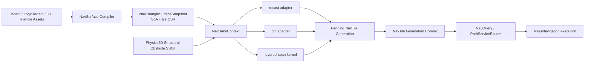

# 动态 3D Navmesh 烘焙架构

本页是 Ludots 任意三角面输入、三算法对比、运行时结构变化、超大世界流式烘焙与 `layered-span` 0GC 目标的正式架构真相。

上位导航域规划见 [Epic #281](https://github.com/MightyBubble/Ludots/issues/281)，现有运行时增量实现见 [NAV-10 #304](https://github.com/MightyBubble/Ludots/issues/304)。本页扩展现有 `NavBakeContext` / `NavBakeService`，不建立第二条 bake 管线。

## 1. 概述

### 1.1 目标

Ludots 必须在同一套生产合同下支持：

- `LogicTerrainField` 与任意 3D 场景三角面作为正式输入；
- `recast`、`cdt`、`layered-span` 三种算法显式选择，不 fallback；
- 离线全量、编辑器 dirty、运行时结构变化共用 `NavBakeContext`；
- 小型 RTS 地图与 `64 x 64` `TerrainChunk` 开放世界运行同一功能矩阵；
- `layered-span` 在预热后完成 dirty 收集、烘焙和发布时 0 managed allocation；
- 相同输入、配置和固定步工作预算产生相同 tile bytes，不受 worker 数量影响；
- 一次结构变化涉及的全部 tile 以一个 generation 原子发布，查询不读取混合代际；
- 完全不可走区域发布合法空 tile，而不是保留旧可走 tile。

第三种算法的正式配置名是 `layered-span`。它是保留多层表面的稀疏 surface-span 流水线，不是只记录 min/max 的单层高度场。

### 1.2 成功标准

成功不是“有一个新 baker 能输出三角形”，而是玩家能在两个正式 showcase 中完成相同操作：切换算法、烘焙、下达移动、建墙/拆墙，并看到路径与 dirty tile 状态正确变化。自动化证据必须同时记录正确性、耗时、分配、内存、checksum 和发布 generation。

任何“比 Recast 快”结论必须来自当前分支、当前机器、相同输入和相同输出合同的记录，不接受理论倍数替代实测。

## 2. 结构

### 2.1 总体数据流



### 2.2 Owner 表

| 数据 / 行为 | 唯一 owner | 说明 |
|---|---|---|
| 地图尺度与 tile 坐标 | `WorldExtentSpec`、`LogicTerrainField`、空间尺度 SSOT | 不创建第二套 chunk/tile 尺度 |
| 3D 三角面快照 | Core `NavTriangleSurfaceSnapshot` | world integer-cm SoA，保留重叠高度层；kernel 入口再转 tile-local |
| 三角面到 tile 的索引 | Core triangle tile CSR | 一次编译，多算法共享；查询返回 span |
| 结构障碍 | Physics2D manifestation/shape/compound SSOT | ECS 只投影变化，不复制 authoring 真相 |
| bake 请求 | `NavBakeContext` | 输入、算法、profile、layer、target、budget 的唯一请求对象 |
| 算法选择 | `NavBakeService` 已有算法 adapter seam | 三个 adapter；找不到或不支持时 fail-fast |
| bake 产物 | `NavTile` / `.ntil` | 三算法共用，不建立私有运行时 mesh |
| 代际发布 | `NavTileStore` 的 generation transaction | 一批 dirty tile 校验完成后一次发布 |
| 路径选择与执行 | `PathServiceRouter` / MassNavigation | bake 不理解 order、formation 或输入 |
| 烘焙网格展示请求 | Core `NavMeshPresentationState` | Mod 只选择显隐、layer/profile 与样式，不读取烘焙内部状态 |
| 烘焙网格展示快照 | Core `NavMeshPresentationSystem` / `NavMeshPresentationBuffer` | 从 Store 与 Queue 投影固定容量 SoA；平台适配器只消费 Buffer |

### 2.3 ECS 与 Kernel 分工

| ECS 正式职责 | Tile kernel 正式职责 |
|---|---|
| Chunk 迭代结构障碍 marker/state | 消费不可变 terrain/triangle/obstacle span |
| 写固定容量 dirty command buffer | 每 worker 使用独立预分配 SoA scratch |
| 在固定 phase 提交工作预算 | slope/clearance/connectivity/contour/triangulation |
| 在 barrier 回放 generation commit | 不读写 ECS，不做结构变更 |
| 发布 typed telemetry/result | 输出到调用方提供的固定容量 writer |

禁止把 triangle、cell、span、contour、polygon 或临时 bake stage 建成 ECS entity。它们生命周期短、数量大、长度可变，entity-per-item 会制造结构变化、随机访问和内存飞线。

## 3. 详情

### 3.1 统一三角面输入

`NavTriangleSurfaceSnapshot` 是三个算法共同的冻结输入。最小通道为：

- `VertexXcm[]`、`VertexYcm[]`、`VertexZcm[]`；
- `TriA[]`、`TriB[]`、`TriC[]`；
- `TriAreaIds[]`；
- `TriStableIds[]`；
- `TriFlags[]`（`NavTriangleSurfaceFlags`，byte-backed）：每三角面恰好一个值；合法值仅为 `Solid` 与 `Solid|WalkCandidate`；零值、未知位、以及没有 `Solid` 的 `WalkCandidate` 一律 fail-fast，错误必须点名三角面 index、stable id 与 `triFlags` owner；无默认值、无静默归一化；
- tile CSR 的 `TileOffsets[]` 与 `TileTriangleIndices[]`。

所有坐标使用整数厘米。两个三角面即使 XZ 投影完全相同，只要 Y 不同，也必须作为两个独立 surface 保留。输入编译不得压缩成 min/max 高度。`Solid` 参与 blocking/clearance；`WalkCandidate` 仅表示坡度/profile 过滤后可能成为可走面，且必须与 `Solid` 同时出现。

三角面由两类 adapter 产生：

1. `LogicTerrainField` adapter：把 Grid/Hex 逻辑地形编译成稳定三角面和 area id；
2. 3D asset adapter：把编辑器或引擎场景中的静态 triangle soup 编译成相同快照。

运行时不解析 FBX/glTF/引擎对象。平台 adapter 在冷阶段完成资源解析，Core 只消费冻结快照。材质到 area/solid/walk-candidate 的映射必须来自配置，禁止按模型名或材质名硬编码。

triangle tile CSR 使用 count -> prefix sum -> fill 两遍构建。每个 tile 内按 `StableTriangleId` 排序；跨 tile 的 triangle halo 由明确配置派生，越界、重复 stable id、容量不足或坏索引直接失败。

### 3.2 三算法产品合同

| 算法 | 主要用途 | 3D 表面策略 | 运行时结构变化 | 0GC 要求 |
|---|---|---|---|---|
| `recast` | 离线参考、兼容基线、差分 oracle | DotRecast layered heightfield | dirty tile 重建，允许较慢 | 必须测量并报告，不作为 0GC gate |
| `cdt` | 结构化地形、干净单值曲面、精确约束 | 按 3D 邻接拆 surface sheet，再投影轮廓与 CDT | dirty tile 重三角化 | 目标逐步收敛，不得伪报 0GC |
| `layered-span` | 正式动态、复杂 triangle soup、多层表面 | 稀疏多 span surface field | base span 缓存 + dynamic overlay + 局部重建 | 预热后 collect/bake/commit 必须 0 B |

两个正式 showcase 的输入保证三算法都支持，因此算法切换不得失败。额外 3D contract corpus 可以包含某算法明确不支持的病态输入；此时必须返回 typed unsupported/error，不得切换到另一算法。

`runtime-incremental` 不再把 CDT 写死为唯一算法。目标实现由已注册 adapter 的 capability 明确判断 `Offline` / `RuntimeIncremental` 与输入类型；不支持即 fail-fast。

### 3.3 `layered-span` 流水线

`layered-span` 采用 surface-only 稀疏场，不构建从地面到顶端的实心 voxel volume：

1. **Tile bin**：从 triangle CSR 取得当前 tile 加 halo 的稳定三角面 span；
2. **Microtile activation**：先标记有三角面或动态障碍覆盖的固定大小 microtile；不建立任意四叉树；
3. **Count spans**：保守扫描三角面，只统计每个 XZ column 的 surface 交点数量；
4. **Prefix sum**：把 column counts 转为 span offsets；
5. **Fill spans**：写入 tile-local `Ycm`、normal/slope、area、stable triangle id；
6. **Stable sort/merge**：每 column 按 Y、stable id 排序，只按显式容差合并同一表面；
7. **Clearance and links**：从上方 span 得到净空，按 profile 的 height/climb/slope 生成横向连接；
8. **Radius field**：计算到 solid/edge 的厘米 clearance，一份基础场供多个 agent radius 阈值复用；
9. **Regions and contours**：确定性标号并提取每个 surface layer 的轮廓；轮廓阶段不能省略；
10. **CDT output**：对合法轮廓做整数约束三角剖分，生成共同 `NavTile`、portal 和 area id；
11. **Validate**：校验 tile 内邻接、跨 tile portal、profile/layer、容量和 checksum；
12. **Stage**：写入 pending generation，全部成功后统一 commit。

microtile 只控制稀疏 residency 与工作跳过，不改变相邻 column 的固定分辨率，因此不会产生 quadtree T-junction。未来多分辨率必须另立设计，并先证明跨层连接与 agent clearance 等价。

#### 边界覆盖与 walk-link 合同

每个 raw span 必须记录四向 closed column-boundary 的精确覆盖，而不是抄写整格 min/max：

- 每侧保存高度区间 `minY/maxY`；
- 另存 along-boundary 区间：West/East 使用 Z，North/South 使用 X；
- 数值必须来自三角面与该侧 closed boundary segment 的精确交。

建立横向 walk-link 时，除高度重叠或 `maxClimbCm` 内攀爬差外，还必须满足：

- 双方在共享边界上存在 **正长度** along-boundary 重叠；
- 仅角点/端点接触、along 区间不相交、或 along 重叠退化为单点，都 **不是** 可穿越 portal；
- 同一高度但落在共享边界不相交半段上的平台不得产生 false link。

每个已接受的 directed walk-link 必须在 CSR 中与 neighbor/direction 同序写入实际用于验收的 portal 区间 `[minAlongCm, maxAlongCm]`（正长度共享 along-boundary 重叠）。West/East portal 使用 Z，North/South portal 使用 X。Count 与 Fill 必须使用同一验收谓词；预热后 Build 不得分配 managed bytes。

同列 surface-sheet 合并同样禁止仅凭 Y 重叠与共面就合并：必须在当前 closed cell 内存在正长度几何接触；点接触不是可合并 sheet；共享非零投影边的相邻可走三角面即使法线不同（折面连续）也应归入同一 sheet。

#### Radius field 合同

`LayeredSpanRadiusFieldBuilder` 在 raw / walkability / surface-sheet / walk-link / raster grid 上构建 agent-radius 无关的水平 clearance 下界场，供多个半径阈值复用：

| 数据 | Owner | 说明 |
|---|---|---|
| 每 span 的水平 clearance（cm） | `LayeredSpanRadiusFieldScratch.SpanClearanceCm` | 非 walkable 为 `0`；同一 same-column sheet 的 walkable 成员共享同一值 |
| span / sheet / portal 区间容量 | `spanCapacity` / `sheetCapacity` / `portalIntervalCapacity` | 容量失败必须清空已发布输出，并点名 owner 字段与实际 required |

正式语义（保守下界，**不是**精确欧氏 clearance）：

1. 同一 `LayeredSpanSurfaceSheetScratch` sheet 是图上的一个节点；竖直重叠但未 walk-link / 不同 sheet 的表面彼此独立；
2. sheet 任一列侧面若不能被已接受、正长度 walk portal 在整段侧边区间上完全覆盖，则该 sheet 为边界种子，clearance=`0`。整段覆盖可由多段 portal 按确定性排序后合并得到；部分 portal、仅端点接触、缺 link、地形外缘与孔洞均使该侧未覆盖；
3. portal 聚合在 sheet 级进行，因此同列正方形地板的两片三角面不会被误判成彼此独立的边界格；
4. 只使用已有 walk-link portal；跨 Y 层的接触若不存在已接受 walk-link，不得计入覆盖；
5. 从全部边界种子沿 sheet/link 图向内传播。相邻 column 一跳的保守整数下界为：

```text
hopCm = floor(min(cellSizeXcm, cellSizeZcm) / sqrt(2))
      = floor(min(cellSizeXcm, cellSizeZcm) * 707106 / 1_000_000)
```

其中 `707106` 是 `1/sqrt(2)` 的 Q1M 常数；算术使用 `Int128`/`long` 安全路径。`cellSizeXcm`/`cellSizeZcm` 由 `LayeredSpanRasterGridSpec` 导出并必须为正。同 sheet 成员共节点；Build 禁止 `Dictionary`/`List`/`HashSet`/`LINQ`/`Queue` 与 managed 分配。

#### Obstacle vertical extents and layered-span overlay

Every `INavObstacleSource` primitive owns an explicit absolute world-centimetre half-open vertical interval `[minYcm,maxYcm)` with `minYcm < maxYcm`. There is no infinite/default extent and `0/0` is rejected.

| 数据 | Owner | 说明 |
|---|---|---|
| Offline vertical interval | `NavObstacle.MinYcm` / `MaxYcm` | 进入 validation 与 hash |
| Runtime vertical SoA | `RuntimeNavObstacleSnapshot.MinYcm[]` / `MaxYcm[]` | `BeginPrimitive` 原子写入；`GetVerticalRange` 读取 |
| Authoring 几何与竖直区间 | `ManifestationObstacleIntent2D` / `CompoundObstacle2D` 件 | 不是空的 `RuntimeNavMeshStructuralObstacle` marker；`navMinYcm`/`navMaxYcm` 仅在 `sinkNavigationObstacle` 时必填 |
| Runtime 投影 | `RuntimeNavMeshObstacleDirtySystem` | Chunk/Inline-query 写入快照；仅改 Y 区间也 dirty 同一 XZ AABB；竖直区间进入 shape signature |

`LayeredSpanObstacleOverlayBuilder` 是正式 SoA 阶段，接在 classify 之后、sheet/link/radius/region/contour/triangulation 之前：

1. 消费已发布 raw spans、walkability、raster grid、`INavObstacleSource`、active layer id、`agentHeightCm`；
2. 仅当 agent 占用半开区间 `[y,y+agentHeightCm)` 与障碍竖直区间重叠，且障碍 XZ footprint 与该 span 的 closed raster cell 保守相交时，把当前 Walkable span 标为 `ObstacleBlocked`；
3. 仅 Y 端点相触不算重叠；不把障碍顶面变成可行走面；
4. 尊重 `Enabled` 与 layer 匹配；不支持 kind / 非法区间 fail-fast；`AreaId` 暂无现有阻挡语义，不发明代价；
5. 空障碍集是确定性 no-op，但仍 republish walkability，保持溯源链；预热后 0 managed allocation。

CDT 与 Recast 的三角面 adapter 共用 Core `NavTriangleObstaclePredicate`（半开竖直区间 + agent 占用高度 + 按 agent radius 保守膨胀的整数 XZ 谓词）。旧 2D `NavObstacleGeometry` 仅保留给已废弃的 LogicTerrain `BakePipeline` 冷路径；生产 adapter 不得调用它。

#### Connected region 合同

`LayeredSpanRegionBuilder` 在已有 raw / walkability / surface-sheet / walk-link / radius-field 输出上构建确定性连通区域，并要求显式非负 `agentRadiusCm`（无兼容重载、无默认半径、无 fallback）：

| 数据 | Owner | 说明 |
|---|---|---|
| 每 span 的 region id | `LayeredSpanRegionScratch.SpanRegionIds` | 非 radius-eligible 为 `-1`；eligible 为紧凑非负 id |
| 每 region 的代表 span | `RegionMinSpanIndices` | 该连通分量中最小的 source raw-span index |
| 每 region 成员数 | `RegionMemberCounts` | 仅计 radius-eligible 成员，供后续 contour 使用 |
| span / region 容量 | `spanCapacity` / `regionCapacity` | 容量失败必须清空已发布输出，并点名 owner 字段与实际 required |

仅 **竖直可走且** `SpanClearanceCm >= agentRadiusCm` 的 span 参与区域。连通性（无向）由两类边并集决定，且边的两端都必须 radius-eligible：

1. 同一 `LayeredSpanSurfaceSheetScratch` sheet id 下的全部 radius-eligible raw span（同列破碎三角面片）；
2. 全部 directed walk-link（CSR 含双向，连通按无向处理），但仅连接两端都 eligible 的 span。

Region id 按各连通分量的最小 source raw-span index 升序分配为紧凑 `0..RegionCount-1`。输入 scratch 的 column/span/walkable 计数必须一致，但计数一致不足以证明同源：还必须通过 scratch 身份 + content generation 溯源合同。任一 stale/mismatched 组合显式失败并保持空输出。预热后 raster → classify → sheet → link → radius → region → contour 全链路成功路径必须 `0 B`。

#### Scratch identity + content generation 溯源合同

计数相同不能当作同源。同一 scratch 实例上一次成功提交、或另一份 raw scratch 上相同 column/span/walkable 计数的输出，都必须被拒绝。

正式合同：

| 阶段 | 成功 Commit 发布 | 下游记录的溯源 | 消费前校验 |
|---|---|---|---|
| raw `LayeredSpanScratch` | 本实例单调递增、非零 `ContentGeneration`；Reset/失败使内容 unpublished（对外 generation=0），下一次成功 Commit 继续递增；溢出显式失败 | — | 下游要求 `HasPublishedContent` |
| walkability | 本实例自己的 content generation | raw 对象引用 + raw content generation | `ReferenceEquals` + generation |
| obstacle overlay | 在同一 walkability scratch 上更新并 republish content generation | 仍绑定同一 raw 引用/generation | 下游消费 overlay 后的 walkability generation；空障碍集仍 republish |
| surface-sheet | 本实例自己的 content generation | raw 对象引用 + raw content generation | `ReferenceEquals` + generation |
| walk-link | 本实例自己的 content generation | raw 引用/generation + walkability 引用/generation | 对 raw 与 walkability 做身份+generation 校验 |
| radius field | 本实例自己的 content generation | raw / walkability / sheets / links 四者的引用与 generation | 四者均匹配当前链；计数相同仍拒绝 stale/different |
| region | 本实例自己的 content generation | raw / walkability / sheets / links / radius 五者的引用与 generation | 五者均匹配当前链；radius stale 时显式失败 |
| contour | 本实例自己的 content generation | raw / walkability / sheets / links / radius / regions 六者的引用与 generation | 六者均匹配当前链；任一 stale/mismatched 显式失败并清空输出 |

约束：

- 溯源只做 scratch 所有权/时效检查，**不得**影响确定性输出字节；
- 校验与成功路径必须 `0 B`（预热后）；
- Reset/失败必须在不分配的前提下使已发布溯源与输出失效；
- 测试中的手工 seed 也必须走正式 `Commit*`，不得绕过 generation 发布。

#### Contour chart / ring 合同

`LayeredSpanContourBuilder` 在 region 输出上构建确定性 contour chart 与闭合 ring，供后续 CDT/`NavTile` 写出消费。本切片不实现三角剖分。

| 数据 | Owner | 说明 |
|---|---|---|
| chart 代表 span / region / area | `LayeredSpanContourScratch.ChartMinSpanIndices` 等 | chart id 按最小 source raw-span 升序紧凑编号 |
| ring CSR 与 polarity | `RingOffsets` / `RingKinds` / `RingSignedArea2`（`Int128`） | Outer 为正 signed area2（CCW）；Hole 为负（CW）；禁止 long 收窄 |
| ring 顶点 | `VertexXcm` / `VertexZcm` / `VertexSourceSpanIndices` / `VertexMandatory` | 世界整数厘米；mandatory 不可被简化删除 |
| chart seam | `SeamChartA/B`、direction、portal interval、span 对 | 跨 chart 已接受 walk portal 的规范去重记录 |
| 容量 | `span/sheet/chart/ring/vertex/edge/seam/portalInterval/canonicalLink/splitPointCapacity` | 容量失败必须清空输出，并点名 owner 与 required |

正式语义：

1. **Eligible 输入**仅为 `SpanRegionIds >= 0` 且 column 与 target 相交的 sheet。同列 sheet 成员聚合；每个 eligible sheet 必须解析出唯一 column、region 与 `SpanAreaIds`；同 sheet 内 region/area 不一致显式失败并点名 owner。同列/同 region/同 area 且 Y 区间重叠的 sheet 在 contour 内先合并为代表 sheet（用于消除残余同列碎片），但不会合并竖直分离的叠层。
2. **Chart 划分**：仅同 region 且同 area 的 walk-link 可 union sheet；若两分量合并后将在同一 XZ column 出现两个 sheet，则拒绝该 union 并保留 chart seam。这样竖直重叠/折返重连表面保持为分离的 2.5D chart，而不是把 XZ 投影压扁。
3. **边界提取（保守全侧）**：对每个 eligible 代表 sheet 的四侧，仅当同 chart 内已接受 portal 的确定性区间并集覆盖整段 cell side 时才抑制该侧；否则发射整段轴对齐 cell side。这是光栅近似，**不**声称任意多边形布尔精确。Surface-sheet 合并也不再跨不同 `SpanAreaIds`。
4. **Target clip**：只把与 `LayeredSpanContourSpec` target 矩形相交的 cell 写入输出；halo 几何不得进入 ring。落在 target 边框上的顶点为 mandatory。
5. **Seam / portal 端点拆分**：边界边在 seam/portal 端点与 target 边框交点处拆分，使后续三角化能对准精确 portal 区间；这些顶点为 mandatory。
6. **Ring 追踪**：每条有向边必须进入确定性闭合 ring。禁止静默死胡同、迭代上限、丢边或部分 ring；畸形拓扑点名失败并清空输出。顶点歧义用整数左转序解决（无 float/`Atan2`）。
7. **简化**：始终删除精确重复与精确共线顶点；`maxSimplificationErrorCm > 0` 时用 Int128 精确弦误差谓词（无除法/舍入），且仅在弦误差内、不与非邻接边相交、保持绕向/非零面积时删除。完成后校验 `>=3` 顶点、非零 `Int128` 面积、无自交（含非邻接触点与共线重叠）、chart 内 ring 边两两不得不当相交/触碰、每个 hole 严格位于恰好一个 outer 内部（边界触碰即失败并清空输出）。
8. **确定性排序**：chart 按 min span；ring 按 chart、outer-before-hole、再按最小顶点键；seam 按规范 chart/span/direction/portal 键。content generation/引用不得影响输出字节。
9. 预热后 raster → … → region → contour 成功路径必须 `0 B`。

`WalkCandidate` 光栅合同：仅当三角面 XZ 投影与 column 的相交具有严格正面积时才 count/fill 该 column 的 walk span；封闭格线上的线/点接触不得产生可走表面。`Solid` 仅阻挡三角面仍对非空线接触做保守光栅。portal 仍要求正长度 along 重叠。

残余限制：contour 使用保守全 cell side，不是任意多边形布尔。正式 raster annulus（八块 100cm 格围成空心 3×3）必须得到单 region/chart 与 outer+hole；任意 annulus 三角 soup 仍可能因 portal 覆盖不完整而碎裂，但不得削弱正式 hole 合同。

#### Triangulation output 合同

`LayeredSpanTriangulationBuilder` 消费已发布的 contour 链与 `NavTriangleSurfaceSnapshot`，对每个 chart 做固定容量整数约束三角剖分，产出可映射到共同 `NavTile` / `NavBorderPortal` 的 SoA：

| 数据 | Owner | 说明 |
|---|---|---|
| 唯一顶点 X/Y/Z（整数厘米）与 chart/source span | `LayeredSpanTriangulationScratch.Vertex*` | 去重键为同 chart 且同 XYZ；Y 不同则保留独立顶点 |
| 三角形 A/B/C、chart/region/area、N0/N1/N2 | `Tri*` / `N*` | 确定性排序；邻接仅同 chart 内部边，或 seam 已证明且端点 XYZ 一致的跨 chart 边 |
| 约束边证据 | `ConstrainedEdge*` | 保留全部 contour ring 边与 hole bridge 边 |
| 边界 portal 记录 | `Portal*` | 仅已接受、正长度、跨目标边框的 walk-link；点接触不是 portal；clearance 取 radius 下界；SoA 含 Left/Right Ycm 与 source/neighbor span 身份（世界厘米，后续 adapter 再局部化） |
| 容量 | `vertex/triangle/constrainedEdge/borderPortal/polygonVertex/adjacencyEdge/bridgeCandidate/ringWork/temporaryConstraintFlagCapacity` | 容量失败清空输出，并点名 owner 与 required |

正式语义：

1. **Spec**：`LayeredSpanTriangulationSpec` 显式提供高度舍入、`maxLawsonFlipCount`、target 矩形与 cell 尺寸；用 long/Int128 校验宽度、cell 对齐、局部谓词界，以及 `NavBorderPortalCoordinateContract` 对 tile 局部厘米 U/V（signed short）的显式容量；无默认值、无兼容重载。
2. **每 chart**：可含多个不相交 Outer；每个 hole 必须恰有一个 owning outer（零/多显式失败）；按确定性 outer 序与其 owned holes 独立三角化，发布同一 chart/region/area；ring 边界一律 `ringOffsets[ring+1]`，禁止 `VertexCount`/`x.Length` 回退。确定性可见 bridge；触及/交叉/歧义 bridge 显式失败；耳切与 Lawson flip 使用 tile-local 平移后的精确 Int128 orientation/incircle；局部 \|delta\| 超过 `DemonstrableLocalAbsDeltaCm`（`1<<30`）显式失败并点名 owner；禁止 float/double/decimal/BigInteger，禁止 int 先减/加/乘再拓宽；`RoundRationalY`/`FloorDiv` 在 int 收窄前做范围检查。
3. **高度**：不压扁层；按 `VertexSourceSpanIndices → SpanTriangleIndices → surface` 采样三角面平面；有理数求值 + 显式舍入；强制 seam/border 顶点若两侧 Y 不同则保留独立 XYZ。
4. **邻接**：半边按端点 XYZ 键匹配；同 chart 正常连接；跨 chart 仅当 contour seam 存在且候选边精确等于该 seam portal 区间并匹配采样端点 XYZ；竖直分离层不得假邻接。
5. **约束临时通道**：per-component 约束旗标写入独立 `temporaryConstraintFlagCapacity` 通道，不得覆盖已发布的 `ConstrainedEdgeFlags`。
6. **边界 portal**：禁止仅凭 contour 边在目标边界上发射 portal；仅从跨精确目标边界的已接受正长度 walk-link 发射；source 与 neighbor 都必须 region-eligible；有向/反向等价记录精确去重。
7. **溯源**：记录 raw/walkability/sheets/links/radius/regions/contour 与 surface 身份+generation；stale/mismatched 即使计数相同也拒绝并清空。
8. 预热后 raster → … → contour → triangulation 成功路径必须 `0 B`。

### 3.4 运行时动态更新

动态更新分三类：

| 变化 | 处理方式 |
|---|---|
| 单位、人群、短寿命 blocker | MassNavigation avoidance，不 dirty navmesh |
| 门、墙、建筑、桥等持久结构 | 复用 Physics2D 障碍 SSOT，写 dynamic overlay，dirty 局部 tile |
| 地形变形或静态 triangle 改动 | 重编受影响 triangle tile CSR 与 base span，再重建局部 tile |

ECS dirty system 使用缓存 `QueryDescription` 和 `IForEachWithEntity`/chunk job，把 blittable 变化记录写入预分配 command buffer。禁止每 tick 创建 `NavObstacle` class、字符串 id、`List`、`Dictionary` 或 `HashSet`。

dirty halo 由最大 agent radius、contour 误差和 portal 邻域共同派生。halo 不是 bool 开关，也不能缺失时使用默认值。

每个 fixed tick 消费配置拥有的确定性 work units。worker 数只改变实际墙钟耗时，不改变本 tick 处理的 job 序列、产物顺序或 checksum。kernel 只写自己的 scratch/output slot，禁止共享写。

### 3.5 Generation 原子发布

一次结构变化得到一个 monotonically increasing generation id。完整流程为：

```text
Dirty command batch
  -> ordered affected tile set
  -> build all layer/profile outputs
  -> accept valid empty tiles
  -> validate border portals and capacities
  -> commit the whole generation
```

查询开始时 pin 一个 committed generation snapshot。一次查询读取的所有 tile 必须来自同一 generation。单 tile `Revision` 只能作为诊断信息，不能代替 generation transaction。

`NoWalkableDomain` 是合法结果状态：发布 empty/tombstone tile，使旧可走 topology 消失。算法异常、坏输入和容量不足才是失败；失败 generation 不发布任何 tile，也不修改已提交 generation。

### 3.6 数值与确定性

- 世界输入与输出使用整数厘米；
- kernel 进入 tile 后转 tile-local 坐标；
- orientation、面积、barycentric 比较使用 `long` 或 `Int128`，按经过证明的范围选择；
- 不使用容器枚举顺序决定产物；所有 variable set 在提交前按稳定 key 排序；
- profile 的 slope 派生阈值在冷阶段编译成 canonical Q1M integer（`minWalkableUpDotQ1M`），热路径只用 exact Int128 法线与平方 up-dot 比较，竖直净空按同列 Solid span 的整数厘米 clearance；不得在热路径使用 float/`Math.Cos`；该阈值进入 config hash。正式冷路径合同由 `LayeredSpanSlopeQ1M` 拥有：`maxSlopeDeg` 必须是 `[0, 89]` 的精确整数度，Q1M 值取冻结度表（对 `cos(deg·π/180)·1_000_000` 做 round-half-away-from-zero 的预计算结果），禁止在热路径或冷路径调用运行时浮点余弦；
- `NavBorderPortal` / `.ntil` 携带左右端点的 Y 厘米（FormatVersion = 3），用于叠层跨 tile portal；无旧版兼容读取、无缺省 Y 重载；
- 固定槽位 `LayeredSpanScratchPool` 在构造时分配全部 SoA scratch；预热后 Acquire/Release 0 managed allocation；耗尽必须点名 `layeredSpan.scratchSlotCount`，禁止阻塞、fallback 或静默跳过；
- worker count、job 完成先后和 dictionary hash seed 不得改变 tile bytes；
- 随机测试只生成输入 corpus，生产算法不使用 PRNG。

运行时网络同步以结构变化命令、编译配置 hash 和 generation id 为合同。若不同参与者生成的 checksum 不同，必须 fail-fast 进入不同步诊断，禁止继续使用“看起来能走”的本地 tile。

### 3.7 超大世界

`64 x 64 TerrainChunk` 表示 4096 个 nav tiles。禁止运行时把整个世界的 triangle、span、NavTile 和 Detour 查询对象同时常驻。

- 离线 full bake 按稳定 tile 顺序流式读取、烘焙、写出和释放 worker scratch；峰值内存与 world tile count 解耦；
- 运行时只保留 active residency window、正在构建的 pending generation 和轻量 tile metadata；
- 跨世界长路径先走已有 NodeGraph/portal graph，得到 corridor 后加载局部 nav tiles；
- 当前战区的精确路径进入 MassNavigation waypoint execution；
- dirty tile 工作只与变化覆盖范围、halo、layer 和 profile 数量有关，不得扫描 4096 tile 或全世界障碍。

### 3.8 性能合同

所有 budget 写入 showcase benchmark 配置（`DynamicNavBakeShowcaseConfig.benchmark`），由测试读取；Core 不硬编码机器相关毫秒数。每个算法分别比较小场景与大场景，不能拿不同算法互相掩盖回退。

正式证据字段由 `RuntimeNavMeshTelemetryService` 与 showcase evidence 共同拥有，并拆分 **dirty collect / bake / commit** 三相：

- collect：障碍 dirty 收集（ECS 热路径或同等正式 enqueue 边界）；
- bake / commit：`RuntimeIncrementalNavMeshRebuildQueue.ProcessBudgetInto` 内部 Stopwatch 分段；
- dirty publish：三相之和，用于大/小场景 p95 比例门。

| 指标 | 正式要求 |
|---|---|
| layered-span steady-state allocation | dirty collect + bake + commit 为 `0 B`（只量该边界，不把无关引擎工作算进去） |
| dirty publish p95 | 大场景不高于同算法小场景的 `dirtyPublishP95RatioMax`，另加配置声明的 `dirtyPublishP95FixedNoiseMs` |
| main-thread collect/commit p95 | 分别不超过 `collectP95BudgetMs` / `commitP95BudgetMs`，且二者之和不超过 `fixedStepBudgetMs` |
| matched interior full-bake throughput | 算法切换 bootstrap 之后、墙体 dirty warmup 之前，在 committed resident 窗口内按 `haloPaddingCm`/tile 尺寸整数向上取整得到的 halo-safe interior（当前配置为 6×6）上，大场景每 tile throughput 至少为小场景的 `steadyStateThroughputRatioMin`（不减固定噪声）；两侧必须有相等的 processed tile 数与 CSR triangle-reference 数，保证三角面/halo 输入等价。与局部 dirty-publish throughput 分列计量，禁止把 dirty throughput 称为 full bake |
| full resident bootstrap (diagnostic) | 完整 64-tile 算法切换 bootstrap 仍证明 resident 数与 generation 原子性；但 RTS 世界边界会截断 halo，开放世界中央 8×8 全为内点，两侧 bootstrap triangle refs 本就不等，因此 **不得** 用 bootstrap throughput 做跨场景比例门 |
| peak working memory | `peakWorkerScratchBytes` 与 `peakResidentBytes`/`peakResidentTileCount` 受 benchmark 上限约束，与 worker scratch + resident window 成正比，不与 4096 个世界 tile 的完整几何成正比 |
| determinism | 重复运行、1 worker、N worker（经正式 `NavBakeService` offline 接口；runtime 队列保持单 worker）的每 tile checksum 与 generation checksum 相同 |
| correctness | 三算法的 golden reachability/blocked portals/area ids 一致；允许三角形布局不同 |
| failure | dropped dirty command、capacity grow、fallback、failed batch、mixed generation、telemetry sample drop 在证据窗内均为 0 |

第一轮基线只记录，不宣称倍数。完成相同输出合同后，`layered-span` 的优化目标才是 runtime dirty p95 低于 Recast，并以实测结果决定是否设相对门槛。

### 3.9 失败语义

| 情况 | 行为 |
|---|---|
| 输入 channel 长度不一致、坏 triangle index、重复 stable id | 构建 snapshot 失败 |
| span、contour、triangle、dirty command 或 output capacity 不足 | 当前 generation 明确失败，提示配置 owner 与需要值 |
| 算法不支持输入或 mode | `Unsupported`，不调用其他 adapter |
| 合法全阻挡 | 发布 empty tile |
| 某一 tile/profile/layer 构建失败 | 整个 generation 不发布 |
| checksum 不一致 | 不同步诊断，禁止继续本地提交 |

不得扩容、丢命令、缩小 halo、减少 profile、改算法或保留旧可走 topology 来隐藏失败。

### 3.10 通用 Core Presentation

烘焙网格显示不是 showcase 私有功能。正式链路固定为：

```text
NavTileStore + RuntimeIncrementalNavMeshRebuildQueue
  -> Core NavMeshPresentationSystem
  -> Core NavMeshPresentationBuffer
  -> Raylib/Web/其他平台 renderer
```

`NavMeshPresentationBuffer` 发布 resident tile 引用以及 `Pending`、`Rebuilding`、`Committed` 三态 tile 坐标，使用 `presentation.navMeshTileStateCapacity` 约束的固定容量 SoA。Core 负责按坐标去重和状态优先级；平台 renderer 只能按 `NavMeshPresentationStyle` 中配置的三态颜色绘制，不得查询 `NavTileStore`、重建队列或算法对象。Showcase 只写 Core 的 retained presentation state，地图切换时重配 layer/profile/style，解绑时关闭请求。

### 3.11 实施切片

1. 三角面 SoA snapshot + tile CSR + 3D layered contract tests；
2. `NavBakeContext` 输入 union 与三算法 capability，保持单一入口；
3. valid empty tile + generation transaction；
4. 现有 runtime obstacle dirty system 改为 chunk collect + fixed command buffer；
5. 两场景共同 runner，先接 Recast/CDT 并记录基线；
6. layered-span count/prefix/fill kernel 与 profile filtering；
7. contour/CDT/output writer 0GC 化；
8. 64 x 64 streaming、portal graph corridor 与正式性能门；
9. headed UAT、证据产物、文档和迁移收口。

## 4. 场景

### 4.1 场景一：RTS 动态堡垒

正式 showcase id：`nav_bake_dynamic_rts`。

| 项目 | 值 |
|---|---|
| 世界 | `8 x 8 TerrainChunk`，每 chunk `64 x 64 m`，总计 `512 x 512 m` |
| 输入 | triangle snapshot；每 chunk 用低三角数地表 patch，坡道/高地/水区增加局部几何 |
| 玩家单位 | 两支可选择小队，复用正式 order -> route -> MassNavigation execution |
| 核心结构 | 中央城门、可建造墙段、两条绕行路线 |
| 动态操作 | 关门/开门、建墙/拆墙；只 dirty 覆盖 tile + halo |
| 算法 | `recast`、`cdt`、`layered-span` 三个可复现实例 |
| 可见反馈 | 当前算法、generation、dirty/rebuilding/committed tile、路径线、到达/不可达、最近 bake 指标 |

首屏直接进入可玩的 RTS 场景：默认选中一支小队，镜头能同时看到目标旗帜、中央城门和绕行路线。算法与结构操作是工具栏中的明确控制，不用打开技术日志才能完成流程。

### 4.2 场景二：64 x 64 Chunk 开放世界

正式 showcase id：`nav_bake_open_world_64x64`。

| 项目 | 值 |
|---|---|
| 世界 | `64 x 64 TerrainChunk`，4096 tiles，总计约 `4096 x 4096 m` |
| 输入 | 流式 triangle snapshot；平原 chunk 保持低三角数，确定性热点放置山口、河谷、城门和桥 |
| Runtime residency | 与小场景相同大小的 active window；完整世界只保留 metadata/portal graph |
| 玩家单位 | 当前热点的一支小队，长距离目标先经 graph corridor 再进入局部 navmesh |
| 动态操作 | 在任一热点建墙/拆墙或开关城门，操作范围与小场景相同 |
| 算法 | `recast`、`cdt`、`layered-span` 三个可复现实例 |
| 可见反馈 | 世界小地图、resident window、长路径 corridor、局部路径、generation、相同指标面板 |

“同等性能”定义为同一算法处理同等局部变化时，不能因为世界从 64 tiles 增长到 4096 tiles 而扫描全世界；墙池停车点还必须落在两侧初始 resident 窗口内、并由 `benchmark.dirtyComparisonBoundaryMarginChunks` 内缩，避免 dirty 邻域与 triangle halo 碰到 RTS 世界边界后引入不对等 bake 输入。正式比例门见 3.8。

### 4.3 3D 合同 Corpus

两个 showcase 之外保留一个不面向玩家的最小 3D contract corpus：重叠桥面与地面、桥下净空、坡道、低顶洞口、垂直墙和跨 tile 三角面。它用于证明 triangle snapshot 与 `layered-span` 不丢层，并对 Recast 做差分。它不是第三个 showcase，也不能替代上述两个玩家场景。

## 5. 边界

### 5.1 In scope

- 任意 triangle soup 的 Core 冻结输入；
- 多层 surface span、净空、坡度、攀爬与 agent radius；
- 三算法共享输入/输出、运行时 dirty 与 benchmark；
- 持久结构变化和局部地形变形；
- generation 原子发布、empty tile 和 checksum；
- 64 x 64 chunk full-bake streaming 与 runtime residency；
- Raylib 玩家 showcase、headless acceptance 和性能证据。

### 5.2 Out of scope

- 单位互相避让和短寿命 blocker；
- 任意体积飞行导航、游泳体积或攀爬体积；
- 把 navmesh 当 authoring SSOT；
- 在 Core 解析商业引擎 scene object、FBX 或 glTF；
- 第一版任意 quadtree 多分辨率；
- 为了通过某个场景硬编码 triangle、tile、profile、路径或预算；
- CDT/Recast 失败时切换 `layered-span`，或反向 fallback。

### 5.3 当前主线迁移边界

- 保留 `NavBakeContext` / `NavBakeService` 名称和职责，深化其 Interface；
- 保留 `LogicTerrainField` 作为 authoring 输入之一，不再要求所有 3D 输入伪装成逻辑格；
- 保留 `NavTile` / `.ntil` 和 `PathServiceRouter`；若为 0GC 引入 slab/page 存储，必须提供同一产物语义的 adapter，不建立第二查询真相；
- 现有 `runtime-incremental + cdt only` 合同将被显式迁移为 adapter capability；旧硬编码合同删除，不做兼容别名；
- 现有 `includeNeighborTiles` bool 将被显式 halo 派生替代；旧字段迁移后 fail-fast。
- `triangleSurface.haloPaddingCm` 必须 `>= layeredSpan.rasterHaloCells * rasterCellSizeCm`。为让 border 邻格不是外圈 clearance seed（clearance=0），`layered-span` 跨 tile portal 在常见 agent radius 下需要足够深的 halo（当前生产默认 `rasterHaloCells=2` / `haloPaddingCm=200`）；过浅时 tile 可非空但 portal 被 clearance 过滤掉。
- 本垂直切片不宣称 `NavBakeService` / dirty queue 0GC 完成；Recast/DotRecast 分配必须如实报告。
- **Host Recast composition seam**：Core 运行时始终只装配自有 `CdtNavBakeAlgorithm` + `LayeredSpanNavBakeAlgorithm`；`RecastNavBakeAlgorithm` 留在 `Ludots.NavBake.Recast`，由真实玩家宿主（`RaylibHostComposer` / `WebHostComposer`）经 `GameBootstrapper` → `GameEngine.RegisterExternalNavBakeAdapters` 在启动期注入。`NavBakeAlgorithmCatalog` 是唯一装配真相：Core 在前、外部按 Kind 排序追加，重复 Kind 或缺失所选算法一律 fail-fast，无 fallback。Showcase 不得自行 `new RecastNavBakeAlgorithm()`。
- **3D border portal proof**：Recast 跨 tile portal 必须以同一世界边界平面（精确 X 或 Z）为证据，而不是仅凭沿轴/Y 重叠。可接受证据三角面必须通过共享 slope/clearance/obstacle/layer/profile 谓词，与 Recast 边有正长度 along 重叠，并在 `maxClimbCm` 内 Y 兼容；点接触、平行异线、错误叠层地板、被阻挡邻格不能证明 portal。最终 Detour 字节一律经 `DetourNavQueryEngine.BuildDetourTileBytes(common NavTile, …)` 写出，外部 link 唯一闸门是 `NavBorderPortal` / `ToDetourNeighbor`（禁止无条件 `MarkDetourTilePortals`）。
- **U/V short 容量**：`NavBorderPortal` 的 U/V 为 signed short，统一存 tile **局部厘米**（Recast / CDT / layered-span 同一合同）。`NavBorderPortalCoordinateContract` 对超出 short 的 tile 尺寸与坐标显式 fail-fast，禁止 clamp/wrap。大世界原点仍合法，只要 checked 世界厘米与局部 U/V 都可表示。

## 6. UAT

### 6.1 Feature：RTS 地图三算法动态烘焙

```gherkin
Feature: RTS 动态堡垒中的精确寻路
  作为第一次进入该场景的玩家
  我希望能切换烘焙算法、改变城门和墙体，并看到小队立即采用新的合法路线
  以便确认三种算法真的服务同一套玩法

  Scenario Outline: 关闭城门后小队改走侧路
    Given 我进入 RTS 动态堡垒并看到中央城门、两条侧路和已选中的小队
    And 当前烘焙算法是 <algorithm>
    When 我点击城门将它关闭
    Then 城门附近的 tile 先显示为 rebuilding
    And 一个新的 generation 完整提交后这些 tile 显示为 committed
    When 我点击城门另一侧的目标旗帜
    Then 小队不穿过关闭的城门
    And 小队沿一条侧路到达目标
    And 指标面板显示本次只处理局部 dirty tiles

    Examples:
      | algorithm    |
      | recast       |
      | cdt          |
      | layered-span |

  Scenario Outline: 完全封死通道后不再沿用旧路径
    Given 当前烘焙算法是 <algorithm>
    And 小队能够穿过中央通道
    When 我连续建墙把中央通道完全封死
    Then 新 generation 发布合法的不可走区域
    And 小队的路径反馈为不可达或选择仍存在的侧路
    And 旧的中央直线路径不会继续显示

    Examples:
      | algorithm    |
      | recast       |
      | cdt          |
      | layered-span |
```

### 6.2 Feature：64 x 64 Chunk 开放世界局部变化

```gherkin
Feature: 开放世界中的局部导航更新
  作为在大地图上指挥小队的玩家
  我希望远处世界保持可浏览，而当前战区的建筑变化只更新附近导航
  以便大世界规模不会让一次普通建墙操作卡住整局游戏

  Scenario Outline: 大世界热点执行与小地图相同的建墙操作
    Given 我进入 64 x 64 chunk 开放世界
    And 当前算法是 <algorithm>
    And 小地图显示完整世界，主视图只加载当前战区
    When 我在当前战区的山口建造一段墙
    Then 只有山口附近的 resident tiles 显示为 dirty 或 rebuilding
    And 世界其他区域不进入 rebuilding
    And 新 generation 提交后小队绕开新墙
    And 指标面板显示本次耗时通过该算法的大世界局部性能门

    Examples:
      | algorithm    |
      | recast       |
      | cdt          |
      | layered-span |

  Scenario: 跨越多个区域的移动使用全局 corridor 和局部 navmesh
    Given 我在世界西侧选中一支小队
    When 我在小地图东侧设置远距离目标
    Then 界面先显示跨世界 corridor
    And 当前与后续战区按 corridor 加载局部 navmesh
    And 小队移动时不要求 4096 个 nav tiles 全部常驻
```

### 6.3 自动化验收

每个 `Scenario Outline` 必须对应 production-path acceptance test，并为三个算法分别输出：

- scene/config/input hash；
- worker count 与 fixed work budget（`fixedStepBudgetMs` + `tileBudgetPerFixedTick`）；
- sampleWindow/warmup 计数；
- full bootstrap tile count / throughput（诊断：resident 数与原子性；跨场景 refs 可不等）与 matched halo-safe interior full-bake tile count / throughput / triangle refs（跨场景比例门）；
- dirty tile count 与 dirty steady-state tiles/sec；
- p50/p95：collect、bake、commit、dirty-publish；
- managed allocated bytes（LayeredSpan 只计量 collect+bake+commit 边界）；
- peak scratch/resident memory 与 peak resident tile count；
- tile checksum 列表与 generation checksum 序列；
- 初始、建墙、拆墙后的 reachability 与路径证据（玩法验收）；
- dropped dirty / capacity growth / fallback / failed batch / mixed-generation / dropped sample 计数。

缺任一字段、任一算法没有真实运行、任一场景用伪路径或预写结果代替生产链路，UAT 均失败。性能比例门见 `DynamicNavBakeShowcasePerformanceAcceptanceTests`，读取两场景正式 `benchmark` 配置，不在测试中硬编码通过阈值。
