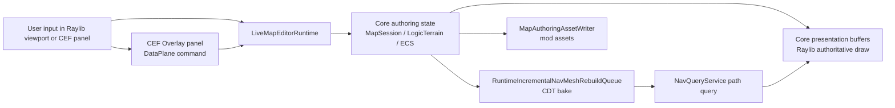

# Live Map Editor Architecture

Epic: [#451](https://github.com/MightyBubble/Ludots/issues/451). Scope: EDR-0 through EDR-7. EDR-8 / #460 pixel streaming is future work and is not part of this implementation.

## Decisions

1. The editor is a launch-time capability mod: `LiveMapEditorMod` is added through launcher selectors. Ludots does not hot-inject mods into an already running session.
2. The panel is a CEF Web UI surface in `UiSurfaceSegment.Overlay`. It is non-exclusive and is toggled in-session with `F4`.
3. Web UI is only the control and data plane. It does not render terrain, navmesh, entities, or a parallel world model.
4. Core is the authoring SSOT. Commands mutate Core state first, then presentation/Raylib/nav/save observe the same state.
5. Raylib/Core is the authoritative viewport renderer. Debug overlays draw from Core `NavTileStore`, path query results, selection state, and brush state.
6. The existing React/Three.js editor and `Ludots.Editor.Bridge` stay as the offline editor path. This Epic does not delete or rewrite them.
7. Live runtime nav rebake is `runtime-incremental + cdt`. Offline full bake may still use Recast, but the in-session editor must not claim Recast for live rebake.
8. Missing runtime `.ntil` tiles are produced by the explicit runtime-incremental CDT source path. Offline/recast mode remains fail-fast on missing `.ntil`.
9. The UAT map is `live_editor_nav_grid`, a child of the existing core `nav_editor_grid` map. It overrides the boards with grid boards that intentionally omit `DataFile`, so Core creates flat grid `LogicTerrainField` authoring data instead of loading the parent `.bin` terrain.
10. `.ltrn` v1 stores grid logic terrain cells. Height is currently authored as `HeightLevel`; the temporary visual adapter projects one height level to 100 cm until the #399 logic/visual height scale line defines a richer authored height scale.

## Ownership

| Area | Owner | Runtime object | Editor behavior |
|---|---|---|---|
| Map session | Core | `MapSession`, `MapConfig` | Read current map/board state through DataPlane topics |
| Logic terrain | Core | `LogicTerrainField`, `.ltrn` for grid authoring | `paintTerrain` mutates grid cells and marks dirty AABB |
| Entities | Core/ECS | `RuntimeEntitySpawnQueue`, `MapEntity`, `MapLoadEntityIndex` | `placeEntity`, `selectEntity`, `removeEntity` command lane |
| Navigation | Core nav | `RuntimeIncrementalNavMeshRebuildQueue`, `NavTileStore`, `NavQueryService` | dirty terrain/obstacle areas rebake, path overlay draws authoritative results |
| Save | Core authoring | `MapAuthoringAssetWriter` | `saveMap` writes an explicit or unambiguous authoring map fragment, `.ltrn`, entities, and loaded nav tiles |
| Panel | WebUI DataPlane | `WebUiDataPlaneRuntime`, `WebUiCommandRouter` | Inspector and controls only |

## Transport Network Editing Boundary

Road, waterway, railway, and other NodeGraph authoring is tracked by [#462](https://github.com/MightyBubble/Ludots/issues/462). That Epic reuses this editor host, DataPlane command lane, Raylib picking, and save surface, but it is not part of the grid terrain/entity/nav UAT delivered by #451.

The transport leg has its own SSOT from [#415](https://github.com/MightyBubble/Ludots/issues/415):

| Concern | Required owner | Editor boundary |
|---|---|---|
| Authoring source | `TransportNetworkAsset` loaded from `TransportNetwork/transport_network.json` | Transport tools mutate the live asset reference only; no private road graph, waterway graph, or spline JSON is introduced |
| Bake | `TransportNetworkBaker.Bake(asset, chunkSizeCm)` | `.graph` chunks and ribbon chunks are derived together through the existing Core baker; the editor never authors `.graph` or ribbon output directly |
| Graph runtime | `ChunkedNodeGraphStore` / `LoadedGraphRuntime` | Rebuilt graph chunks replace store data through the existing graph runtime path so `PathServiceRouter` / `AutoPathService` read the same data |
| Ribbon rendering | `TransportNetworkRibbonSource` -> `SurfaceSourcePayloadRegistry` -> Core/Raylib presentation, with `RoadSplineBuffer` as a renderer-facing buffer where configured | Raylib draws the authoritative ribbon; the Web UI panel must not reconstruct ribbon geometry or use a JS world renderer |
| Route validation | `GraphEdgeProjectionQuery`, `PolylineGoalSnapQuery`, `GraphHybridRouteBuilder`, `AutoPathService` | Start/goal picking and multimodal route checks reuse Core query services; no new routing algorithm is added by the editor |
| Cost ownership | `pathing.json` tag rules, `AgentProfile` capacity fields, optional `GraphEdgeCostOverlay` | Transport authoring edits area/tag/capacity/flow only; edge cost is not baked into the asset |
| Save | #451 save surface plus transport serializer/catalog registration from #462 TNE-5 | Saving writes back `transport_network.json` and required catalog registration, then round-trips through `TransportNetworkAssetLoader` |

#451 therefore provides the shared shell. #462 adds transport-specific tools: node CRUD, segment point CRUD, area/tag/direction/flow/capacity editing, baker-triggered graph+ribbon refresh, route overlay, and transport asset persistence. Those tools must keep neutral `transport` terminology; road, water, and rail are configurations of the same transport network, not separate editor-owned systems.

## Entity Placement And Spatial Geometry

Entity placement follows the spatial geometry SSOT called out by #455 / #457. The editor may place and remove map-scoped entities, but it must not invent a parallel geometry model.

| Concern | SSOT | Editor behavior |
|---|---|---|
| Spawn request | `RuntimeEntitySpawnQueue` / `RuntimeEntitySpawnSystem` | `placeEntity` enqueues an existing template at the picked world point and waits for the spawn receipt |
| Map ownership | `MapEntity { MapId }` and `MapLoadEntityIndex` | Spawned entities are registered against the focused `MapSession`; save writes authored `MapConfig.Entities` |
| Entity generation | `PresentationStableId` plus ECS generation resolver | `removeEntity` requires the selected stable id/generation to still be current |
| Selection geometry | `SpatialBounds` / `SpatialFootprint2D` / `SpatialBox3D` | Selection remains a consumer of generic spatial geometry; no `SelectionFootprint2D`, `SelectionRange`, or editor-owned selection shape is introduced |
| Obstacle intent | `ManifestationObstacleIntent2D` / `CompoundObstacle2D` | Placed templates may carry authored obstacle intent; the editor does not synthesize private obstacle data |
| Derived physics/nav | `Collider2D`, `NavObstacle2D`, `CompoundObstacle2DState` | Existing bridge systems derive physics/nav state from authored geometry; editor commands do not write those derived sinks directly |
| Rendering | Core presentation / Raylib performer state | Placed entities render through their real presentation assets; no placeholder mesh, fake icon, or JS-side representation is authoritative |

Obstacle editing remains bounded by the same rule: authored truth lives on the entity/template geometry components, then existing bridge systems derive physics/nav. If a future brush authors obstacle regions directly, that brush must write the established authored obstacle components and let `ManifestationObstacleBridge2DSystem` rematerialize sinks by `ShapeSignature` / `PoseSignature` / `SinkSignature`.

## EDR-2 Spike Result

The spike result is go for EDR-3 through EDR-7 with these constraints:

| Topic | Result |
|---|---|
| Viewport picking | Uses Core/Raylib pointer state via `AuthoritativeGroundPointerHelper`; Web UI does not compute ray hits |
| Brush input | Raylib viewport drives `paintTerrain` while the panel is open; panel chrome suppresses viewport commands |
| Simulation picking | In `sim`/`nav` tool, left click sets start and right click sets goal; query runs through `NavQueryService` |
| Debug draw | Brush, selection, path, and nav tile triangles are drawn by Core/Raylib buffers |
| Known limitation | Panel hit testing is currently mirrored by fixed overlay chrome bounds in the presentation system; the browser surface still owns the CEF hit test for UI delivery |

## Flow

## Command Lane

| Command | Writes | Notes |
|---|---|---|
| `setTool` | editor runtime only | Selects inspect/paint/entity/sim/nav behavior |
| `setBrush` | editor runtime only | Brush radius, height, area, cost, blocked/water/ramp flags |
| `paintTerrain` | `MutableGridLogicTerrainField` | Converts focused terrain to mutable grid when needed, bumps editor terrain revision, enqueues dirty AABB |
| `placeEntity` | `RuntimeEntitySpawnQueue` | Uses spawn receipts to bind the authored instance to the live entity |
| `selectEntity` | editor selection state | Selects nearest map entity near the picked world point |
| `removeEntity` | ECS + session entity index/authored list | Uses presentation destroy lifecycle when stable visual ids exist |
| `rebakeDirty` | nav tile stores | Processes runtime-incremental CDT dirty queue |
| `queryPath` | nav debug state | Uses `NavQueryService.TryFindPath`, reports elapsed microseconds |
| `transportSetMode` | editor runtime only | Selects transport node/segment/route viewport behavior |
| `transportAddNode` / `transportMoveNode` / `transportDeleteNode` | `TransportNetworkAsset.nodes` | Mutates the live asset and validates through Core |
| `transportBeginSegment` / `transportAppendSegmentPoint` / `transportCommitSegment` | `TransportNetworkAsset.segments` | Drafts and commits segment points and area/tag/flow/capacity fields |
| `transportRebake` | Core graph/ribbon derived outputs | Runs `TransportNetworkBaker.Bake(asset, chunkSizeCm)` and refreshes `ChunkedNodeGraphStore` plus `TransportNetworkRibbonSource` |
| `transportQueryRoute` | transport route debug state | Uses Core pathing (`GraphEdgeProjectionQuery`, `LoadedChunkSolvePrimer`, `PathServiceRouter` / `AutoPathService`) |
| `transportSave` | mod transport asset | Writes `TransportNetwork/transport_network.json`, ensures catalog registration, then round-trips through `TransportNetworkAssetLoader` |
| `saveMap` | mod assets | Writes an explicit `metadata.liveMapEditor.saveTarget=true` map fragment, or exactly one unambiguous fragment with boards |

## Save Scope

`saveMap` writes the focused merged authoring state back to the selected mod map fragment. For this Epic it writes:

| Asset | Status |
|---|---|
| Grid `LogicTerrainField` | Written as `.ltrn` through `LogicTerrainBinary` |
| `MapConfig.Entities` | Written into the selected map JSON |
| Loaded nav tiles | Written as `.ntil` through `NavTileBinary` after the runtime queue is clean |
| Transport network asset | When loaded, written as `TransportNetwork/transport_network.json` through the #462 transport save path |
| Visual heightmap `.vhtm` | Not independently authored by this editor path; when the map has no explicit `.vhtm`, Core derives the displayed visual heightfield from the grid LogicTerrain adapter |

## EDR Delivery Matrix

| Issue | Result |
|---|---|
| #452 EDR-0 | Boundary documented here; launcher preset keeps Raylib + original Web editor/Bridge paths separate |
| #453 EDR-1 | `LiveMapEditorMod` adds a launch-time CEF overlay panel and DataPlane state topic |
| #454 EDR-2 | Raylib pointer picking drives brush/entity/path interactions; CEF chrome suppresses viewport commands |
| #455 EDR-3 | WebUI command lane places, selects, and removes map entities through Core/ECS |
| #456 EDR-4 | Grid `LogicTerrainField` can be edited live and saved as `.ltrn` |
| #457 EDR-5 | Terrain dirty AABBs feed runtime-incremental CDT rebake; Raylib overlays draw authoritative nav tiles/path |
| #458 EDR-6 | `MapAuthoringAssetWriter` saves map config, grid terrain, entities, and loaded nav tiles in-process |
| #459 EDR-7 | UAT preset `live_map_editor_nav_grid_cef_raylib` stacks CEF runtime, an existing nav grid map, and the editor mod |

## Non-Goals

- No online pixel streaming in this Epic.
- No second WebGL/Three world renderer for in-session editing.
- No fallback to fake navmesh, fake green planes, or JS-computed paths.
- No runtime dependency on `Ludots.Editor.Bridge` for save.
