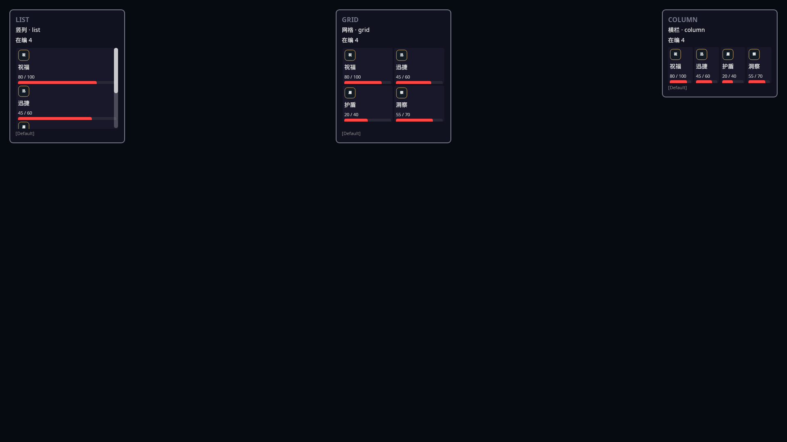

# 面板开箱布局教室

同一份效果芯片，三种编排：竖列 / 网格 / 横栏；带剩余时间、层数与统一 `image` 图标。

> 状态：🟢 — Showcase：`panel_author_layout_kit`。作者教室（同屏三面板），与「一袋一场」玩家竖切正交。

> **合同**：[面板开箱布局套件](../panel-author-layout-kit.md) · [面板视图投影](../panel-view-projection.md) · Graph：[LoadEffectTiming](../../reference/graph-node-op-wiki/LoadEffectTiming.md) / [LoadEffectStack](../../reference/graph-node-op-wiki/LoadEffectStack.md)



## 玩家 30 秒

进场同时看到三块面板：左边竖着点名，中间两列格子，右边一排横栏。每颗芯片能认出效果名、剩余时间条、层数，以及一枚小图标。

## 作者写法

| 项 | 值 |
|----|----|
| 芯片 | `panel.kit.effect.chip`（`image` + 名 + 时间条 + 层数） |
| 容器 | `panel.kit.effect.list` / `.grid` / `.column` |
| 收集 op | `QueryCollectActiveEffects` |
| 图标 | 主体表面 `imageId` → `Presentation/image_assets.json` |
| Showcase | `panel_author_layout_kit` |

照抄资产：`mods/showcases/panel_author_layout_kit/PanelAuthorLayoutKitShowcaseMod/assets/Panels/panel_templates.json`。

## 边界

- 不新造「立绘控件 / 头像控件」——统一 `type: "image"`。
- 本场是作者教室，可同屏三面板；玩家竖切仍一袋一场。
- 横栏人多时格子有下限宽度，超出可横滑，不得画出面板外框。

## 验收（玩家视角）

```gherkin
Feature: 开箱布局教室
  Scenario: 三编排同屏
    Given 我启动 panel_author_layout_kit
    When 地图加载完成
    Then 我能同时看到标题含「竖列」「网格」「横栏」的三块面板
    And 芯片上能认出效果名、剩余时间、层数与小图标
    And 横栏里的芯片不跑出面板框
```

## 怎么进

```text
scripts/run-mod-launcher.cmd cli launch $panel_author_layout_kit --adapter raylib
```
