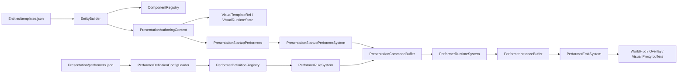

# 表现 Authoring 与运行时契约

本文定义当前工作树中“实体如何接入表现层”的正式契约，并说明它与 [表现层编译式 DSL 目标架构](presentation-compiled-dsl-architecture.md) 的关系。

## 1. 状态

当前可用入口是：

- entity template 的 `Presentation` authoring 块
- `Presentation/mesh_assets.json`
- `Presentation/visual_templates.json`
- `Presentation/performers.json`
- `Presentation/text_tokens.json` 与 `Presentation/text_locales.json`
- GAS / input / selection 等系统写入正式 presentation command 或正式 entity 集合

读者入口按角色区分：

| 角色 | 应读页面 | 不应照抄的页面 |
|------|----------|----------------|
| 新手作者 | [实体表现配置入门指南](../reference/entity-presentation-authoring-guide.md) | 历史冻结的 performer 页面 |
| Runtime 开发者 | 本文 | 历史冻结页中的 runtime performer entity 设计 |
| 迁移执行者 | compiled DSL 架构、开发计划、迁移计划 | 任何保留旧 runtime 主线的历史计划 |

编译式 DSL 是迁移目标，不代表当前 runtime 已经删除 `PerformerInstanceBuffer`。因此当前文档采用两个口径：

| 层级 | 当前真相 |
|------|----------|
| 作者怎么配置 | 以本文和参考指南为准 |
| 运行时如何承载 | 当前仍有 transitional performer runtime |
| 终态怎么迁移 | 以编译式 DSL 目标架构和迁移计划为准 |

禁止为了迁移便利保留隐藏兼容入口。旧 authoring 字段应 fail-fast，而不是跳过或降级。

GitBook 中带有“历史冻结”状态的 performer 页面只保留背景材料。搜索命中 `commandKind`、`scopeId`、`behaviorSlot`、`slotIndex` 等旧名时，必须回到本文的 loader 契约判断当前 authoring 是否允许。

## 2. SSOT

### 2.1 位置、朝向、高度

逻辑位置唯一真相：

- `WorldPositionCm`
- `PreviousWorldPositionCm`

逻辑朝向唯一真相：

- `FacingDirection.AngleRad`

表现层派生：

- `WorldToVisualSyncSystem` 把 `WorldPositionCm` 的 XY 厘米平面转换为 `VisualTransform.Position` 的 XZ 米平面。
- 同一个系统把 `FacingDirection.AngleRad` 转换为绕 Y 轴的 `VisualTransform.Rotation`。
- `TerrainHeightSyncSystem` 在表现同步之后采样 `IVisualHeightmap`，只改写 `VisualTransform.Position.Y`。

结论：

- gameplay 不直接维护第二套 performer world position。
- 贴地不是 adapter 私活。
- visual heightmap 只影响表现高度，不改变 `WorldPositionCm`。

### 2.2 资产

资产解析链路：

```text
Presentation/mesh_assets.json
  -> MeshAssetRegistry
Presentation/visual_templates.json
  -> VisualTemplateRegistry
Entities/templates.json: Presentation.visualTemplateId
  -> PresentationAuthoringContext
  -> VisualTemplateRef + VisualRuntimeState + PresentationStableId
```

`visualTemplateId` 是实体默认外观的正式入口。`VisualTransform` 决定变换，`VisualRuntimeState` 决定 render path、mesh、material、visible flag、animator id。

### 2.3 Text

文字唯一真相：

```text
Presentation/text_tokens.json
Presentation/text_locales.json
WorldText.defaultTextId
```

`source: "textToken"` 已移除。WorldText 的 binding 只负责数值参数、颜色、字号等，不负责把字符串 token 当数据源解析。文本 token 使用 `defaultTextId`，文本数值格式使用 `worldTextValueMode`；`paramKey` 15/16 是运行时保留槽，不是 JSON authoring 入口。

### 2.4 Performer 参数

当前 JSON 使用 `paramKey`，但正式含义由 `WellKnownPerformerParamKeys` 定义。代码、测试和文档必须引用这些名字；JSON 中出现的数字只允许来自这个表。

后续 DSL 前端可以把符号名编译为 dense param layout，但不能把未知数字 silent default 到某个行为。

## 3. Authoring 数据流



关键点：

- `EntityBuilder` 只把 `Presentation` 块交给 `PresentationAuthoringContext`，其他组件仍走 `ComponentRegistry`。
- `PresentationAuthoringContext` 负责验证 registry 引用并分配 `PresentationStableId`。
- `PresentationStartupPerformerSystem` 只处理 `PresentationStartupPerformers`，不会扫描名字或模板。
- `PerformerRuleSystem` 从 presentation events 生成 commands。
- `PerformerRuntimeSystem` 负责实例生命周期。
- `PerformerEmitSystem` 将实例输出到 typed draw/HUD buffer。

## 4. Loader 契约

`PerformerDefinitionConfigLoader` 必须 fail-fast。

已拒绝的旧字段：

| 字段 | 拒绝原因 | 新口径 |
|------|----------|--------|
| `entityScope` | JSON authoring 不能再声明全局实体扫描 | 用 lifecycle rule、startup performer 或后续 owner artifact |
| `requiredTemplate` | 模板过滤不能作为 performer query fallback | 用 event key 或正式组件/系统路由 |
| `maxVisibilityDistanceCm` | 距离裁剪不属于 performer definition 私有字段 | 用 culling/AOI/visibility contract |
| `commandKind` | command 字段名旧 | 用 `kind` |
| `scopeId` | scope 不能暴露为旧数字字段 | 用 `scopeTag` 或 `scopeSource` |
| `behaviorSlot` | 旧命令字段 | 用 `targetBehaviorSlot` |
| behavior `slotIndex` | 旧 behavior 字段 | 用 `slot` |
| binding `source: "textToken"` | text token 入口不在 binding | 用 `defaultTextId` |
| WorldText `paramKey` 15/16 | token 和文本模式不是数字 binding | 用 `defaultTextId` / `worldTextValueMode` |
| binding `source: "graph"` | 当前 runtime binding evaluator 不支持 graph source | 用 rule condition 或 command graph |

这些错误不能被 catch 后跳过。坏 performer authoring 会阻止加载，避免一个 mod 半成功运行。

## 5. Current Runtime 边界

当前 runtime 仍然包含：

- `PerformerDefinition`
- `PerformerCommand`
- `PerformerInstanceBuffer`
- `PerformerRuleSystem`
- `PerformerRuntimeSystem`
- `PerformerEmitSystem`

这些属于迁移中的 transitional runtime。它们可以继续承载现有 showcase 和测试，但不能被文档描述成终态架构。

`behaviors` authoring 已进入 parser contract，用于表达 `AssetBinding`、`Animator`、`Attachment`、`Material` 等未来 compiled recipe。当前 hot path 仍以 `visualKind`、typed HUD buffer、visual proxy buffer 为主；未 lower 到 backend 的 behavior slot 不应被当作已经完成的表现输出。

## 6. HUD 与 Skia 路径

HUD 数据流：

```text
PerformerEmitSystem
  -> WorldHudBatchBuffer
  -> WorldHudToScreenSystem
  -> ScreenHudBatchBuffer / PresentationOverlayScene
  -> SkiaOverlayRenderer
```

规则：

- World HUD 在 Core 里投影为 screen item。
- Skia 只消费已经格式化或可格式化的 packet，不反查 ECS。
- `PresentationTextPacket` 是 adapter-neutral 文字协议。
- `WorldHudStringTable` 和 text catalog 管 locale/token 格式化。

这条路径是 Web parity 的基础：Web adapter 应消费同样的 typed buffer 或等价 packet，不重新读取 `Name`、`AttributeBuffer` 拼 UI。

## 7. GAS 和选择面板

实体模板中的 GAS 基线：

- `AttributeBuffer` 定义基础属性。
- `AbilityStateBuffer` 定义基础技能槽。
- `AbilityFormSetRef` 把单位接入 form routing。
- `GameplayTagContainer` 是标签事实容器。

选择面板和实体信息面板的边界：

- selection 只提供 entity 集合。
- 面板数据源订阅 entity 集合并通过正式 sampler/semantic catalog 读取信息。
- 面板不能把“当前选择”硬编码成唯一来源；control group、hover set、debug set、脚本指定集合都应能复用同一面板。

## 8. 小地图和 Web parity

当前工作树里的 `mods/capabilities/minimap` 是旧 capability，不是 Core-owned performer marker contract。正式小地图不能依赖：

- `Name + WorldPositionCm + MapEntity` 扫描
- `Team` 推断颜色
- tag/name 聚合 fallback
- mod 私有 minimap input adapter

目标方向：

```text
authoring declares marker intent
  -> Core typed marker buffer
  -> Skia minimap lane
  -> Web adapter consumes same data contract
```

在 Core contract 落地前，GitBook 不定义新的 minimap 配置字段。

## 9. 技术债务报告

| 项 | 当前状态 | 收束要求 |
|----|----------|----------|
| behavior slots | loader 已解析，runtime 未完整 lower 到 typed backend | compiler pass 必须把 behavior lower 为 typed recipe，不允许 generic runtime scan |
| numeric `paramKey` | 由 `WellKnownPerformerParamKeys` 定义，但 JSON 仍写数字 | DSL 前端应支持符号名并编译为 dense key |
| entity-scoped runtime | Core 内置 HUD 仍使用 runtime enum 支撑旧热路径 | JSON authoring 已拒绝 `entityScope`，后续迁移到 owner artifact |
| visual template material | 当前模板 `materialId` 仍是数字 | 后续需要 material registry key 化，不能散落魔法 id |
| minimap | 旧 capability 仍在 mods 下 | 正式 Core marker contract 落地后删除或冻结旧 mod |

这些债务不能通过 fallback 解决，只能通过正式 compiler/backend 迁移收束。
