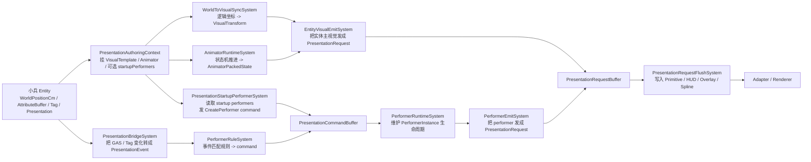

# Presentation / Performer 当前架构

本文只描述 Ludots 当前已经实现并正在运行的 Presentation / Animator / Performer 架构，不讨论未来目标态。

目标是回答三个问题：

1. 一个小兵从出生到死亡，当前代码到底怎么跑。
2. `entity`、`visual`、`animator`、`performer` 现在分别负责什么。
3. 当前实现里哪里已经清晰，哪里还存在架构分叉。

## 1. 一句话总览

当前 Ludots 的表现层不是“单一 actor 对象模型”，而是两条主线并存：

- `entity visual` 负责主模型、主材质、主动画状态。
- `performer` 负责附加表现，例如地圈、血条、飘字、marker、one-shot prefab。

也就是说，当前一个小兵的“身体”和“附加表现”不是同一个运行时对象。

## 2. 当前运行时流图

## 3. 小兵从生到死

### 3.1 出生

小兵出生时，先创建 ECS `Entity`。

如果模板里配置了 `Presentation` authoring，则 `PresentationAuthoringContext` 会给它挂上这些表现层组件：

- `VisualTemplateRef`
- `VisualRuntimeState`
- `AnimatorPackedState`
- `AnimatorRuntimeState`
- `AnimatorParameterBuffer`
- `AnimationOverlayRequest`
- `AnimatorFeedbackBuffer`
- `PresentationStableId`
- 可选 `PresentationStartupPerformers`
- 可选 `PresentationStartupState`

这一步的关键含义是：

- 主视觉是挂在 entity 身上的。
- animator 运行时状态也是挂在 entity 身上的。
- performer 不是天然存在的，只是可能通过 startup 配置再创建。

代码入口：

- [PresentationAuthoringContext.cs](C:\001_AI\LudotsProd_issue121_116_119\src\Core\Presentation\Config\PresentationAuthoringContext.cs)

### 3.2 位置与朝向同步

逻辑层位置真相是：

- `WorldPositionCm`
- `PreviousWorldPositionCm`

表现层位置输出是：

- `VisualTransform`

`WorldToVisualSyncSystem` 每帧把逻辑坐标插值后写进 `VisualTransform`，如果 entity 有 `FacingDirection`，也会顺带更新旋转。

这条线只负责“实体长在哪里、朝哪看”。

代码入口：

- [WorldToVisualSyncSystem.cs](C:\001_AI\LudotsProd_issue121_116_119\src\Core\Presentation\Systems\WorldToVisualSyncSystem.cs)

### 3.3 主动画推进

如果 entity 挂了 animator 相关组件，`AnimatorRuntimeSystem` 会根据：

- controller
- 当前 state
- transition
- parameter bits

推进动画状态，并把结果写回：

- `AnimatorRuntimeState`
- `AnimatorPackedState`

这条线只负责“主模型当前播放什么动画状态”，例如 idle、move、attack、hit、death。

代码入口：

- [AnimatorRuntimeSystem.cs](C:\001_AI\LudotsProd_issue121_116_119\src\Core\Presentation\Systems\AnimatorRuntimeSystem.cs)

### 3.4 主视觉发射

`EntityVisualEmitSystem` 会扫描具有：

- `VisualTransform`
- `VisualRuntimeState`
- `PresentationStableId`

的 entity，并把它们发成 `PresentationRequest`。

它会把这些信息一起带出去：

- mesh / material
- transform
- team color
- animation packed state
- overlay animation
- visibility / LOD

这里发出去的是“小兵本体的外观”。

代码入口：

- [EntityVisualEmitSystem.cs](C:\001_AI\LudotsProd_issue121_116_119\src\Core\Presentation\Systems\EntityVisualEmitSystem.cs)

## 4. Performer 这条线

### 4.1 performer 现在负责什么

performer 当前更像“附加表现对象”，常见用途有：

- 血条
- 世界文本
- 地面范围圈
- marker
- one-shot 特效
- one-shot prefab

它不是实体本体，也不是主动画容器。

### 4.2 performer 如何产生

当前 performer 有两种主要来源。

第一种，启动时创建：

- entity 挂 `PresentationStartupPerformers`
- `PresentationStartupPerformerSystem` 读取后发 `CreatePerformer`

第二种，事件驱动创建：

- `PresentationBridgeSystem` 把 GAS / Tag 变化翻译成 `PresentationEvent`
- `PerformerRuleSystem` 根据规则发 `CreatePerformer` / `DestroyPerformerScope` / `SetPerformerParam`

代码入口：

- [PresentationStartupPerformerSystem.cs](C:\001_AI\LudotsProd_issue121_116_119\src\Core\Presentation\Systems\PresentationStartupPerformerSystem.cs)
- [PresentationBridgeSystem.cs](C:\001_AI\LudotsProd_issue121_116_119\src\Core\Presentation\Systems\PresentationBridgeSystem.cs)
- [PerformerRuleSystem.cs](C:\001_AI\LudotsProd_issue121_116_119\src\Core\Presentation\Systems\PerformerRuleSystem.cs)

### 4.3 performer 运行时生命周期

`PerformerRuntimeSystem` 消费 command，并维护 `PerformerInstanceBuffer`。

当前它负责：

- 创建持久 performer instance
- 释放指定 performer
- 按 scope 批量销毁 performer
- 处理 one-shot performer
- 处理 transient prefab / transient marker 生命周期
- owner 死亡时释放 entity-anchor performer

代码入口：

- [PerformerRuntimeSystem.cs](C:\001_AI\LudotsProd_issue121_116_119\src\Core\Presentation\Systems\PerformerRuntimeSystem.cs)
- [PerformerInstanceBuffer.cs](C:\001_AI\LudotsProd_issue121_116_119\src\Core\Presentation\Performers\PerformerInstanceBuffer.cs)
- [TransientMarkerBuffer.cs](C:\001_AI\LudotsProd_issue121_116_119\src\Core\Presentation\Rendering\TransientMarkerBuffer.cs)

### 4.4 performer 发射

`PerformerEmitSystem` 会把 performer instance 发成 `PresentationRequest`。

当前支持的输出包括：

- `GroundOverlay`
- `Marker3D`
- `WorldBar`
- `WorldText`
- `RoadSpline`

参数解析优先级是：

`override > binding > default`

也就是说 performer 本身不缓存颜色、尺寸、数值，它每帧重新解析绑定，保证数据新鲜。

代码入口：

- [PerformerEmitSystem.cs](C:\001_AI\LudotsProd_issue121_116_119\src\Core\Presentation\Systems\PerformerEmitSystem.cs)

## 5. 最终落到哪里

无论是 entity visual 还是 performer，最后都会先写入 `PresentationRequestBuffer`。

然后 `PresentationRequestFlushSystem` 统一把 request flush 到 adapter-facing buffer：

- `PrimitiveDrawBuffer`
- `GroundOverlayBuffer`
- `WorldHudBatchBuffer`
- `RoadSplineBuffer`
- `PresentationVisualProxyBuffer`
- `SkinnedVisualBatchBuffer`

这一步之后，adapter 才真正消费这些最终输出。

代码入口：

- [PresentationRequestFlushSystem.cs](C:\001_AI\LudotsProd_issue121_116_119\src\Core\Presentation\Requests\PresentationRequestFlushSystem.cs)

## 6. 现在各层职责边界

### 6.1 entity

当前 entity 负责：

- 逻辑状态
- 世界位置
- 属性与 tag
- 主视觉配置
- 主动画状态
- 可选地声明 startup performer

### 6.2 visual

`visual` 当前指实体本体的渲染状态。

它负责：

- 模型/材质/模板
- transform
- 动画 packed state
- adapter-facing visual proxy

### 6.3 animator

`animator` 当前只负责 entity 主模型动画。

它不负责：

- 血条
- 飘字
- 地圈
- one-shot 特效

### 6.4 performer

`performer` 当前负责附加表现。

它可以：

- 跟随 entity
- 用 attribute / graph / color 绑定驱动参数
- 响应 GAS 事件和 tag 事件
- 有持续时间和销毁 scope

## 7. 当前架构里的关键分叉

当前最重要的事实是：

Ludots 还不是单一 actor 模型。

它现在是“双轨制”：

- 主模型与主动画走 entity visual
- 附加表现走 performer

这带来的直接结果是：

1. 小兵“本体”并不是 performer。
2. `entity` 当前仍然可能直接知道 performer，例如 `PresentationStartupPerformers`。
3. 血条这类长期附着物到底应该属于 entity visual 还是 performer，在现实现状里已经统一到 performer，但入口仍有分叉。

## 8. 结论

如果只看当前实现，可以用一句话概括：

> entity 是逻辑真相和主视觉宿主，animator 是主动画状态机，performer 是围绕 entity 运行的附加表现系统。

这解释了为什么当前会同时看到：

- entity visual pipeline
- animator runtime pipeline
- performer command / rule / runtime pipeline

它们现在都是真实存在、都在工作，但还没有完全收束成单一 actor 语义。
