# Presentation Pipeline Showcase UAT Design

This document defines the UAT showcase plan for the final Presentation / Performer / Prefab pipeline. The goal is to validate one production path: entity and gameplay facts become presentation events, performer rules create commands, performer runtime owns instances, performer emit produces presentation requests, and adapters consume only flushed adapter-facing buffers.

## 1. Acceptance Goal

The accepted pipeline is:

```mermaid
flowchart LR
    A["Entity lifecycle / GAS / Tag / Projectile fact"] --> B["PresentationEventStream"]
    B --> C["PerformerRuleSystem"]
    C --> D["PresentationCommandBuffer"]
    D --> E["PerformerRuntimeSystem"]
    E --> F["PerformerInstanceBuffer"]
    F --> G["PerformerEmitSystem"]
    G --> H["PresentationRequestBuffer"]
    H --> I["PresentationRequestFlushSystem"]
    I --> J["Adapter-facing buffers"]
```

These paths are explicitly out of scope and must fail audit:

- Entity code directly knowing performer exists.
- Entity-scoped performer scanning.
- Startup performer, projectile cue, prefab cue, or projectile binding config as a second truth.
- Adapter-side parsing of performer semantics.
- Fallback to legacy fields or legacy loaders.

## 2. Showcase Mod Shape

Recommended fixture:

`mods/showcases/presentation_pipeline_uat/PresentationPipelineUatMod`

The mod should be config-driven and contain only deterministic UAT content:

- `assets/Entities/templates.json` for test units, projectile carriers, and prefab carriers.
- `assets/Presentation/performers.json` for performer rules, bindings, behavior, and prefab-producing performers.
- `assets/Presentation/visual_templates.json` for primary entity visuals.
- `assets/Presentation/meshes.json` for primitive mesh and prefab asset references.
- `assets/Maps/presentation_pipeline_uat.json` for fixed spawn points, movement lanes, culling zones, and LOD zones.

## 3. Scenario Matrix

| Scenario | Trigger fact | Expected performer behavior | Acceptance |
| --- | --- | --- | --- |
| Entity spawn health bar | `EntitySpawned` | Create persistent world bar scoped by stable id | Only entities with attributes create bars |
| Entity destroy cleanup | `EntityDestroyed` | Destroy performers by stable-id scope | No HUD, primitive, overlay, or request residue |
| Template-key lane | `EntitySpawned` + template key | Exact-key rule creates hero-only visual | No `RequiredTemplateId` or `EntityScope` |
| Attribute binding | Attribute current/base changes | Bar fill resolves from owner attributes each frame | No cached gameplay truth in performer |
| Tag behavior | `TagEffectiveChanged` | Explicit gained/lost rules create and destroy marker/aura | Tag branches configured in performer rules |
| Projectile spawned | `ProjectileSpawned` | Create trail, impact, or prefab performer request | No projectile cue config |
| One-shot prefab | GAS/projectile event | Runtime creates transient prefab request | Lifetime owned by runtime buffers |
| Culling | `CullState.IsVisible=false` | Instance remains active but does not emit | Reappears without recreating gameplay truth |
| LOD | Owner LOD changes | Request carries adapter-neutral LOD | Adapter consumes, does not decide performer semantics |
| Map/session unload | Map dispose or session switch | Instances and buffers are cleared | No cross-map stable-id or visual residue |
| Batch stress | 1000 units + 200 events/frame | SoA buffers remain stable | No fallback expansion path or legacy path |
| Cross-adapter parity | Raylib / UE5 | Same flushed request semantics | Stable id, kind, LOD, cull parity |

## 4. UAT Cases

### UAT-001 Entity Spawn Creates Persistent Performer

Steps:

1. Load `PresentationPipelineUatMod`.
2. Spawn three entities: two with `AttributeBuffer`, one without.
3. Run lifecycle, rule, runtime, emit, and flush for one frame.

Expected:

- Three `EntitySpawned` facts are published.
- Two `CreatePerformer` commands are emitted.
- `PerformerInstanceBuffer.ActiveCount == 2`.
- `WorldHudBatchBuffer` contains two bars.

### UAT-002 Entity Destroy Releases Performer Scope

Steps:

1. Start from UAT-001.
2. Mark one entity as `PresentationLifecycleState.PendingDestroy`.
3. Run one presentation frame.

Expected:

- `EntityDestroyed.PayloadA` equals the entity `PresentationStableId`.
- `DestroyPerformerScope` uses the same stable-id scope.
- The bar is gone next frame.
- The entity never stores a performer component.

### UAT-003 Template Key Rule Filter

Steps:

1. Register template keys `uat.hero` and `uat.minion`.
2. Configure a performer rule for `EntitySpawned + uat.hero`.
3. Spawn one hero and one minion.

Expected:

- The hero receives the keyed aura or extra bar.
- The minion only receives generic rules.
- Config contains no `RequiredTemplateId`, `EntityScope`, or `startupPerformerIds`.

### UAT-004 Attribute Binding Refresh

Steps:

1. Spawn one unit with health.
2. Reduce current health every 10 frames.
3. Do not send `SetPerformerParam`.

Expected:

- Bar fill follows `current/base` from the owner each frame.
- `PerformerInstanceBuffer` stores identity, scope, and owner only, not gameplay truth.

### UAT-005 Tag Behavior

Steps:

1. Add `uat.burning` to an entity.
2. Rule creates a burning marker on tag gained.
3. Remove the tag.
4. Rule destroys the burning scope on tag lost.

Expected:

- Both branches come from `TagEffectiveChanged`.
- Rules use explicit `TagGained` and `TagLost` conditions.
- Gameplay systems do not call presentation directly.

### UAT-006 Projectile / Prefab Grounding

Steps:

1. Fire a skill that spawns a projectile.
2. Projectile spawn publishes `ProjectileSpawned`.
3. Performer rules create trail, impact, or prefab requests.

Expected:

- Projectile visuals come only from performer definitions.
- No `projectile_cues.json` or projectile binding registry participates.
- Prefab output reaches `PresentationRequestBuffer` and then flushes to adapter-facing buffers.

### UAT-007 Culling And LOD

Steps:

1. Spawn 100 units with health bars.
2. Mark some owners invisible.
3. Mark some owners low LOD.

Expected:

- Invisible owner instances remain but do not emit.
- Restoring visibility resumes emission from the same instance.
- LOD is carried on requests; adapters do not reverse-engineer performer logic.

### UAT-008 Map Lifecycle Cleanup

Steps:

1. Load the UAT map and create units, projectiles, and one-shot prefabs.
2. Run until performer and request buffers are non-empty.
3. Unload the map or switch session.

Expected:

- Performer instances for the map are released.
- `PresentationRequestBuffer` and adapter-facing buffers are clear.
- The new map first frame contains no old stable ids, prefabs, or HUD.

### UAT-009 Batch / 0-Alloc Observation

Steps:

1. Spawn 1000 units.
2. Publish 200 GAS/tag/projectile presentation events per frame.
3. Run 300 frames.

Expected:

- No fallback capacity expansion or legacy route is used.
- Steady-state hot path avoids per-entity temporary objects.
- Request counts match visible active instances.

### UAT-010 Cross Adapter Parity

Steps:

1. Run the same UAT map through Raylib acceptance.
2. Run the same UAT map through UE5 host-bound acceptance.
3. Capture adapter-facing buffer summaries after flush.

Expected:

- Stable id, request kind, LOD, and culling results match.
- Adapters never read performer config.
- Adapters consume buffers only.

## 5. Automated Test Targets

Recommended acceptance tests under `src/Tests/GasTests/Production`:

- `PresentationPipelineUatConfigTests` validates forbidden fields and required performer rules.
- `PresentationPipelineUatLifecycleTests` validates spawn, destroy, and scope cleanup.
- `PresentationPipelineUatPrefabGroundingTests` validates projectile and prefab request paths.
- `PresentationPipelineUatAdapterParityTests` validates Raylib / UE5 flushed-buffer parity.
- `PresentationPipelineUatPerfTests` validates batch capacity, request counts, and steady-state allocation observations.

## 6. Evidence Output

Each UAT run should produce:

- JSON summary: event count, command count, instance count, request count, adapter buffer count.
- Screenshot or deterministic textual frame dump.
- Config audit confirming forbidden fields are absent.
- Lifecycle audit confirming no residue after map unload.

## 7. Completion Criteria

The UAT is complete only when all of these are true:

- Performer is a presentation observer, not an entity subsystem.
- Prefab is visual output produced through performer and presentation requests.
- `PresentationRequestBuffer` is the only adapter-facing output gate.
- Culling and LOD affect emitted requests and owner visibility, not gameplay truth.
- Lifecycle scopes use stable ids and create/destroy pairs are observable.
- No fallback, compatibility layer, or duplicate configuration truth remains.
