# Surface Source Performer UAT Plan

This document defines the formal UAT fixture for performer-authored procedural surfaces after PR129 convergence.

## Goal

Validate one production path:

```mermaid
flowchart LR
    A["performers.json SurfaceSource authoring"] --> B["PerformerDefinitionRegistry"]
    B --> C["PerformerEmitSystem"]
    C --> D["PresentationRequestKind.SurfaceSource"]
    D --> E["SurfaceSourceFlushSystem"]
    E --> F["SurfaceSourceRuntimeRegistry"]
    F --> G["ChunkSurfaceBakeSystem"]
    G --> H["ProceduralMeshAssetData"]
    H --> I["VisualRuntimeState + PresentationLocalBounds"]
    I --> J["CameraCullingSystem / VisualLodProfile"]
    J --> K["Raylib / UE5 finalized visual consumption"]
```

The fixture must reject these directions:

- surface authoring outside `performers.json`
- adapter-local procedural generation
- `RoadSpline` as authoritative road geometry
- direct primitive draw fallback for formal surface visuals

## Showcase Mod

Formal showcase fixture:

`mods/showcases/spline_surface_uat/SplineSurfaceUatMod`

Its purpose is narrow:

- road surface via `SurfaceSource(kind=SplineRibbon)`
- river surface via `SurfaceSource(kind=SplineRibbon)`
- lake surface via `SurfaceSource(kind=ClosedArea)`
- raw procedural mesh via `SurfaceSource(kind=RawProceduralMesh)`

The mod intentionally reuses the same runtime payload registry and bake path for all four cases.

## Acceptance Matrix

### UAT-001 Road Surface From Performer

- `uat_surface_road` is authored only in `assets/Presentation/performers.json`
- runtime payload enters through `SurfaceSourcePayloadRegistry.SetSplineRibbon`
- baked output becomes one persistent procedural visual entity

Acceptance:

- removing the performer definition removes the authoritative road surface
- no parallel road surface config file exists
- road surface reaches the same bake and culling path as other surface kinds

### UAT-002 River Surface From Performer

- `uat_surface_river` uses `SplineRibbon`
- width and flow semantics enter through the structured `surface.geometrySource` block
- runtime payload still resolves through the same scope and payload registry path

Acceptance:

- river surface does not create a dedicated render lane
- changing payload version only rebakes the affected source record
- adapters consume the same finalized procedural visual truth

### UAT-003 Lake Surface From Performer

- `uat_surface_lake` uses `ClosedArea`
- boundary authoring is performer-owned
- triangulation happens in Core bake code, not in adapter code

Acceptance:

- lake surface becomes one baked procedural visual entity
- bounds-aware culling sees the baked bounds
- deleting the performer scope destroys the baked entity without residue

### UAT-004 Raw Procedural Mesh From Performer

- `uat_surface_raw` uses `RawProceduralMesh`
- payload provides positions, normals, tangents, uv0, indices, submesh material, and bounds
- bake path accepts it without creating a second raw-mesh rendering API

Acceptance:

- raw mesh uses the same performer/runtime/adapter pipeline as road, river, and lake
- procedural mesh contract validation remains active
- material truth still comes from the Core presentation material registry

## Required Runtime Signals

The UAT run should confirm:

- `SurfaceSourceRuntimeRegistry.Records` contains four active records
- record kinds cover `SplineRibbon`, `ClosedArea`, and `RawProceduralMesh`
- baked entities carry `VisualRuntimeState`, `PresentationLocalBounds`, and `CullState`
- map visual ground truth comes from declared `visualHeightmapAsset`

## Follow-up Expansion

This fixture is the base for future production slices:

- road-network chunk ownership and rebake minimization
- spline-driven river widening and shoreline rules
- lake shoreline material layering
- authored-vs-procedural mixed LOD sets
- UE5 and Raylib parity captures for the same source records
