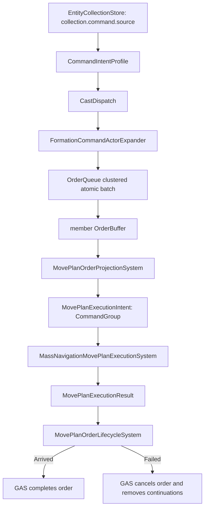

# MassNavigation 正式链路

本页是 `massNavigationMove`、Formation showcase 与 MassNavigation 执行边界的正式 SSOT。GitHub issue #690 负责本次收口。

## 第一性原理

- Order 是 GAS 的玩法生命周期，不是导航数据结构。
- Formation 是 Mod 业务聚合，不是 MassNavigation Core 子域。
- MassNavigation 只消费 typed MovePlan 数据，并产出 typed result。
- anchor 只代表玩家可选择的业务集群；成员才是 order actor 和 navigation actor。
- 同一玩家命令对成员的 fan-out 必须经 Command Router，并以原子 batch 提交。

## 责任边界

| 模块 | 拥有 | 禁止拥有 |
| --- | --- | --- |
| Command Router / GAS | `CommandIntentProfile`、`CastDispatch`、actor expansion、`OrderQueue`、`OrderBuffer`、Order 完成/取消 | Formation 成员查询规则、MassNavigation solver 状态 |
| Formation Capability Showcase | anchor/member/slot 业务状态、`ICommandActorExpander`、初始布局、玩家可见表现 | Core Formation 平行域、专用 Formation order consumer、直接 solver 访问 |
| MovePlanning | `MovePlanExecutionIntent`、`MovePlanExecutionResult`、execution mode/token 合同 | Order 类型解释、Formation 业务语义 |
| MassNavigation Core | typed intent 执行、command group、route/flow、arrival/failure result、ECS writeback | `OrderBuffer`、`OrderTypeId`、`OrderId`、`NotifyOrderComplete`、Formation anchor 业务 |
| MassNavigationMod | 资产、配置，以及 GAS Order 与 MovePlan 的组合根装配 | 第二套 order runtime、私有输入或 selection runtime |

## 主链



`CommandGroupToken` 是跨边界 opaque correlation token。MassNavigation 不得知道它来自 `OrderId`；映射只发生在 GAS projection/lifecycle 内。

## Formation 集群转发

Formation anchor 进入 `collection.command.source`，但不接收 order，也不进入 MassNavigation。

`FormationCommandActorExpander` 在 CastDispatch 之后：

1. 读取 showcase-owned `FormationAnchorState`。
2. 按 `FormationIndex + SlotIndex` 查找 live members。
3. 排除 `SuspendedTag` 成员。
4. 校验 anchor 声明 slot 数、每源容量和总展开容量。
5. 按稳定 slot 顺序输出成员 actor。
6. Command Router 通过 `TryEnqueueClusteredBatch` 一次提交。

任一 actor 无效、重复、缺少 `OrderBuffer`、被规则阻塞或容量不足时，整个 admission batch 不激活任何成员。

## GAS 与 MassNavigation 边界

GAS projection 只处理自己注册的 `massNavigationMove` order，并验证：

- active order id 为正；
- spatial kind 为单一 `WorldCm`；
- X/Z 是有限厘米值；
- result token 必须与当前 active order 匹配。

MassNavigation command-group consumer 只查询：

- `MassNavigationAgent`；
- `MassNavigationAgentIndex`；
- `MovePlanExecutionIntent`；
- `MovePlanExecutionResult`。

它不引用 Order 类型。route 目标、成员绑定、group 容量和 focus 容量必须在任何 group/solver 写入前完成 prepare。route 拒绝写 `Failed` result，由 GAS 取消订单；到达写 `Arrived` result，由 GAS 完成订单。

## Individual 与 CommandGroup

`MovePlanExecutionMode` 必须显式声明：

- `Individual`：Road 等逐实体 MovePlan producer，交给 `IMovePlanExecutionSink`。
- `CommandGroup`：GAS cluster order projection，交给 MassNavigation command-group consumer。
- `None`：未配置，不得被任何执行器静默接受。

两个 consumer 互斥，不能同时消费同一 intent。

## Spawn 与实体职责

```text
FormationCapabilityShowcaseRuntime
  -> RuntimeEntitySpawnQueue
  -> RuntimeEntitySpawnSystem
  -> showcase-owned FormationAnchorState / FormationMemberState
  -> MassNavigationAuthoredAgentBindingSystem binds members only
```

Anchor 具有 selectable、health、outline 等业务/表现组件，但没有 `OrderBuffer`、`MassNavigationAgent` 或 MovePlan execution contract。

Member 具有 `OrderBuffer`、`MassNavigationAgent`；绑定后具有 `MovePlanExecutionIntent` 与 `MovePlanExecutionResult`。

## 代理实体结构变更

代理索引是引擎可见状态：实体上的 `MassNavigationAgentIndex`、求解器的右行序与推挤优先级、route 与 command group 的成员键都按它寻址。查询顺序随 archetype 拓扑变化，不能作为索引来源。因此：

- 代理注册顺序锚定实体 id（即创建序）。`MassNavigationAuthoredAgentBindingSystem` 的 rebuild 与 append 都按 id 排序后落位，重建前后同一批代理的索引不变。
- 上层对代理实体挂任何与 massnav 无关的稀疏组件（玩家偏好、`InteractionMode`、状态标记）不重排代理索引，也不打断执行中的 move。这是合同，由回归测试钉住。
- massnav 合同组件（`MassNavigationAgent`、`MassNavigationAgentIndex`、`MovePlanExecutionIntent`/`MovePlanExecutionResult`）的增删属于代理生命周期变更，仍走绑定/重建路径。
- GAS 效果链对代理实体做结构变更时，继续走 effect phase 的 structural command 缓冲，不在系统执行中途裸写。

## 让行 settle 与 waypoint 推进

求解器有两种 settle：到达式（单位进入目标的停靠圈内）与卡死超时式（让行或拥堵中停滞超过 arrival timeout，停在停滞处）。卡死式 settle 的落点没有半径上界——单位可能停在距当前 waypoint 任意远处。

route 游标的推进圈如果盖不住 settle 落点，就成死锁：当前 waypoint 保持为导航目标但不带 recovery reset，`SetUnitTarget` 对未变化的目标原样早退，settle 不被清除，单位永久驻留，订单最终被排空（表象 `completed=true` 但没走到目标）。两条不变量封住这个面：

- 推进圈必须包含停靠圈。`waypointAdvanceStopThresholdScale >= 1` 由 route 语义校验强制；到达式 settle 因此永远落在推进圈内，走正常的按位置推进。
- 卡死式 settle 无法用有限阈值覆盖，走特殊路径：settle 中的代理每次 apply 至多推进一个 waypoint。推进即 re-target 并带 recovery reset，settle 被清除，单位恢复向下一个 waypoint 移动；每次 apply 一跳，拥堵不会把游标整段跳空。最后一个 waypoint 不受影响，到达判定始终是位置性的。

订单完成语义与此对齐：`Arrived` 只由成员位置对 member order target 的距离判定产生，route 在订单侧释放前保持 active；回归测试在断言完成时同时断言落点位置。

## 配置规则

- order key 使用现有 GAS order catalog，不新增 Formation 专用 order。
- Formation 业务数据只在 `FormationCapabilityShowcaseMod`。
- capacity 必须显式配置；运行时禁止扩容、静默丢弃或部分提交。
- `TargetContext` 不承载 cluster identity；`Order.CommandSource` 是 command router 的明确来源字段。
- 不恢复 Q/E 假旋转、Core Formation、`MassNavigationOrderIngestionSystem` 或任何兼容旁路。

## 证据

- GAS lifecycle：`src/Tests/GasTests/MovePlanOrderLifecycleTests.cs`
- Formation expansion：`src/Tests/PresentationTests/FormationCommandActorExpanderTests.cs`
- Typed Mass consumer：`src/Tests/PresentationTests/MassNavigationMovePlanExecutionTests.cs`
- Anchor/member lifecycle：`src/Tests/PresentationTests/FormationCapabilityLifecycleTests.cs`
- 代理索引对裸组件 Add 稳定：`src/Tests/PresentationTests/MassNavigation/MassNavigationAuthoredAgentBindingIncrementalTests.cs`
- 移动中/进图期组件 Add 不断 move：`src/Tests/GasTests/Map/RoadNetworkShowcaseTests.cs`（`RoadNetworkShowcase_EngineFarRoadMove_*ComponentAdd*` / `*InteractionModeAdd*`）
- settle 在推进圈外仍恢复推进 + 完成带位置断言：`src/Tests/PresentationTests/MassNavigation/MassNavigationRouteExecutionContractTests.cs`（`RouteSink_SettledOutsideAdvanceCircle_*` / `RouteSemantics_AdvanceCircleMustContainUnitStopCircle`）
