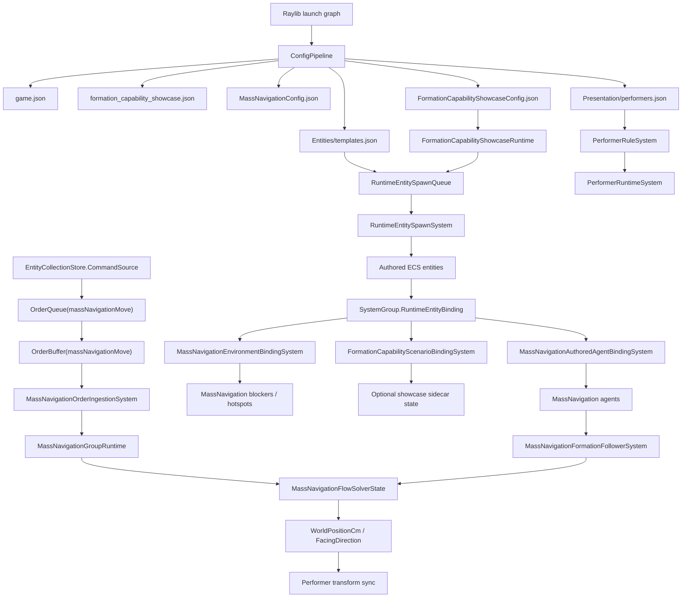
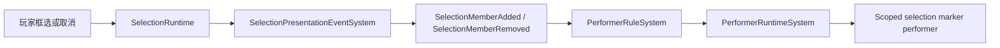

# MassNavigation 正式链路

这份文档给要审架构边界的开发者看。面向第一次上手的教程请先读 `gitbook/reference/mass-navigation-user-book.md`。

当前参考实现：

`mods/showcases/formation_capability/FormationCapabilityShowcaseMod/`

Core runtime 基建：

`src/Core/MassNavigation/`

MassNavigation 能力 Mod：

`mods/capabilities/navigation/MassNavigationMod/`

启动文件：

- `src/Apps/Raylib/Ludots.App.Raylib/launcher.formation-capability-showcase.runtime.json`
- `src/Apps/Raylib/Ludots.App.Raylib/raylib.formation-capability-showcase.launch.graph.json`

launch graph 当前包含：

- `LudotsCoreMod`
- `CoreInputMod`
- `CameraProfilesMod`
- `MassNavigationMod`
- `FormationCapabilityShowcaseMod`

## 职责边界

| 层 | 拥有什么 | 不应该拥有什么 |
| --- | --- | --- |
| Core | ConfigPipeline、entity template、RuntimeEntitySpawnQueue、RuntimeEntitySpawnSystem、SystemGroup.RuntimeEntityBinding、MassNavigation authored component binding、MassNavigationFlow simulation、EntityCollectionStore.CommandSource、OrderQueue、OrderBuffer、order ingestion、ECS writeback、SelectionRuntime、PresentationEvent、PerformerRuntime、MinimapRuntime、VisualHeightmap service。 | Formation Capability 方阵、士兵归属、Shu/Wei 业务命名、showcase 轮廓颜色。 |
| MassNavigationMod | MassNavigation asset/config package、optional tuning panel UI adapter、launch-graph dependency surface。 | MassNavigation agent binding、MassNavigationFlow runtime、order ingestion、formation/follower runtime、post-spawn agent binding。 |
| FormationCapabilityShowcaseMod | 方阵/士兵业务配置、spawn 请求参数、可选 sidecar 场景绑定、障碍 overlay、方阵轮廓表现。 | 私有 selection runtime、私有 order runtime、私有 performer runtime、私有 config loader、私有 MassNavigation binding runtime。 |

## 端到端链路



## Selection 到 Marker

selection marker 生命周期不归 MassNavigation 私有系统所有。



配置里的事件 key 是 `selection.live.primary`。代码里的 canonical key 是 `SelectionSetKeys.LivePrimary`。它们必须指向同一个玩家主选择流。

不要增加第二个拼写、兼容 alias 或 showcase 专属 selection key。

## Order 链路

```text
Local input
  -> EntityCollectionStore.CommandSource
  -> OrderQueue(massNavigationMove)
  -> OrderBuffer(massNavigationMove)
  -> MassNavigationOrderIngestionSystem
  -> MassNavigationGroupRuntime
  -> MassNavigationFlowSolverState
  -> ECS position/facing handoff
  -> performer sync
```

order authoring 使用语义字符串。数字 id 是 runtime 实现细节。

## Spawn 链路

Formation Capability showcase 走共享 runtime spawn path，但不再用 MassNavigation 专属 post-spawn channel 绑定：

```text
FormationCapabilityShowcaseRuntime
  -> RuntimeEntitySpawnQueue
  -> RuntimeEntitySpawnSystem
  -> authored ECS components
  -> SystemGroup.RuntimeEntityBinding
  -> MassNavigationAuthoredAgentBindingSystem
  -> MassNavigationEnvironmentBindingSystem
  -> FormationCapabilityScenarioBindingSystem (optional showcase sidecar)
```

MassNavigation membership is authored by components:

- `MassNavigationAgent` means the entity participates in the core MassNavigation runtime.
- `OrderBuffer` means the entity is controllable/orderable.
- `ManifestationObstacleIntent2D` / `CompoundObstacle2D` means the entity authors obstacle geometry.
- `MassNavigationFlowObstacleProjection` means the bridge has projected authored obstacle geometry into the MassNavigationFlow runtime sink.
- `MassNavigationBlockerProfile` is the runtime binding summary attached after `MassNavigationEnvironmentBindingSystem` runs.
- `MassNavigationFormationAnchor` enables optional formation anchor behavior.
- `MassNavigationFormationFollower` enables optional follower behavior.

Formation is optional. Do not author a disabled formation component; absence of the component means absence of the feature.

`MassNavigationConfig.world.obstacles[]` is obsolete. Obstacle authoring belongs to map/template ECS components. The shared spawn path materializes those components, `ManifestationObstacleBridge2DSystem` produces `MassNavigationFlowObstacleProjection`, and `MassNavigationEnvironmentBindingSystem` rebuilds solver obstacles from `MassNavigationFlowObstacleProjection + WorldPositionCm`.

Showcase sidecar binding may attach `FormationCapabilityFormationAgent` / `FormationCapabilityFormationSoldier` / overlay components after core MassNavigation binding exists. That sidecar must not create a second MassNavigation runtime or bind agents through a post-spawn channel.

## 配置文件链路

| 文件 | 链路职责 |
| --- | --- |
| `mods/showcases/formation_capability/FormationCapabilityShowcaseMod/assets/game.json` | 启动 map、capacity、presentation culling、selection preview order keys。 |
| `mods/showcases/formation_capability/FormationCapabilityShowcaseMod/assets/Maps/formation_capability_showcase.json` | map id 和 visual heightmap 绑定。 |
| `mods/showcases/formation_capability/FormationCapabilityShowcaseMod/assets/MassNavigationConfig.json` | 导航世界、solver、profiles、cadence、arrival、avoidance、camera profiles、view residency。 |
| `mods/showcases/formation_capability/FormationCapabilityShowcaseMod/assets/FormationCapabilityShowcaseConfig.json` | 方阵场景、士兵 template/profile、slot layout、outline、obstacle overlay、initial selection。 |
| `mods/showcases/formation_capability/FormationCapabilityShowcaseMod/assets/Entities/templates.json` | 可 spawn 的 entity templates。 |
| `mods/showcases/formation_capability/FormationCapabilityShowcaseMod/assets/Presentation/performers.json` | performer definitions 和 lifecycle rules。 |
| `mods/showcases/formation_capability/FormationCapabilityShowcaseMod/assets/Configs/config_catalog.json` | showcase config catalog。 |

## 严格 authoring 规则

- 配置大小写严格。
- 缺 template 失败。
- 缺 performer definition 失败。
- 缺 visual heightmap service 失败。
- 缺 order key 失败。
- 缺 selection event key 失败。
- runtime spawn queue capacity 不足失败。
- authoring 使用语义字符串；runtime 可以编译成 int。

## 禁止的捷径

- 不要 fallback visual。
- 不要旧 order/presentation 兼容 bridge。
- 不要 MassNavigation 私有 selection marker lifecycle system。
- 不要隐藏大小写宽容解析。
- 不要在 C# 里按 team name 写颜色 switch。
- 不要用 solver index 做 performer scope。
- 不要每帧扫描 selection 来创建 marker。
- 不要给 showcase JSON 私建 loader。
- 不要把移动和朝向偷偷耦合。
- 不要在 MassNavigationMod 或 showcase Mod 里做 MassNavigation agent post-spawn channel binding。
- 不要 author 一个“不启用”的 optional formation component；不需要 feature 就不配组件。

## 测试对齐

主要 contract test：

`src/Tests/PresentationTests/FormationCapabilityShowcaseContractTests.cs`

它应该覆盖：

- launch graph 包含 Formation Capability entry mod。
- showcase config 可加载。
- 方阵 template id 和士兵 template id 存在。
- 方阵可选中、可接订单。
- 士兵是 MassNavigation agent，但不能直接选中。
- selection marker 由 performer rule 驱动。
- layout 和 outline 名称严格大小写。
- obstacle overlay 配置存在。
- visual heightmap 归 map 持有。
- 士兵速度 profile 大于方阵速度 profile。
- core MassNavigation runtime binding 正确绑定方阵和士兵。
- optional sidecar scenario binding 只绑定 showcase 业务组件。

## 当前验证提示

本文档重写时，工作区存在大量未提交代码变更。如果 build 或 launch 失败，必须先修通代码并重跑 contract tests，再把本文当作验收证据。
