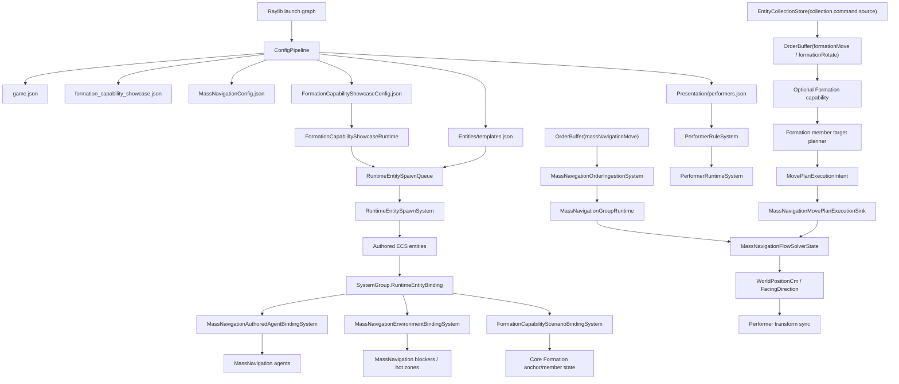

# MassNavigation Formal Chain

Current status: formal Selection APIs are retired. MassNavigation command authority flows through
`EntityCollectionStore` and the default `collection.command.source` collection, then into explicit
`OrderBuffer` orders. New code/config must not add `SelectionRuntime`, `SelectionSetKeys`,
`selection.live.primary`, or selected-provider fallback.

## Reference Implementation

- Core runtime: `src/Core/MassNavigation/`
- Capability assets: `mods/capabilities/navigation/MassNavigationMod/`
- Optional Formation capability: `src/Core/MassNavigation/Formation/`
- Formation showcase adapter: `mods/showcases/formation_capability/FormationCapabilityShowcaseMod/`
- User-facing tutorial: `gitbook/reference/mass-navigation-user-book.md`

## Responsibility Boundary

| Layer | Owns | Must Not Own |
| --- | --- | --- |
| Core MassNavigation | Config pipeline, MassNavigation agent binding, MassNavigationFlow simulation, explicit spatial-target ingestion, MovePlanning execution sink, ECS writeback, collection events, performer/minimap integration | Physical input, Selection, showcase scenario policy, camera/HUD/outline/colour/presentation |
| Optional Core Formation | Stable formation identity, membership/slots, facing, semantic formation orders and deterministic member-target planning through MovePlanning | Physical input keys, local shortcut/debug policy, camera, HUD, outlines, colours, templates, performers, scenario teams/players, direct solver/private group access |
| MassNavigationMod | Asset/config package and optional UI adapter | Core binding/runtime/order ingestion or any formation business state |
| FormationCapabilityShowcaseMod | Showcase scenario config, physical Q/E mapping, configured rotate step, local-player command policy, camera/HUD/outlines/colours and player-readable UI | Private Selection runtime, private config loader, private MassNavigation binding runtime, direct solver access, or stable Formation domain ownership |

## End-To-End Chain



## Command Source To Marker

Command-source marker lifecycle is driven by collection events and performer rules. It is not a
private MassNavigation subsystem.


Configuration event keys use `collection.command.source`; code uses
`EntityCollectionKeys.CommandSource`. Do not add alternate spellings, compatibility aliases,
showcase-only command-source keys, or Selection fallback.

## Order Chain

```text
Local input
  -> EntityCollectionStore(collection.command.source)
  -> OrderBuffer(formationMove / formationRotate)
  -> optional Formation capability
  -> formation command state and member target planner
  -> MovePlanExecutionIntent
  -> MassNavigationMovePlanExecutionSink
  -> MassNavigationFlowSolverState
  -> ECS position/facing handoff
  -> performer sync
```

MassNavigation core does not read `CommandSource`, `InteractionContextStack`, or retired Selection
authority APIs. Generic `massNavigationMove` accepts one explicit spatial destination and no formation
payload. Formation-facing physical input and presentation policy stay in the consuming Mod; stable
formation identity, slots, facing and member-target geometry stay in the optional Core Formation
capability. Generic MassNavigation only executes the explicit targets that reach its Order or
MovePlanning seams.

## Spawn Chain

```text
FormationCapabilityShowcaseRuntime
  -> RuntimeEntitySpawnQueue
  -> RuntimeEntitySpawnSystem
  -> authored ECS components
  -> SystemGroup.RuntimeEntityBinding
  -> MassNavigationAuthoredAgentBindingSystem
  -> MassNavigationEnvironmentBindingSystem
  -> FormationCapabilityShowcaseScenarioBindingSystem
  -> optional core Formation components and preallocated member ranges
```

Formation is an optional MassNavigation Core capability. Loading MassNavigation without authored
Formation data must not require Formation config, author Formation entities, or allocate per-map
Formation state. Engines may keep the reusable Formation systems registered after first use, but
those systems must be gated by the active MassNavigation runtime and remain dormant on maps that do
not author Formation data.

## Config Rules

- Use semantic order keys in assets; runtime ids are implementation details.
- Keep command marker definition ids in command-source terminology.
- Keep obstacle authoring in map/template ECS components.
- Keep stable formation identity, membership, slots, facing and semantic formation orders inside the optional Formation capability.
- Keep physical input mappings, Q/E rotation shortcuts, configured rotate step, camera, HUD, outlines, colours, templates and initial battlefield setup inside the showcase mod.
- Use `MovePlanExecutionIntent` / `MassNavigationMovePlanExecutionSink` for explicit member targets;
  do not access `MassNavigationFlowSolverState` or `MassNavigationGroupRuntime` from the showcase.
- Keep MassNavigation capability assets reusable by other mods.
