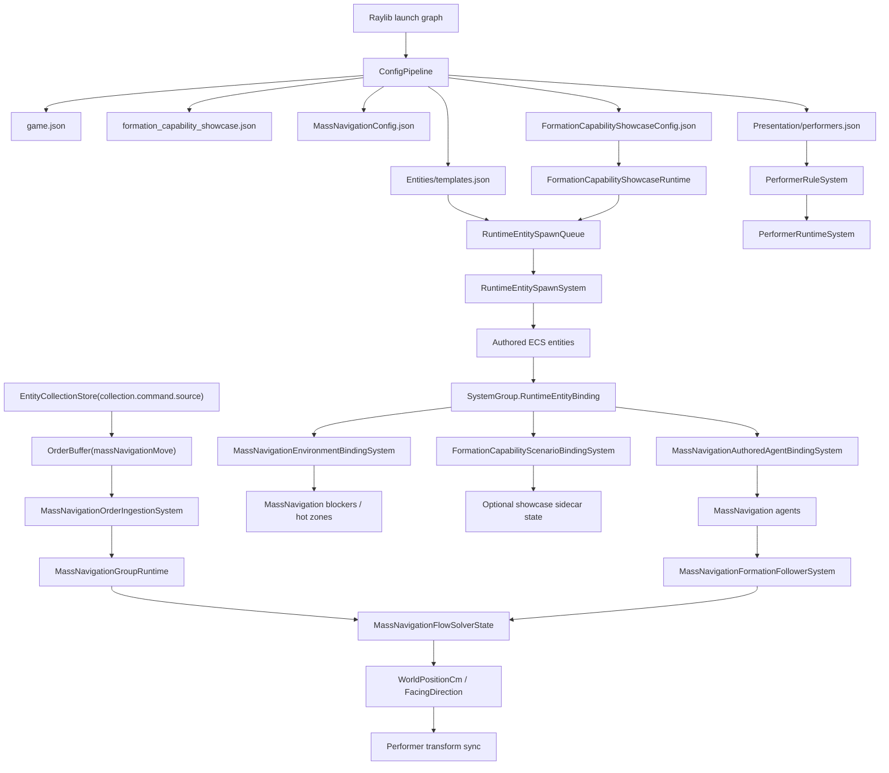
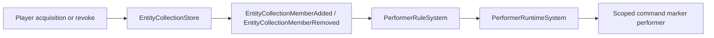

# MassNavigation Formal Chain

Current status: formal Selection APIs are retired. MassNavigation command authority flows through
`EntityCollectionStore` and the default `collection.command.source` collection, then into explicit
`OrderBuffer` orders. New code/config must not add `SelectionRuntime`, `SelectionSetKeys`,
`selection.live.primary`, or selected-provider fallback.

## Reference Implementation

- Core runtime: `src/Core/MassNavigation/`
- Capability assets: `mods/capabilities/navigation/MassNavigationMod/`
- Minimal showcase: `mods/showcases/formation_capability/FormationCapabilityShowcaseMod/`
- User-facing tutorial: `gitbook/reference/mass-navigation-user-book.md`

## Responsibility Boundary

| Layer | Owns | Must Not Own |
| --- | --- | --- |
| Core | Config pipeline, ECS authored components, runtime binding, MassNavigationFlow simulation, explicit order ingestion, ECS writeback, collection events, performer/minimap integration | Showcase factions, showcase colors, private input arbitration, private performer runtime |
| MassNavigationMod | Asset/config package and optional UI adapter | Core binding/runtime/order ingestion, formation sidecar runtime |
| FormationCapabilityShowcaseMod | Scenario config, spawn requests, optional formation sidecar state, player-readable showcase UI | Private Selection runtime, private order runtime, private config loader, private MassNavigation binding runtime |

## End-To-End Chain



## Command Source To Marker

Command-source marker lifecycle is driven by collection events and performer rules. It is not a
private MassNavigation subsystem.



Configuration event keys use `collection.command.source`; code uses
`EntityCollectionKeys.CommandSource`. Do not add alternate spellings, compatibility aliases,
showcase-only command-source keys, or Selection fallback.

## Order Chain

```text
Local input
  -> EntityCollectionStore(collection.command.source)
  -> OrderBuffer(massNavigationMove)
  -> MassNavigationOrderIngestionSystem
  -> MassNavigationGroupRuntime
  -> MassNavigationFlowSolverState
  -> ECS position/facing handoff
  -> performer sync
```

MassNavigation core does not read `CommandSource`, `InteractionContextStack`, or retired Selection
authority APIs. It consumes explicit orders and simulation configuration.

## Spawn Chain

```text
FormationCapabilityShowcaseRuntime
  -> RuntimeEntitySpawnQueue
  -> RuntimeEntitySpawnSystem
  -> authored ECS components
  -> SystemGroup.RuntimeEntityBinding
  -> MassNavigationAuthoredAgentBindingSystem
  -> MassNavigationEnvironmentBindingSystem
  -> FormationCapabilityScenarioBindingSystem (optional showcase sidecar)
```

Formation is optional. Do not author disabled formation components; absence of the component means
absence of the feature.

## Config Rules

- Use semantic order keys in assets; runtime ids are implementation details.
- Keep command marker definition ids in command-source terminology.
- Keep obstacle authoring in map/template ECS components.
- Keep showcase-only sidecar behavior inside the showcase mod.
- Keep MassNavigation capability assets reusable by other mods.
- Load `MassNavigationConfig.json` through ConfigPipeline `ArrayById` profiles and bind one profile only from map `Metadata.massNavigation.profileId`; do not duplicate `mapId` in the profile or cache a process-global last-loaded map/config pair. Keep execution data under `runtime` and optional example spawn/presentation/relationship data under `sceneAuthoring`.
- Long-lived Core or Mod systems must resolve the focused simulation through `MassNavigationRuntimeBinding`, gate sidecar behavior to the owning map, and exclude `SuspendedTag` entities. Capturing the first `MassNavigationSimulationRuntime` is invalid because map push/pop and unload/reload preserve system registration while changing the active runtime.
- Use `cadence.*Hz` as the only cadence authoring surface; interval-tick mirrors are not runtime configuration.
- Use `solver.fieldWidthCm/fieldHeightCm` as the only solver-window dimensions.
- Use `flow.crowdCostEnabled` and `flow.crowdStampBudgetAgentsPerRefresh` for crowd-cost stamping; these fields do not enable/disable the flow solver or configure solver iterations.
- Use `streaming.radiusCm/retainSeconds` for navigation streaming. Camera profiles, performer residency, and obstacle authoring are separate shared-system concerns.

## 10K Performance Evidence

The canonical issue #642 acceptance command is:

```powershell
.\scripts\acceptance\run-mass-navigation-large-world-uat.ps1 -Iterations 1 -Adapter raylib -PerformanceWarmupTicks 300 -SteadyStateSeconds 60 -StopOnFailure
```

The wrapper launches `$capability_standard_mass_navigation_large_world_10k` through the normal launcher and writes the latest successful evidence to:

- `artifacts/acceptance/mass-navigation-issue-642/battle-report.md`
- `artifacts/acceptance/mass-navigation-issue-642/trace.jsonl`
- `artifacts/acceptance/mass-navigation-issue-642/path.mmd`
- `artifacts/acceptance/mass-navigation-issue-642/summary.json`

Performance evidence has two attribution levels:

- Process-wide: total allocated bytes, GC collection counts, retained managed heap, heap fragmentation, and working set. These include the headless launcher/evidence host and must not be presented as MassNavigation-only allocations.
- Solver-owned: prepared agent capacity and `AgentStorageAllocationCount`. A steady-state delta of zero proves the agent-storage arrays did not grow during the measured interval.

The fixed simulation path also treats route scratch/point buffers and formation-follower membership snapshots as prepared storage. Route tracking prepares the declared path budget before `MassNavigationFormationSystem` applies the route; application only performs capacity checks. Formation follower membership uses plan-sized double buffers prepared at runtime activation or map-binding revision changes. Capacity misses fail with the authored capacity name instead of allocating during simulation.

The 10K foundation and capability-standard `game.json` files size presentation buffers from measured scenario occupancy (10,009 markers, 30,009 performers, 20,000 HUD items) with explicit headroom. `MassNavigationEvidenceContractTests` prevents returning to blanket 128K/256K capacities. A capacity miss must fail fast and be corrected from observed peak demand; do not add dynamic growth or silent drops.

MassNavigation telemetry timing and presentation system-breakdown timing are disabled before warmup and remain disabled for the measured wall-clock interval. During the interval the recorder alternates a command-source group between two in-bounds targets every five wall-clock seconds through the formal `OrderBuffer` path, so the measurement is not an idle-world claim. Missing summary fields or missing acceptance artifacts fail the wrapper; they do not degrade to an `n/a` success.
