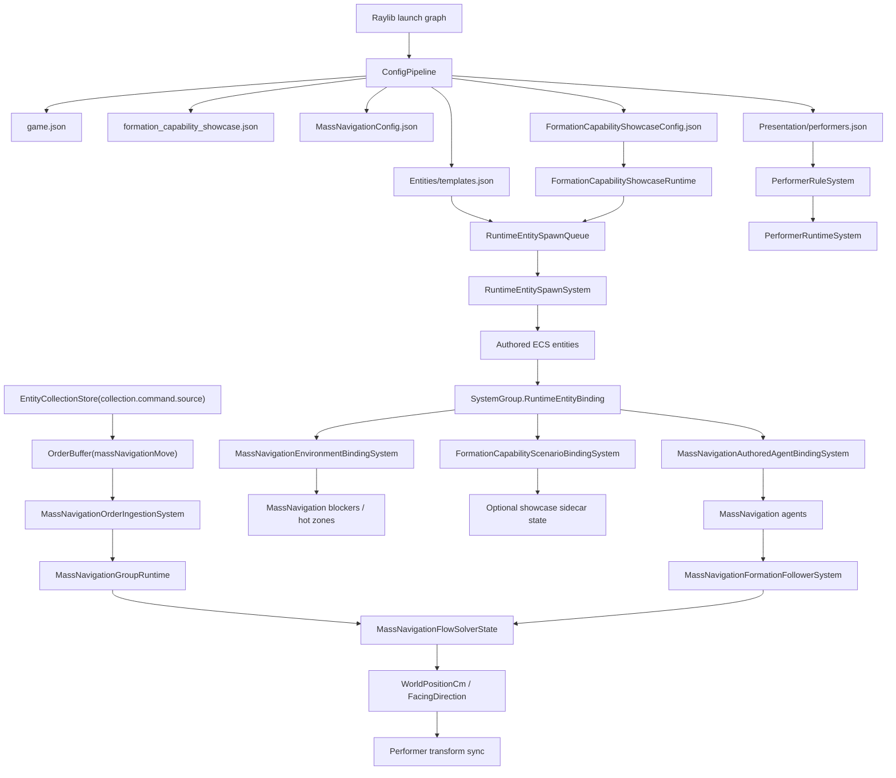
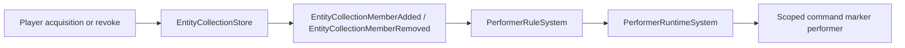

# MassNavigation Formal Chain

Current status: formal Selection APIs are retired. MassNavigation command authority flows through
`EntityCollectionStore` and the default `collection.command.source` collection, then into explicit
`OrderBuffer` orders. New code/config must not add `SelectionRuntime`, `SelectionSetKeys`,
`selection.live.primary`, or selected-provider fallback.

## Reference Implementation

- Core runtime: `src/Core/MassNavigation/`
- Capability assets: `mods/capabilities/navigation/MassNavigationMod/`
- Minimal showcase: `mods/showcases/formation_capability/FormationCapabilityShowcaseMod/`
- User-facing tutorial: `gitbook/reference/mass-navigation-user-book.md`

## Responsibility Boundary

| Layer | Owns | Must Not Own |
| --- | --- | --- |
| Core | Config pipeline, ECS authored components, runtime binding, MassNavigationFlow simulation, explicit order ingestion, ECS writeback, collection events, performer/minimap integration | Showcase factions, showcase colors, private input arbitration, private performer runtime |
| MassNavigationMod | Asset/config package and optional UI adapter | Core binding/runtime/order ingestion, formation sidecar runtime |
| FormationCapabilityShowcaseMod | Scenario config, spawn requests, optional formation sidecar state, player-readable showcase UI | Private Selection runtime, private order runtime, private config loader, private MassNavigation binding runtime |

## End-To-End Chain



## Command Source To Marker

Command-source marker lifecycle is driven by collection events and performer rules. It is not a
private MassNavigation subsystem.



Configuration event keys use `collection.command.source`; code uses
`EntityCollectionKeys.CommandSource`. Do not add alternate spellings, compatibility aliases,
showcase-only command-source keys, or Selection fallback.

## Order Chain

```text
Local input
  -> EntityCollectionStore(collection.command.source)
  -> OrderBuffer(massNavigationMove)
  -> MassNavigationOrderIngestionSystem
  -> MassNavigationGroupRuntime
  -> MassNavigationFlowSolverState
  -> ECS position/facing handoff
  -> performer sync
```

MassNavigation core does not read `CommandSource`, `InteractionContextStack`, or retired Selection
authority APIs. It consumes explicit orders and simulation configuration.

## Spawn Chain

```text
FormationCapabilityShowcaseRuntime
  -> RuntimeEntitySpawnQueue
  -> RuntimeEntitySpawnSystem
  -> authored ECS components
  -> SystemGroup.RuntimeEntityBinding
  -> MassNavigationAuthoredAgentBindingSystem
  -> MassNavigationEnvironmentBindingSystem
  -> FormationCapabilityScenarioBindingSystem (optional showcase sidecar)
```

Formation is optional. Do not author disabled formation components; absence of the component means
absence of the feature.

## Config Rules

- Use semantic order keys in assets; runtime ids are implementation details.
- Keep command marker definition ids in command-source terminology.
- Keep obstacle authoring in map/template ECS components.
- Keep showcase-only sidecar behavior inside the showcase mod.
- Keep MassNavigation capability assets reusable by other mods.
