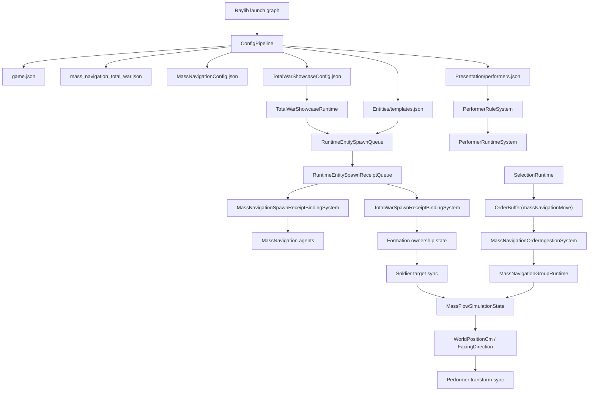
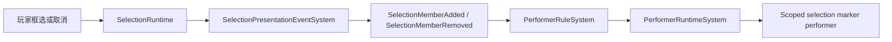

# MassNavigation 正式链路

这份文档给要审架构边界的开发者看。面向第一次上手的教程请先读 `gitbook/reference/mass-navigation-user-book.md`。

当前参考实现：

`mods/showcases/mass_navigation_total_war_entry/MassNavigationTotalWarEntryMod/`

通用基建：

`mods/capabilities/navigation/MassNavigationMod/`

启动文件：

- `src/Apps/Raylib/Ludots.App.Raylib/launcher.mass-navigation-total-war.runtime.json`
- `src/Apps/Raylib/Ludots.App.Raylib/raylib.mass-navigation-total-war.launch.graph.json`

launch graph 当前包含：

- `LudotsCoreMod`
- `CoreInputMod`
- `CameraProfilesMod`
- `MassNavigationMod`
- `MassNavigationTotalWarEntryMod`

## 职责边界

| 层 | 拥有什么 | 不应该拥有什么 |
| --- | --- | --- |
| Core | ConfigPipeline、entity template、RuntimeEntitySpawnQueue、SelectionRuntime、OrderBuffer、PresentationEvent、PerformerRuntime、MinimapRuntime、VisualHeightmap service。 | Total War 方阵、士兵归属、Shu/Wei 业务命名。 |
| MassNavigationMod | agent profiles、order ingestion、MassFlow simulation、MassNavigation runtime facade、ECS writeback、selection metadata sync、authoring contract。 | 方阵拥有士兵、士兵 slot 排列、showcase 轮廓颜色。 |
| MassNavigationTotalWarEntryMod | 方阵/士兵场景配置、方阵生成士兵、士兵 slot target sync、障碍 overlay、方阵轮廓表现。 | 私有 selection runtime、私有 order runtime、私有 performer runtime、私有 config loader。 |

## 端到端链路



## Selection 到 Marker

selection marker 生命周期不归 MassNavigation 私有系统所有。



配置里的事件 key 是 `selection.live.primary`。代码里的 canonical key 是 `SelectionSetKeys.LivePrimary`。它们必须指向同一个玩家主选择流。

不要增加第二个拼写、兼容 alias 或 showcase 专属 selection key。

## Order 链路

```text
Local input
  -> SelectionRuntime
  -> OrderBuffer(massNavigationMove)
  -> MassNavigationOrderIngestionSystem
  -> MassNavigationGroupRuntime
  -> MassFlowSimulationState
  -> ECS position/facing handoff
  -> performer sync
```

order authoring 使用语义字符串。数字 id 是 runtime 实现细节。

## Spawn 链路

Total War showcase 走共享 runtime spawn path：

```text
TotalWarShowcaseRuntime
  -> RuntimeEntitySpawnQueue
  -> RuntimeEntitySpawnReceiptQueue(channel = massNavigation.totalWar.runtimeSpawnReceipts)
  -> MassNavigationSpawnReceiptBindingSystem
  -> TotalWarSpawnReceiptBindingSystem
```

`TotalWarSpawnReceiptBindingSystem` 不是新旧兼容 bridge。它存在的原因是“这个 spawn 出来的士兵属于哪个方阵 slot”是业务绑定，必须留在 showcase 或游戏 Mod。

## 配置文件链路

| 文件 | 链路职责 |
| --- | --- |
| `mods/showcases/mass_navigation_total_war_entry/MassNavigationTotalWarEntryMod/assets/game.json` | 启动 map、capacity、presentation culling、selection preview order keys。 |
| `mods/showcases/mass_navigation_total_war_entry/MassNavigationTotalWarEntryMod/assets/Maps/mass_navigation_total_war.json` | map id 和 visual heightmap 绑定。 |
| `mods/showcases/mass_navigation_total_war_entry/MassNavigationTotalWarEntryMod/assets/MassNavigationConfig.json` | 导航世界、solver、profiles、obstacles、cadence、arrival、avoidance、camera profiles、view residency。 |
| `mods/showcases/mass_navigation_total_war_entry/MassNavigationTotalWarEntryMod/assets/TotalWarShowcaseConfig.json` | 方阵场景、士兵 template/profile、slot layout、outline、obstacle overlay、initial selection。 |
| `mods/showcases/mass_navigation_total_war_entry/MassNavigationTotalWarEntryMod/assets/Entities/templates.json` | 可 spawn 的 entity templates。 |
| `mods/showcases/mass_navigation_total_war_entry/MassNavigationTotalWarEntryMod/assets/Presentation/performers.json` | performer definitions 和 lifecycle rules。 |
| `mods/showcases/mass_navigation_total_war_entry/MassNavigationTotalWarEntryMod/assets/Configs/config_catalog.json` | showcase config catalog。 |

## 严格 authoring 规则

- 配置大小写严格。
- 缺 template 失败。
- 缺 performer definition 失败。
- 缺 visual heightmap service 失败。
- 缺 order key 失败。
- 缺 selection event key 失败。
- spawn receipt capacity 不足失败。
- authoring 使用语义字符串；runtime 可以编译成 int。

## 禁止的捷径

- 不要 fallback visual。
- 不要旧 order/presentation 兼容 bridge。
- 不要 MassNavigation 私有 selection marker lifecycle system。
- 不要隐藏大小写宽容解析。
- 不要在 C# 里按 team name 写颜色 switch。
- 不要用 solver index 做 performer scope。
- 不要每帧扫描 selection 来创建 marker。
- 不要给 showcase JSON 私建 loader。
- 不要把移动和朝向偷偷耦合。

## 测试对齐

主要 contract test：

`src/Tests/PresentationTests/MassNavigationTotalWarShowcaseContractTests.cs`

它应该覆盖：

- launch graph 包含 Total War entry mod。
- showcase config 可加载。
- 方阵 template id 和士兵 template id 存在。
- 方阵可选中、可接订单。
- 士兵是 MassNavigation agent，但不能直接选中。
- selection marker 由 performer rule 驱动。
- layout 和 outline 名称严格大小写。
- obstacle overlay 配置存在。
- visual heightmap 归 map 持有。
- 士兵速度 profile 大于方阵速度 profile。
- spawn receipt binding 正确绑定方阵和士兵。

## 当前验证提示

本文档重写时，工作区存在大量未提交代码变更。如果 build 或 launch 失败，必须先修通代码并重跑 contract tests，再把本文当作验收证据。
