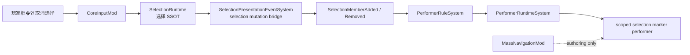

# 正式寻路基建用户教学�?
本文从零开始介绍 Ludots 的正式寻路基建。`MassNavigationMod` 是当前正式的大世界导航能力入口，读者不需要知道 Ludots 内部历史，只要知道这是一个用 Ludots 正式链路提供“大世界万人导航、框选、右键移动、避障和表现同步”的系统。
## 你会得到什�?
这套正式寻路基建展示的是一�?RTS 风格的大地图�?
- 地图/board 决定世界边界�?- 配置决定队伍、单位模板、障碍、热点、表现资源和导航调参�?- 玩家框选单位后右键下达移动命令�?- 单位以高性能 SoA solver 移动、避让、写�?ECS 位置�?- 视觉�?performer 管线渲染，选中 marker、小地图 marker、生命条都不是临时绘制�?
当前能力由 `MassFlow` 和 `MassNavigation` 两层组成：`MassFlow` 负责高性能 SoA solver 热路径，`MassNavigation` 负责 gameplay 命令、选择、实体模板、ECS 写回和表现交接。你可以把这里当作正式寻路基础设施的学习入口和配置范本。
## 五分钟跑起来

在仓库根目录执行�?
```powershell
.\scripts\run-mod-launcher.cmd cli launch mass_navigation --adapter raylib --build auto
```

也可以使�?preset�?
```powershell
.\scripts\run-mod-launcher.cmd cli launch mass_navigation_raylib
```

启动后检查这些画面：

- 大量单位分布在地图上�?- 左侧�?MassNavigation 调参面板�?- 右上角有诊断 HUD�?- 小地图显示全图和视窗�?- 框选单位后，单位脚下出�?selection marker�?- 右键地面后，单位移动而不是重置回出生点�?
## 核心概念

世界边界来自 map �?board，不来自 MassNavigation 私有配置。当前地图在 `mods/capabilities/navigation/MassNavigationMod/assets/Maps/mass_navigation.json` �?author board；运行时通过 `PrimaryBoard.WorldSizeSpec.Bounds` 读取�?
ECS 坐标是权威世界坐标。MassNavigation solver 使用本地 SoA cache 工作，然后把结果写回 `WorldPositionCm`、`PreviousWorldPositionCm` �?`FacingDirection`�?
Solver window 是当前高精度求解窗口。现在固定为 10,000 x 10,000 cm，因为底�?`MassFlowSimulationState` 的网格、hash 和数组容量仍是固�?cache。`MassNavigationConfig.world.solverWindowWidthCm/HeightCm` 必须匹配这个 cache�?
Flow work area 是当前关注区域，由镜头、最近命令目标、选中单位范围共同驱动。它可以�?solver window 大，用来描述下一步该优先处理的区域�?
`flow.enabled=false` 不代表不能移动。当�?showcase 主要使用本地 steering、formation target �?avoidance；flow field 管线是可选能力，在这份验收配置里默认关闭�?
## 文件地图

主要入口�?`mods/capabilities/navigation/MassNavigationMod/assets/`�?
- `MassNavigationConfig.json`：队伍、agent profiles、障碍、热点、cadence、arrival、avoidance、crowd semantics、presentation id 引用�?- `Entities/templates.json`：agent、blocker、hotspot、local player 等实体模板�?- `GAS/order_types.json`：`massNavigationMove` 订单类型和它的规则�?- `Presentation/performers.json`：单位主体、生命条、选中 marker、小地图 marker、障碍、热�?performer�?- `Presentation/mesh_assets.json` �?`Presentation/host_assets.json`：模型资源和后端文件绑定�?- `Maps/mass_navigation.json`：地图、board、局部玩�?entity、视觉地形�?- `Configs/Camera/virtual_cameras.json`：战�?战略镜头 profile�?- `game.json`：启�?map、presentation capacity、selection preview 订单列表、Navigation2D 开关等全局配置片段�?
配置通过 `ConfigPipeline` 合并。不要在业务代码里新写私�?JSON 加载器�?
## 配置里的数字和语义名

MassNavigation 配置里有两类值。第一类是真实数值，例如 `agentsPerTeam`、`simulationHz`、`radiusCm`、`speedCmPerSecond`、`sizePx`、颜色、scale、offset、queue size �?timeout。它们就是调参值，应该继续写数字�?
第二类是运行时内�?handle，例�?performer `slot`、`paramKey`、`speedParamKey`、`orderTypeId`、order blackboard key、validation graph id。用户配置不应该记这些数字。现�?MassNavigation authoring 使用语义字符串：

- performer 行为槽写 `"slot": "body"`、`"grounding"`、`"animator"`、`"minimap"`�?- performer 参数�?`"massNavigation.agent.health.ratio"`、`"massNavigation.agent.health.current"`、`"blacksmith.worker.locomotion.speed"`�?- 禁用可选参数写 `"none"`，加载后才编译成内部 `-1` �?`0` 哨兵�?- `massNavigationMove` 不手�?`orderTypeId`；`OrderTypeConfigLoader` �?key 稳定分配 int，并在运行时继续�?`OrderTypeRegistry`�?- order rule 引用�?`interruptsActiveOrderTypeKeys`，不要写其它 order 的数�?id�?
这些语义名只存在于加载期。真正的仿真、performer tick、order buffer �?bitset 仍然使用 int、数组和 bitmask，不把字符串带进热路径�?
## 最小单位模�?
一个可�?MassNavigation 控制的单位模板必须包含这些正式组件：

- `Team`
- `OrderBuffer`
- `SelectionSelectableTag`
- `SelectionSelectableState`
- `WorldPositionCm`
- `FacingDirection`
- `MassNavigationAgentTag`
- `MassNavigationControllable`

`WorldPositionCm` 会通过 component registry authoring 补齐 `PreviousWorldPositionCm`、`VisualTransform`、`CullState`。模板读者不需要手动把这三个全写出来，�?spawn receipt binding 会校验运行时实体最终具备它们�?
单位 profile 不写�?C# switch 里。当前配置使�?`agentProfiles.profiles[]` 决定 light/heavy、`navMass`、`visualScale` 和每 N 个单位分配一次的规则�?
## 玩家操作

玩家不配置任何东西。玩家只需要知道这些操作：

- 鼠标框选单位�?- 左键点空地取消选择�?- 右键点地面下达移动命令�?- 被选单位脚下出�?selection marker；取消选择�?marker 消失�?
玩家不需要知�?selection key、performer scope、entity template id 或任何运行时内部集合�?
## 为什么会�?selection 通道�?
selection 通道名不是给玩家输入的，也不是给 Mod 作者手写第二套集合的。它只是加载器和规则系统用来指向同一条选择事实的正式语义名�?
- 玩家看不到它�?- Mod 作者通常也不用直接写它，只需要写 `when: "PlayerPrimarySelection"` 这类面向业务的语义�?- 引擎内部需要它，是为了把“谁被选中”这条事实稳定送到表现层，而不是让 MassNavigation 或任�?showcase 私有 system 自己猜�?
当前这条通道在代码里有一�?canonical 常量 `SelectionSetKeys.LivePrimary`。配置层看到�?`selection.live.primary` 是同一概念的作者名，不是第二套集合，也不是兼容入口�?
术语对照很简单：

| �?| 名字 | 含义 |
| --- | --- | --- |
| 玩家 | 不暴�?| 玩家不输入这类内部名 |
| Mod 作�?| `selection.live.primary` | 配置里用的语义名，指向主选择通道 |
| 引擎内部 | `SelectionSetKeys.LivePrimary` | 代码里的 canonical key |

## Mod 作者配置：单位选择反馈

Mod 作者也不需要声明“当前框选集合”。当前框选集合由 `CoreInputMod` �?`SelectionRuntime` 维护，是引擎运行时状态，不是 Mod 的业务配置对象�?
Mod 作者要配置的是“哪些实体能被选中”和“这些实体被选中时显示什么反馈”：

- 在实体模板里声明 `SelectionSelectableTag` �?`SelectionSelectableState`�?- 在实体模板里声明正式位置/表现交接组件，例�?`WorldPositionCm`、`FacingDirection`、`VisualHeightmapSampleState`�?- �?`Presentation/performers.json` 中声�?selection marker performer，例�?mesh、材质、尺寸、offset、render path �?mobility�?- �?selection feedback 规则中声明：当实体被玩家主选择选中时显示哪�?marker，取消选择时由引擎清理�?- light/heavy 或其它类型差异应来自模板、tag、profile 或规则条件，不由 feature system 猜�?
目标配置形态如下。注意这是下一步要落地的正�?authoring contract；如果当前代码还没有完全支持某个字段，应该补 Core 基建，而不是让 MassNavigation 再写一个私�?system 绕过去�?
作者输入的是“这个单位被玩家主选择选中时，用哪�?performer 做反馈”。作者不输入、不创建、不管理运行时的框选集合；那是 `SelectionRuntime` 的职责�?
```json
{
  "selectionFeedback": [
    {
      "id": "my_unit_light_selected",
      "when": "PlayerPrimarySelection",
      "sourceTemplates": [ "my_unit_light" ],
      "performerId": "my_unit_selection_marker_light",
      "cleanupScope": "SelectionMember"
    }
  ],
  "performers": [
    {
      "id": "my_unit_selection_marker_light",
      "mesh": "my.selection.marker",
      "renderPath": "InstancedStaticMesh",
      "mobility": "Movable",
      "localOffset": [0.0, 0.035, 0.0],
      "localScale": [0.55, 0.05, 0.55]
    }
  ]
}
```

字段含义�?
- `when: "PlayerPrimarySelection"`：玩家主选择。它�?CoreInput 提供的能力名，不是作者创建的集合�?- `sourceTemplates`：哪些实体模板被选中时使用这条反馈规则�?- `performerId`：要创建�?marker performer�?- `cleanupScope: "SelectionMember"`：这份反馈归属当前进入选择集合的成员；同一成员重复进入选择不会创建第二�?marker，离开选择集合时只清理该成员的 marker�?- `renderPath: "InstancedStaticMesh"`：marker �?instancing，不回退到逐个 primitive draw�?
如果�?light/heavy 两种单位，作者写两条 `selectionFeedback`，分别指�?light/heavy 模板和不�?marker performer。不要在 C# 里通过 `MassNavigationAgentProfile.Heavy` 之类的组件手写分支�?
## 运行时输�?
玩家�?Mod 作者能观察到的结果应该是：

- 框选符�?`sourceTemplates` 的单位时，每个被选单位脚下出现一�?marker�?- 同一个单位重复进入选择时，不重复创建第二个 marker�?- 左键点空地清空选择时，这批 marker 立即消失�?- marker 跟随单位移动，不停在创建时的位置�?- light/heavy 或其它模板差异按配置选择对应 marker�?- 批量框选和批量清空不需�?Mod 写循环，也不需�?MassNavigation 私有 system 每帧扫描�?
这意味着你检�?marker 时应关注�?
- 选中后每�?live owner 只有一�?marker�?- 取消选择�?marker 立即消失，不停在取消瞬间的位置�?- reset 后旧 owner �?performer 不应继续留在新场景选择集合里�?- core performer 代码不包�?MassNavigation 专属分支�?
## 内部实现边界

这部分给引擎�?Mod 开发者看，玩家不需要读�?
### 谁在用这条链�?
| �?系统 | 做什�?| 是否必要 |
| --- | --- | --- |
| `CoreInputMod` / `SelectionRuntime` | 维护选择 SSOT 和成员变�?| 必须 |
| `SelectionPresentationEventSystem` | �?selection mutation 变成通用 presentation event | 必须 |
| `PerformerRuleSystem` | 只做事件、条件和命令匹配 | 必须 |
| `PerformerRuntimeSystem` | 执行 batch create / scoped destroy | 必须 |
| `MassNavigationMod` | �?author marker definition �?rules | 必须，但不拥�?lifecycle |



目标链路是：

```text
CoreInputMod
  -> SelectionRuntime
  -> selection mutation batch
  -> presentation selection bridge
  -> PresentationEvent(SelectionMemberAdded/Removed)
  -> PerformerRuleSystem
  -> PerformerRuntimeSystem
  -> PerformerEntityRuntime batch create / scoped destroy
```

职责边界�?
- `SelectionRuntime` 是选择集合 SSOT。它只记录选择状态和成员变化，不知道 MassNavigation。这里唯一的正式通道名是 `SelectionSetKeys.LivePrimary`；`selection.live.primary` 只是同一概念在配置层的作者名�?- presentation selection bridge 只把通用 selection mutation 转成通用 presentation event，不创建 MassNavigation performer�?- `PerformerRuleSystem` 只按配置匹配事件、条件和命令，不内置 showcase 名称�?- `PerformerRuntimeSystem` 消费命令；同一帧同 definition、entity anchor、无 parent 的批量创建可以合并走 `CreateEntityAnchoredRootBatch`�?- `MassNavigationMod` �?author 模板、profile、performer、order 和场景配置�?
上面的作者配置会在加载期降低�?performer rule。内部形态可以类似这样，但这不是玩家文档，也不要求普�?Mod 作者手写：

```json
{
  "event": { "kind": "SelectionMemberAdded", "key": "selection.live.primary" },
  "condition": {
    "inline": "SourceHasEntityTemplate",
    "entityTemplateId": "my_unit_light"
  },
  "command": {
    "kind": "CreatePerformer",
    "definitionId": "my_unit_selection_marker_light",
    "scopeSource": "SourceStableId"
  }
}
```

`selection.live.primary` 是这条通道�?authoring 层的语义名；loader 会把它编译成 `SelectionSetKeys.LivePrimary`。它不是第二套集合，也不是兼容别名�?
禁止事项�?
- 不在 MassNavigation system 里读�?`SelectedFlags` 后手动创�?marker�?- 不在 MassNavigation config 里写 selection marker performer id 字段来驱动生命周期�?- 不用 solver index、array index、team id 或其它临时数字当 selection marker scope�?- 不给 performer behavior �?MassNavigation 专属分支�?- 不在配置里暴�?order type id、param key、behavior slot 这类内部 handle；配置写语义字符串，加载期编译�?
性能约束�?
- selection 变化应该�?mutation-driven，不做每帧全�?diff�?- 框选万人时，事件和命令�?batch 处理，稳态帧不重复创�?marker�?- marker �?`InstancedStaticMesh` + `Movable` performer，跟随实体走既有 transform sync�?- 清空选择时按 scope/definition 清理，不保留上一�?transient projection�?- 10k agents 验收必须记录 dropped performer/event/request �?0，并比较 `performer_ms`、`presentation_ms`、`frame_ms`�?
## 开发迭代计�?
下面是把当前 showcase 清理成上�?contract 的开发顺序。每一步都应该有测试或 UAT 证据�?
1. 文档先行
   先保持本文的玩家、Mod 作者、内部实现三层视角一致。玩家不需�?internal key；Mod 作者不声明 runtime selection set；内部实现才讨论 `SelectionRuntime`、mutation �?performer rule�?
2. Core selection revision
   `SelectionRuntime` 是选择�?SSOT。选择容器只在真实变更时递增 revision，presentation bridge �?revision 跳过稳态帧�?
3. Presentation selection bridge
   通用 bridge �?selection 容器变更转成 `SelectionMemberAdded` / `SelectionMemberRemoved` presentation event。event source 是被选实体，target �?selection container，key 是选择通道语义 id�?
4. Performer rule 扩展
   `PresentationEventKind` 增加 selection 事件，performer config loader 允许�?selection 通道 key。条件只使用通用概念，例�?source template、source tag、source has visual transform；不能写 MassNavigation profile 分支�?
5. Performer runtime cleanup
   destroy �?selection marker 限定 definition + source owner + source stable scope，避免用 owner stable id 清掉�?scope 下的 agent �?performer�?
6. MassNavigation 配置迁移
   �?`Presentation/performers.json` �?light/heavy selection marker author rules。light/heavy 差异来自模板、tag �?profile 配置条件。`MassNavigationConfig.presentation` 不再�?selection marker performer id 驱动生命周期�?
7. MassNavigation 私有 marker system 已移�?   MassNavigation selection sync 只服�?solver selected flags，不负责表现生命周期。marker 的创建和清理由通用 selection presentation event �?performer rule 驱动�?
8. 验证
   必跑：配�?loader 测试、selection mutation 测试、performer rule selection 事件测试、presentation flush 残留测试、MassNavigation 10k UAT。验收点是框选、移动、取消选择、reset 后无 marker 残留，且没有 dropped performer/event/request�?
## 表现和选中 Marker

单位主体�?performer。当�?agent 使用 Blacksmith showcase �?`blacksmith.worker.knight` skinned mesh 和动�?profile；MassNavigation 不复制这套素材�?
选中 marker 不是 agent �?performer 里常驻隐�?mesh。它是独�?scoped performer，由通用 selection-to-performer 事件�?performer rules 创建/销毁。MassNavigation �?author 模板�?performer 配置，不拥有 marker 生命周期代码�?
## 命令链路

右键移动的链路是�?
```text
Input
  -> SelectionRuntime
  -> OrderBuffer(massNavigationMove)
  -> MassNavigationOrderBridgeSystem
  -> MassNavigationGroupRuntime
  -> MassFlowSimulationState
  -> ECS position/facing writeback
  -> performer transform sync
```

`massNavigationMove` �?id �?`GAS/order_types.json` 注册�?`OrderTypeRegistry`。selection move path preview 允许预览哪些订单，由 `selection.movePathPreviewOrderTypeKeys` 配置，不应在 CoreInput 源码里硬编码 showcase 订单名�?
## 如何改成自己的场�?
保守做法是先复制 MassNavigation showcase 的配置形状，然后逐项改：

1. �?`MassNavigationConfig.json` 修改 `scenario.teams` �?`agentsPerTeam`�?2. �?`presentation.teams` 为每�?team 绑定 light/heavy template �?performer�?3. �?`agentProfiles.profiles` 调整 `navMass`、`visualScale`、heavy 分布规则�?4. �?`world.obstacles` author 障碍，坐标是 solver window 内的本地 cm�?5. �?map �?board �?author 世界尺寸�?visual heightmap�?6. �?`Presentation/performers.json` 调整模型、颜色、生命条、小地图 marker �?selection marker�?
注意当前 solver window 仍是固定 cache。可以移动热点和大世界窗口，但不能把 solver cache 配成任意尺寸�?
## 调参指南

`cadence` 控制各子系统频率�?
- `simulationHz`：仿真步频�?- `targetUpdateHz`：formation/group target 刷新频率�?- `hardResolveHz`：硬穿透修正频率�?- `entitySyncHz`：写�?ECS 的频率�?- `maxStepsPerFixedTick`：单�?fixed tick 最多补几步�?
`arrival` 控制到达和卡住恢复：

- `timeoutMs`：停滞多久触发恢复�?- `progressDistanceCm`：认为“有进展”的距离�?- `wakePushDistanceCm`：被推离后重新唤醒的距离�?- `maxRetryCount`：最多重试次数�?
`avoidance` 控制不同质量单位之间的推挤策略：

- `dominantMassRatio`：质量差达到多少认为�?dominant push�?- `friendlyResponseScale`：友军协作避让强度�?- `nonFriendlyResponseScale`：非友军阻挡响应�?- `dominantPushResponseScale`：重单位推开轻单位的响应�?
`semantics` 控制更细�?gameplay 语义，例如障碍硬半径、目标投�?clearance、阵�?slot 间距、速度、分离半径和速度平滑�?
## 常见问题

看不到单位：

- 检�?`PerformerBlacksmithShowcaseMod` 是否�?`mod.json` dependencies 中�?- 检�?`Presentation/host_assets.json` 是否能解析模型源文件�?- 检�?map 是否绑定 visual heightmap�?
框选没�?marker�?
- 检查本地玩家模板是�?author `PlayerOwner` �?`SelectionDragState`�?- 检�?agent 模板是否 author selection 组件�?- 检�?performer definition 是否存在 `mass_navigation_agent_selection_marker_light/heavy`�?
右键不移动：

- 检�?`massNavigationMove` 是否注册�?`OrderTypeRegistry`�?- 检�?`selection.movePathPreviewOrderTypeKeys` 只是预览配置，不等于命令提交配置�?- 检�?agent 是否�?`OrderBuffer` �?`MassNavigationAgentIndex`�?
reset 后表现异常：

- �?MassNavigation 实体应标�?`PresentationDestroyPending`，等�?presentation 生命周期发布 destroy 事件并最终销毁�?- 新场�?spawn 通过 `RuntimeEntitySpawnQueue` �?receipt channel 绑定，不直接 `world.Create` 业务实体�?
改了 solver window 尺寸后失败：

- 这是当前限制。配置必须匹配固�?10,000 x 10,000 cm SoA cache。通用可变尺寸 solver 需要后续提�?`MassFlow`/`MassNavigation` 后再做�?
## 架构边界

MassNavigation 已经复用正式链路：`ConfigPipeline`、template spawn、`SelectionRuntime`、`OrderBuffer`、`OrderTypeRegistry`、performer、minimap 和 presentation lifecycle。
当前仍需继续强化的工程边界：
- solver cache/grid/hash 仍固定在 C# 常量上；spawn/formation layout 仍有具体示例场景逻辑；strategic/tactical camera reset 仍是 MassNavigation 本 mod 的运行时策略；team relationship 会写入全局 `TeamManager`，需要后续正式分层；通用“只配置 entity 模板就接入万人导航”的 contract 仍需要继续沉淀到 `MassNavigation`。
因此，使用者可以把它当作高性能大世界导航的正式学习入口；其中仍标明的限制就是后续基础设施演进清单。
## 下一步学�?
- 正式链路手册：`gitbook/reference/mass-navigation-formal-chain.md`
- Mod 边界说明：`mods/capabilities/navigation/MassNavigationMod/README.md`
- 关键 runtime：`Runtime/MassNavigationSimulationRuntime.cs`
- 热路�?solver：`Runtime/MassFlowSimulationState.cs`
- 选择 marker：`assets/Presentation/performers.json` 中的 selection performer rules
- 命令桥：`Systems/MassNavigationOrderBridgeSystem.cs`

