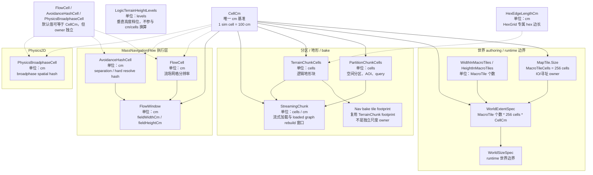

# 空间尺度配置查表

本页是 `gitbook/architecture/spatial-scale-and-resolution-ssot.md` 的快速查表入口。权威概念、owner 与映射以架构页为准；本页只解释“看到某个配置/常量时，它是什么意思、用在哪里、不能和什么混用”。主表中带「#1567 切 1 已迁移」标注的行是历史键位，现行键位见文末[「四域归位目标键位」](#四域归位目标键位1567)。

交互式关系图见 [`spatial-scale-explorer.html`](spatial-scale-explorer.html)，用于点击查看“谁用谁做单位”、哪些尺度必需、哪些尺度可配置。Mod 作者地图尺度入门见 [`map-scale-authoring-guide.md`](map-scale-authoring-guide.md) 与 [`map-scale-authoring-starter.html`](map-scale-authoring-starter.html)。

## 单位依赖图

| 配置 / 常量 | 目标概念 | 单位 | 当前默认 | 含义 / 应用场景 | owner / 约束 |
|---|---|---:|---:|---|---|
| `SpatialScaleDefaults.CellCm` | `CellCm` | cm | 100 | 全局原子尺度。board 世界尺寸、nav bake cm 换算、默认 flow/hash cell 都从它解释。 | 唯一基准单位，必须 > 0。 |
| `BoardConfig.GridCellSizeCm` | `CellCm` | cm | 100 | board authoring 输入，决定 grid board 每个 sim cell 的厘米边长，并进入 `WorldExtentSpec`。 | 仍保留历史字段名；语义按 `CellCm` 解释。 |
| `BoardConfig.HexEdgeLengthCm` | `HexEdgeLengthCm` | cm | 400 | HexGrid board 的 hex 边长，影响 `HexMetrics`、HexGrid 坐标/查询/渲染布局。 | 仅 HexGrid 生效；Grid / NodeGraph 不受它影响，必须 > 0。 |
| `MapTile.Size` | `MacroTileCells` | cells | 256 | 256-cell IO/寻址宏块。世界大小的 `WidthInMacroTiles` / `HeightInMacroTiles` 以它为倍率。 | `MapTile.Size` 是 owner；`SpatialScaleDefaults.MacroTileCells` 只引用它。 |
| `BoardConfig.WidthInMacroTiles`（#1567 切 1 已迁移） | 历史键 | macro tiles | 64 | 曾是 board/world 宽度 authoring 数量；切 1 起加载即 fail-fast。 | 现行写法：map `World.WidthCm` + `Boards[].WidthCells`。 |
| `BoardConfig.HeightInMacroTiles`（#1567 切 1 已迁移） | 历史键 | macro tiles | 64 | 曾是 board/world 高度 authoring 数量；切 1 起加载即 fail-fast。 | 现行写法：map `World.HeightCm` + `Boards[].HeightCells`。 |
| `WorldExtentSpec` | `WorldExtent` | cm | derived | 由 `World.WidthCm/HeightCm/CellSizeCm` 直构（#1567 切 1），宏块数为派生 IO 细节，产出 runtime `WorldSizeSpec`。 | 是计算对象，不替换 `WorldSizeSpec`。 |
| `BoardConfig.ChunkSizeCells` | `PartitionChunkCells` | cells | 64 | 空间分区、AOI、query backend 的分区块边长。只描述查询分区，不描述地形或 navmesh。`World.Tuning.PartitionChunkCells` 声明后为唯一预算（#1567 切 4 已落地），板级字段仅在未声明 Tuning 时生效，退役随切 4b。 | 必须 > 0 且为 2 的幂。 |
| `VertexChunk.ChunkSize` | `TerrainChunkCells` | cells | 64 | 逻辑地形块边长。当前 navmesh tile footprint 等于 `TerrainChunk` footprint。 | 当前固定；#286 已把 grid/hex 地形输入统一到 `LogicTerrainField`。 |
| Nav bake tile footprint | `TerrainChunk` footprint | cells / cm | 64 cells | navmesh `.ntil` 的 tile 覆盖一个 `TerrainChunk`。 | 不再单独命名为尺度 owner；不要把 `NavTile` 当第二个 chunk 尺度。 |
| streaming / loaded graph window | `StreamingChunk` | cells / cm | derived | 流式加载、loaded graph rebuild 的空间窗口。 | 从 board 分区或显式配置推导；禁止私有 loader fallback。 |
| `MassNavigationFlowSolverConfig.fieldWidthCm` / `fieldHeightCm` | `FlowWindow` | cm | preset 显式配置 | MassNavigationFlow 执行层滑窗/工作区尺寸。 | 必须 > 0，并被 `FlowCell` 与 `AvoidanceHashCell` 整除。 |
| `MassNavigationFlowSolverConfig.flowCellSizeCm` | `FlowCell` | cm | preset 常用 100 | MassNavigationFlow 流场网格分辨率。 | 必须 > 0；不要和 board `CellCm` 混成同一个配置 owner。 |
| `MassNavigationFlowSolverConfig.separationHashCellSizeCm` | `AvoidanceHashCell` | cm | preset 常用 100 | MassNavigationFlow 分离邻居哈希 cell。 | 必须 > 0；属于 avoidance，不属于 navmesh bake。 |
| `MassNavigationFlowSolverConfig.hardResolveHashCellSizeCm` | `AvoidanceHashCell` | cm | preset 常用 50 | MassNavigationFlow 硬解析候选哈希 cell。 | 必须 > 0；可小于 `CellCm`，但必须由配置显式给出。 |
| `SpatialScaleDefaults.PhysicsBroadphaseCellCm` | `PhysicsBroadphaseCell` | cm | 100 | Physics2D broadphase spatial hash 默认尺度。 | 显式配置 / 命名常量，禁止缺失时静默 fallback。 |
| `SpatialScaleDefaults.LogicTerrainHeightLevels` | logic terrain height levels | levels | 16 | 逻辑地形高度档位数量，当前为 4-bit 高度域。 | owner 在 `SpatialScaleDefaults`；最大值为 `LogicTerrainMaxHeightLevel`。 |

迁移规则：

- `WidthInTiles` / `HeightInTiles` 与 `WidthInMacroTiles` / `HeightInMacroTiles` 都是历史字段名（#283 / #1567 切 1）；出现即 fail-fast，现行写法是 `World.WidthCm/HeightCm` + `Boards[].WidthCells/HeightCells`。
- #283 进行破坏式迁移，旧键出现即 fail-fast，不提供别名兼容。
- Authoring UI 让作者输入目标米数，落盘为分配后的 `World.WidthCm/HeightCm` 与 `Boards[].WidthCells/HeightCells`；不要让作者手填 TerrainChunk/NavTile 个数。
- `WorldExtentSpec` 是 authoring/计算对象，产出既有 `WorldSizeSpec`；不要替换 `WorldSizeSpec`。
- `HexEdgeLengthCm` 只用于 HexGrid board 的 hex 几何；不要拿它解释 Grid board cell、FlowCell 或 NavTile footprint。
- `NavTile footprint` 是 `TerrainChunk` 的用途，不是独立尺度 owner。
- `PartitionChunk` 只用于空间分区/AOI/query；不要拿它解释 terrain/navmesh tile。
- `MacroTile` 只用于 IO/寻址宏块和世界范围 authoring；不要拿它解释 streaming chunk 或 terrain chunk。
- 障碍数据源仍使用 `ManifestationObstacleIntent2D` + `ShapeDataStorage2D` + `CompoundObstacle2DState`。

## 四域归位目标键位（#1567）

空间配置按世界/板/导航/执行四域归位后，authoring 键位与 owner 如下；各切合入前现状键仍生效，旧键在新键生效后 fail-fast。

| 域 | 目标键 | 单位 | 含义 | 取代的现状键 |
|---|---|---|---|---|
| 世界（host world） | map `RootBoard`（缺省第一块板） | 板名 | 根板锚定 host world；无板图无世界；boot 占位在 game.json `world` | 独立 `World` 尺寸节点（rootboard 裁决后废弃）；宏块数量键 |
| map | `Tuning.PartitionChunkCells` / `LoadedChunkCapacity` | cells / 个 | map 级分区与 streaming 预算，缺省由引擎推导（4b） | `Boards[].ChunkSizeCells` / `LoadedChunkCapacity` |
| 板 | `Boards[].WidthCells/HeightCells` + `CellSizeCm` | cells | Grid 板范围（格子数直写） | 宏块数 × 256 换算 |
| 板 | `Boards[].WidthHexes/HeightHexes` + `HexEdgeLengthCm` | hexes | Hex 板范围，世界足迹经 `HexMetrics` 派生 | 同上（含借 `GridCellSizeCm` 算 hex 板足迹的现状做法） |
| 板 | `Boards[].OriginXCm` / `OriginYCm` | cm | 板摆在世界坐标哪里，缺省居中；越出世界 fail-fast | 板恒居中（无 origin 字段） |
| 导航 | navmesh.json `boards.<name>.source` | —— | 烘焙源（.height 直采 / .grid / .hex），板是可选源之一 | bake 从板 LogicTerrain 投影的现状链路（#1350 直采方向） |
| 导航 | navmesh.json `boards.<name>.tileWorldWidthCm/HeightCm` | cm | nav 瓦片颗粒度，显式两轴，不从板或地形块推导 | `Boards[].NavTileGrid`（与 TerrainChunk 64-cell 的焊接） |
| 执行 | `MassNavigationConfig.json` 各键 | cm | 不变 | —— |

四域边界三句话：世界尺寸不由板决定；板是业务区域不是性能分区；nav 瓦片颗粒度与板无关。
